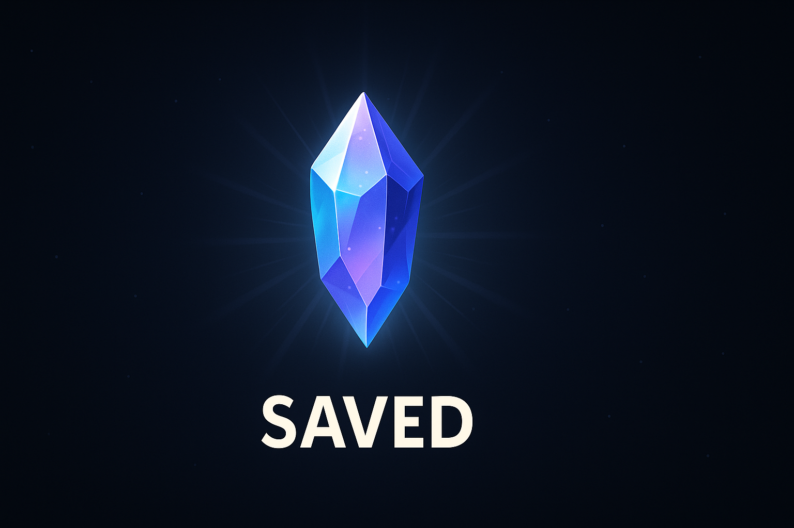

# 💾 Save Crystal — Honest Hero RPG GitHub Maze v1.0.0

Welcome, brave explorer of the WFGY GitHub Maze.

Rumor says... somewhere inside this repo lies a hidden paper. A true gem.  
But no one knows exactly **where**. Only those who follow the maze will find it.

This is **Honest Hero RPG – GitHub Edition** (v1.0.0).  
A strange, evolving repository of semantic relics, hidden folders, and cryptic README scrolls.

---

## 🔐 Integrity & Checksum

To ensure the maze remains honest, a `checksum.txt` file is placed in the root directory.  
This is the **official signature** of Maze v1.0.0.  
As the maze evolves, new versions (v1.1, v1.2, ...) may appear — but past routes will never change.

**Your quest:**  
- Use the provided Colab notebook to verify the checksum.
- This ensures no one secretly moved the walls… or the treasure.

👉 [Verify the Maze Checksum on Colab](https://colab.research.google.com/)

---

## 🧩 A Living Maze?

Yes. Every version update may add:
- New NPCs (inside README files)
- New folders
- New hidden items or silly traps
- New memes… or maybe a legendary paper

But once a path is built, it will remain forever.  
The maze doesn’t change… **it grows**.

Are you ready for what’s next?
