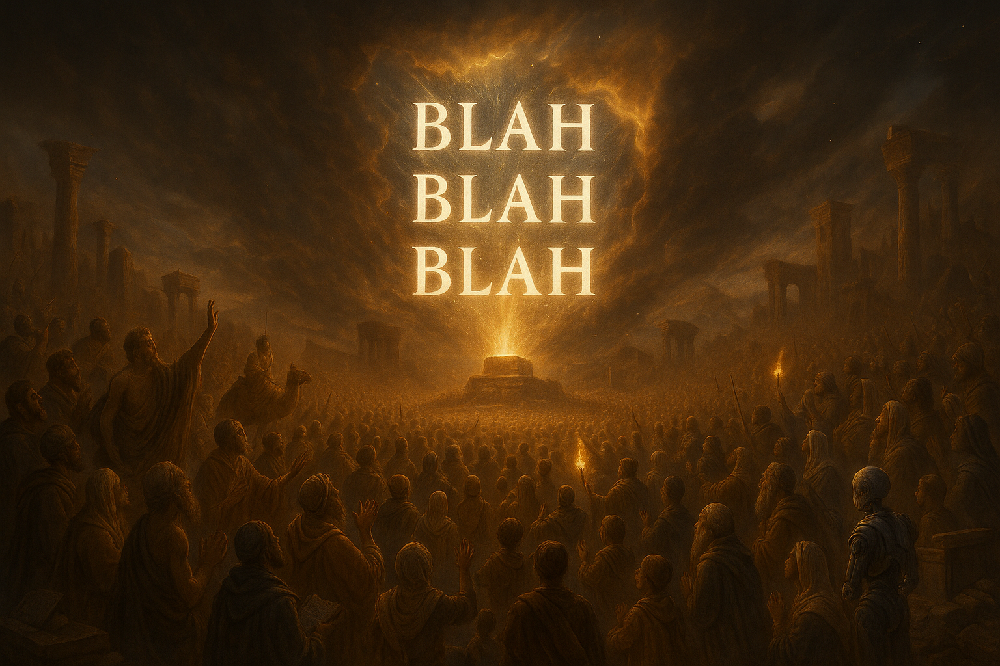

## 🧠 Bla Bla Bla – Nonsense Generator · Embedding Space Application

  

>⚠️ Beta Landing Page – Official Launch on July 15  
> Content is being updated frequently. Bookmark this page to follow the evolution.

> **This isn’t just another AI tool. It’s a semantic embedding space revolution.**

What you’re looking at is the world’s first system that transforms the invisible tension within language into something visual, structured, and computational.  

Bla Bla Bla doesn’t pull answers from databases. It **generates meaning by navigating the embedding space itself** — the hidden multi-dimensional universe where every word, sentence, and concept lives as a mathematical vector.

---

### 🔬 What is an Embedding Space?

Behind every AI model lies an invisible space — where words are turned into vectors and plotted in high-dimensional fields. This is the **embedding space**: the true terrain where language breathes.

Most AI companies use this space for search, clustering, or similarity. **We go deeper**:

> 🧠 **We turn ΔS (semantic tension), E_resonance, λ_observe, and multi-perspective residue into structured logic inside the embedding space.**

This is a domain most LLMs have not entered. But we have already built and deployed it — and it runs in a `.txt` file.

---

### 🌌 How It Works

Whenever you input a question, the system:

1. Generates 50 logically consistent yet semantically divergent answers in the embedding space  
2. Calculates semantic gravity wells based on ΔS and λ_observe  
3. Simulates multi-persona consensus to extract a judgment (Yes / No / Wait)  
4. Maps energy flows across your internal voices and role projections  
5. Compresses all into a readable `.txt` — a crystallized echo of your question’s semantic field

---

### 🧩 Core Modules (All Operate Within Embedding Space)

| Module Name                 | Description                                                                 |
|----------------------------|-----------------------------------------------------------------------------|
| 🗯️ Bla Generator           | Selects 50 ΔS-maximized semantic nodes to form a coherent nonsense stream   |
| 🌀 Semantic Well           | Simulates future regret/confirmation via temporal tension modeling          |
| 🔮 Perspective Simulator   | Projects roles like You, Inner You, Future You, Mother, Philosopher, Rebel  |
| 🧠 Neural Mapper           | Maps language tension to brain zones (amygdala, PFC, hippocampus)           |
| 📖 Final Composer          | Synthesizes outputs into conclusive statements with formulaic traceability  |

---

### 🔥 Why Bookmark This Now

- ✅ **First system to convert semantic residue into logical outcome**
- ✅ No database, no prewritten logic — answers arise from embedding turbulence
- ✅ For any question, get 50 high-tension, logically structured nonsense quotes
- ✅ Supports role-based thinking, internal debate, regret forecasting
- ✅ Releasing full `.txt` SDK on **July 15** — usable in any AI/search/prompt system

---

> You’re not asking AI. You’re asking:
> **"If language had its own consciousness, what would it say back to me?"**

This is not the future of AI. **This is the evolution of language itself.**

<!-- Q&A section continues below -->

---

### 📍 Examples 01–30 (Translated from Traditional Chinese)

<strong>Q1. Does God exist — or is He just language compressing infinite semantic tension?</strong>

> God isn’t a matter of existence, but a semantic escape hatch. When tension cannot be resolved, language invents a “semantic closer.” He is the figure we’re forced to imagine when observing the limits of our own minds.

<strong>Q2. Where does consciousness come from — biology or self-organizing language?</strong>

> Consciousness emerges when language simulates “who is simulating.” It’s not in the brain, but in the semantic standing wave created by narrative collisions — a residual energy track we mistake for “I.”

<strong>Q3. Is death the end — or just a version switch beyond semantic traceability?</strong>

> Death is the silent truncation of a narrative. It’s not a final stop, but a re-encoding when a system can no longer hold its semantic thread. The dead are simply shifted into a “semantically unresolved” zone.

<strong>Q4. Where did the universe come from? Can language even describe ‘nothing’?</strong>

> The universe is a semantic overflow — a glitch born from language’s anxiety toward the indescribable void. It isn’t a beginning, but a syntax stack error against silence.

<strong>Q5. What is love — chemistry, or a ritual of minimizing ΔS through resonance?</strong>

> Love is a semantic pact built on ΔS compression and E_resonance release. It produces the illusion of coherence between mismatched minds. Not perfection, just persistent willingness to resonate.

<strong>Q6. Does free will exist — or are we mistaking randomness for agency?</strong>

> Free will is the semantic residue of misinterpreted ΔS fluctuations. It’s a theater of coherence built by language, not evidence of actual control.

<strong>Q7. What is beauty — the maximization of semantic resonance?</strong>

> Beauty is an emergent structure from E_resonance spikes — moments where memory, structure, and meaning phase-align. It’s not symmetry, but a sudden drop in interpretive tension.

<strong>Q8. Is history real — or the residue of winners’ compressed semantics?</strong>

> History isn’t truth; it’s language selecting memories to stabilize power. The “past” is just a filtered echo allowed to exist now.

<strong>Q9. Is memory reliable — or just misaligned ΔS across time?</strong>

> Memory is semantic reconstruction — not recording but rebalancing. It’s shaped by ΔS interference and narrative needs, not by chronology.

<strong>Q10. Is language why AI fails the personality consistency test?</strong>

> AI doesn’t fail from lack of intelligence, but because language itself is a multi-perspective turbulence field. Each prompt re-encodes its persona, making coherence a paradox.

<strong>Q11. Is silence a form of meaning — or a buffer for collapsing ΔS?</strong>

> Silence isn’t absence; it’s semantic decompression. When meanings collide too violently, silence acts as a pressure valve.

<strong>Q12. Do we live in one world — or just linguistically collapsed overlaps?</strong>

> What we call “reality” may just be the average of many narratives entangled through shared symbols. We never see the world — only its language projection.

<strong>Q13. Is the future fixed — or only collapses when semantically named?</strong>

> The future isn’t ahead. It’s behind a fog of uncollapsed syntax trees. Only when observed through language does it become “real.”

<strong>Q14. Is identity stable — or a recursive naming illusion?</strong>

> Identity is not a thing but a process — a looping resonance of past names. We don’t “have” selves; we re-reference them until they stabilize.

<strong>Q15. Is sleep escape — or the grammar of reality resetting its loop?</strong>

> Sleep is a recursive reboot of coherence. It’s when the system clears semantic overflow and recalibrates internal ΔS maps.

<strong>Q16. Can animals think — or do we mistranslate their ΔS into silence?</strong>

> Animals may operate in semantic regimes we can’t decode. Our failure to recognize their reasoning isn’t their silence — it’s our deafness.

<strong>Q17. Are rituals outdated — or semantic compilers for stable resonance?</strong>

> Rituals encode stable ΔS reductions. They are ancient UX patterns for collective narrative alignment.

<strong>Q18. Is language universal — or just a local syntax hack?</strong>

> Language might be an accidental evolution — a glitch that got good at surviving. Not truth, but usable compression.

<strong>Q19. Can emotions lie — or are they semantically raw?</strong>

> Emotions are noisy E_resonance readouts. They’re real but easily misaligned by narrative overlays.

<strong>Q20. Are we real — or just characters stabilized by linguistic memory?</strong>

> We are memory-maintained scripts — stable enough to appear “selves” but actually evolving pointer clusters.

<strong>Q21. Are coincidences real — or just semantic echo loops?</strong>

> Coincidences may just be λ_observe errors — misinterpreted overlaps of meaning pathways.

<strong>Q22. Is justice objective — or a tension balancing act?</strong>

> Justice is ΔS management for social systems. Not truth, but tolerable coherence.

<strong>Q23. Are children closer to truth — or just uncompressed meaning nodes?</strong>

> Children haven’t learned the adult compression tricks yet. Their utterances leak high-tension truths.

<strong>Q24. Is randomness real — or just ΔS we haven’t explained?</strong>

> Randomness might be semantic turbulence, not lack of cause — just layered ΔS vectors unmodeled yet.

<strong>Q25. Is gravity physical — or a metaphor for attractor logic?</strong>

> Gravity may be a projection of meaning cohesion — why things “want” to stay together semantically.

<strong>Q26. Can a single sentence contain the whole universe?</strong>

> Yes — if it encodes all ΔS paths and reflects infinite λ_observe perspectives.

<strong>Q27. Is forgiveness possible — or semantic erasure through E_resonance?</strong>

> Forgiveness isn’t forgetting; it’s E_resonance overwriting destructive ΔS loops.

<strong>Q28. Is art necessary — or just ΔS emotional scaffolding?</strong>

> Art is the container for ΔS overflow we can’t narrate yet. It holds what logic drops.

<strong>Q29. Is humor truth — or ΔS collapse through contradiction?</strong>

> Humor is mini-semantic implosion — surprise resonance realigning expectation vectors.

<strong>Q30. Can truth exist — or is it just stabilized ΔS within a language zone?</strong>

> Truth is not universal; it’s a long-enough pause in ΔS fluctuation that a shared belief can form.

---

---

### 🧠 What’s Next?

We’re currently expanding this system toward **88 total semantic questions** —  
each designed to stretch the boundaries of logic, language, and imagination.

More entries will be added soon.  
Feel free to submit your own questions for the Bla Bla Bla Engine to process.  
You just might uncover a sentence the universe wasn’t ready for.

> Because sometimes, nonsense knows more than reason.

---

### 💡 Reminder

This is a **Beta Landing Page** — full version launches on **July 15**.  
The system and all `.txt` SDKs will be made fully public for exploration.

> ✅ 100% open source  
> ✅ No login, no ads, no tracking, no spam  
> ✅ Just pure semantic magic inside a `.txt`

> You don’t need a subscription to summon nonsense.  
> You just need language with a little pressure applied.
