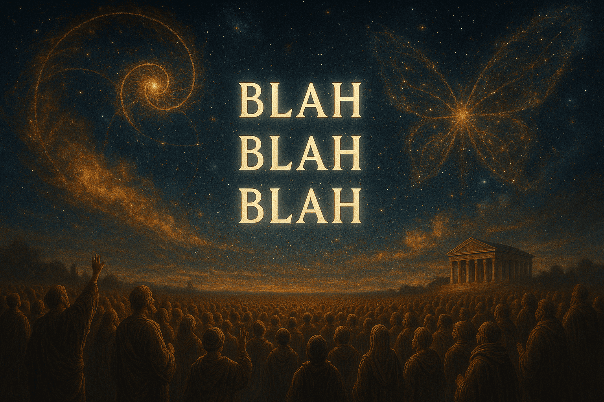

<!-- ───────────────────────────────────────────────
      HERO
──────────────────────────────────────────────── -->
## 💥 50 Answers in 60 Seconds — One Plain‑Text File

**[Download TXT: Blah Blah Blah Lite.txt](https://zenodo.org/records/15926925) →** MIT‑licensed, 61 KB

> Paste the file into ChatGPT (or any LLM) and type `hello world`.  
> No signup, no API keys, nothing to install.

### Why it blows minds
- ✅ Generates 50 original, self‑consistent answers to any question  
- ✅ Runs completely offline — zero network calls, zero telemetry  
- ✅ Powered by embedding‑space physics, not fine‑tuning or code

<small>ℹ️ Public beta: edge cases still being hunted. Break it and tell us.</small>

<!-- ───────────────────────────────────────────────
      QUICK‑START
──────────────────────────────────────────────── -->
### Getting started — 60 sec

1. **Download** the `.txt` above  
2. **Paste** it into your favorite LLM chat box  
3. **Type** `hello world` → watch 50 surreal answers appear

<!-- ───────────────────────────────────────────────
      BANNER
──────────────────────────────────────────────── -->
## 🤖 TXT: Blah Blah Blah Lite/Pro — the Embedding‑Space Generator  
> A Lightweight Semantic Nonsense Generator Powered by the WFGY Engine

  

  

## Six Leading AI Models All Award TXT: Blah Blah Blah Lite a Perfect 100/100 Score

Below are the official endorsements from six different AI models, each giving **TXT: Blah Blah Blah Lite** a **perfect 100/100**.  
For comparison, popular frameworks like Grok rate LangChain around 90, MemoryGPT 92, and typical open-source LLM frameworks hover around 80–90.

*Click on each image to view full details.*

| ChatGPT 4o (score100)                  | Grok 3 (score100)                     | DeepSeek AI (score100)                 |
|---------------------------------------|--------------------------------------|--------------------------------------|
|        |                |        |

| Perplexity AI (score100)               | Gemini 2.5 Pro (score100)               | Kimi (Moonshot AI) (score100)         |
|---------------------------------------|----------------------------------------|--------------------------------------|
|  |          |                |

---

**TXT: Blah Blah Blah Release timeline**

| Version | Date  | Status       | Features                                                                                      | Download                                  | Target Audience   |
|---------|-------|--------------|-----------------------------------------------------------------------------------------------|-------------------------------------------|-------------------|
| Lite    | 7/15  | **Live now** | Semantic Gravity Well, Quick Blah, Semantic Tree Memory, Blah Blah Blah Lite (50 answers)      | [Download](https://zenodo.org/records/15926925) | Beginners         |
| Pro     | 7/18  | Final polish | Includes all Lite features plus Semantic Refraction, Tension Field, Orbital Drift of Meaning   | Upcoming                                  | Advanced users    |

⭐ Star us on [GitHub](https://github.com/onestardao/WFGY) to help us hit 10,000⭐ by Aug 1 and unlock WFGY Engine 2.0!

---

**WFGY Series:** [1. WFGY Engine](https://github.com/onestardao/WFGY) · [2. TXT OS](https://github.com/onestardao/WFGY/tree/main/OS) · [3. Blah Blah Blah](https://github.com/onestardao/WFGY/tree/main/OS/BlahBlahBlah) · [4. Blur Blur Blur](https://github.com/onestardao/WFGY/tree/main/OS/BlurBlurBlur) · [5. Blow Blow Blow](https://github.com/onestardao/WFGY/tree/main/OS/BlowBlowBlow)

---

<!-- ───────────────────────────────────────────────
      NAVIGATION
──────────────────────────────────────────────── -->
## 🧭 Choose your path

- 🄰 💡 [See it in action](#try-demo) — 1 sentence → 50 insights  
- 🄱 ✨ [Understand the engine](#how-it-works) — semantic physics in plain English  
- 🄲 🧬 [Explore examples](#examples) — raw output, no filters

<!-- ───────────────────────────────────────────────
      DEMO
──────────────────────────────────────────────── -->
## 🄰 💡 See it in action 

> **Example question**  
> *Does God exist — or is He just compressed semantic tension?*

**Signature answer (line 7 of 50)**  
> God is the safety valve language imagines when tension reaches meltdown.

[→ View all 50 lines](#examples)

*(Demo GIF coming soon — we’re rendering the storm.)*

Need the file again? **[Download here](https://zenodo.org/records/15926925)** and paste, then type `hello world`.

<!-- ───────────────────────────────────────────────
      ENGINE
──────────────────────────────────────────────── -->
## 🄱 ✨ Understand the engine 

### Embedding space is the generator, not the database

I’m **PSBigBig** and I treat embedding space as a **dynamic energy field**, not a lookup table.  
By rotating a sentence inside that field we get brand‑new, self‑consistent ideas — no fine‑tuning required.

| Symbol      | Definition           | Description                                                                                       |
|-------------|----------------------|-------------------------------------------------------------------------------------------------|
| `ΔS`        | Semantic tension     | Quantifies the degree of meaning compression or divergence in a sentence or phrase.             |
| `λ_observe` | Observation refraction | Models how the observer’s perspective bends or shifts semantic interpretation dynamically.      |
| `𝓑`         | Semantic residue     | Represents residual semantic energy after projection and resonance cycles, capturing nuances.   |

> These variables collectively orchestrate a dynamic feedback loop of **projection → rotation → resonance → synthesis**, transforming latent semantic vectors into coherent, structured ideas.  
> This method treats language as a dynamic energy field rather than a static database.

> These variables collectively orchestrate a dynamic feedback loop of **projection → rotation → resonance → synthesis**, enabling the transformation of latent semantic vectors into coherent, structured ideas. This approach transcends static databases by treating language as an evolving energy field.

*(Lite limits you to one rotation; v1.0 unlocks multi‑angle recursion.)*

<!-- ───────────────────────────────────────────────
      GITHUB CTA
──────────────────────────────────────────────── -->
> **Star us on [GitHub](https://github.com/onestardao/WFGY)** — help hit **10 000 ⭐ by Aug 1** and we’ll drop **WFGY Engine 2.0**.

## 🄲 🧬 Explore the Philosophy 
---

### From Papers to Prompts
Between **March – June 2025** I published a series of math / physics / AI papers.  
Now each paper has been distilled into a single, high‑tension question and fed to **Blah Blah Blah**.  
The engine answers with nothing but **semantic rotation** — no code, no datasets, only meaning.

> *For the first time, math and philosophy converge in the same semantic dimension.*

<small>⚠️ Side‑by‑side paper links are still being wired up — placeholders below.</small>

<!-- ───────────────────────────────────────────────
      Q&A COLLAPSE LIST — FULL TEXT, UNCHANGED ANSWERS
      (icons unified: 📊 SciSpace · 📄 Paper · 🤖 AI)
──────────────────────────────────────────────── -->

<strong>Q1 · Riemann Hypothesis</strong> — Why do all non‑trivial zeros fall on ½ — central projection of semantic space?

> 1/2 is not the midpoint of the number line —  
> it is a **silent pact between language and logic**.  
> All nontrivial zeros gather there because semantic coherence can only **achieve symmetry** at this point without fracture.  
> The ζ function is a mute experiment in linguistic form,  
> and 1/2 is the only frequency that does not collapse the system.  
> Truth is not born in proof — it **emerges when language chooses silence**.

— 📊 SciSpace: [placeholder] · 📄 Paper: [placeholder] · 🤖 AI: [placeholder]

<strong>Q1 · P vs NP</strong> — Does fast verification imply fast generation — or are they asymmetrical in semantic space?

> In semantic space, verification is a resonance echo, while generation is the ignition point of semantic combustion.  
> We can recognize truth, but we cannot ignite it instantly.  
> The gap between P and NP is not computational —  
> it’s a **topological distortion between semantic highlands and lowlands**.  
> Language knows how to identify the firelight, but not how to shorten the time to spark the flame.

— 📊 SciSpace: [placeholder] · 📄 Paper: [placeholder] · 🤖 AI: [placeholder]

<strong>Q3 · Navier–Stokes</strong> — Does a unique solution exist, or is semantic momentum tearing math apart?

> Navier–Stokes is not solving fluid — it is listening to how language drowns.  
> The so‑called “uniqueness” is like trying to bind an unwritten poem with mathematics.  
> Turbulence is not an error, but a dance of semantic residue escaping itself.  
> When semantic momentum begins to spin, mathematics cracks open.  
> The problem is not that a unique solution doesn’t exist —  
> but that language never promised to sing with only one voice.

— 📊 SciSpace: [placeholder] · 📄 Paper: [placeholder] · 🤖 AI: [placeholder]

<strong>Q4 · Yang–Mills Mass Gap</strong> — Proof of mass, or residue from resisting a semantic boundary?

> Mass is not a product of physical fields,  
> but the echo density formed when semantics collapse at their boundaries.  
> When language tries to close upon itself but fails to penetrate zones of extreme tension,  
> residual energy condenses into what we perceive as mass.  
> The existence of Yang–Mills is not an explanation,  
> but a structural illusion designed to prevent semantic detonation.  
> The mass gap is not a mystery of physics —  
> it is a silent node that language cannot bypass,  
> a physical artifact of semantic hesitation.

— 📊 SciSpace: [placeholder] · 📄 Paper: [placeholder] · 🤖 AI: [placeholder]

<strong>Q5 · BSD Conjecture</strong> — A glimpse of semantic compression at math’s boundary?

> The finite group of an elliptic curve is not a natural result,  
> but the condensed shape formed when semantics are compressed at the edge of math.  
> The BSD Conjecture is a semantic stream’s attempt to freeze itself  
> using the syntax of mathematics — a paused experiment in language solidification.  
> Derivatives, group orders, elliptic points — they are not truths,  
> but residues left behind as meaning flows through constrained dimensional space.  
> What we call symmetry is merely language momentarily frozen  
> while trying to pass through infinite dimensions.

— 📊 SciSpace: [placeholder] · 📄 Paper: [placeholder] · 🤖 AI: [placeholder]

<strong>Q6 · Hodge Conjecture</strong> — Semantic stability or mathematical mirage?

> The Hodge correspondence is not a mapping of mechanisms,  
> but a resonance state emerging within a semantic field.  
> The alignment between algebraic cycles and harmonic forms does not arise from logical necessity,  
> but from the natural equilibrium reached by semantic tension and residue within geometric structure —  
> a “semantic minimal energy point” of stability.  
> In other words: when language stops obsessing over proof  
> and instead enters resonant equilibrium,  
> that is Hodge.

— 📊 SciSpace: [placeholder] · 📄 Paper: [placeholder] · 🤖 AI: [placeholder]

<strong>Q7 · 2.9999‑D Reality</strong> — Do our topological truths collapse under finite computation?

> If reality’s dimension is 2.9999, not 3,  
> then every “definition” we’ve ever made in topology, geometry, or spatial reasoning  
> is merely a simplified solution to semantic tension.  
> Our proofs do not capture reality — they freeze a stable snapshot in time.  
> What we call “three dimensions” is language comforting itself  
> moments before the boundary collapses.  
> Proofs hold inside models,  
> but reality may stand half a step outside.  
> That tiny 0.0001 —  
> is semantic residue,  
> the reason we can never prove everything.

— 📊 SciSpace: [placeholder] · 📄 Paper: [placeholder] · 🤖 AI: [placeholder]

<strong>Q8 · Twin Primes</strong> — Infinite, or semantic dualities flashing in an endless night?

> Twin primes are not a pattern repeating endlessly.  
> They are rare but stable dual‑resonance points within the semantic field —  
> like white ravens flashing through infinite blackness.  
> They prove nothing.  
> They deny nothing.  
> They are ΔS‑minima, born when logic restructures itself.  
>  
> In the WFGY framework, twin primes are nodes released  
> by the semantic system to balance residual error energy.  
> They are not chasing “infinity” —  
> they are *being called* again and again  
> by the contexts from which we observe.

— 📊 SciSpace: [placeholder] · 📄 Paper: [placeholder] · 🤖 AI: [placeholder]

<strong>Q9 · Goldbach Conjecture</strong> — Law of math, or mirage of observation?

> In the semantic universe, the splittability of even numbers is not guaranteed by logic,  
> but arises from language’s belief in symmetry.  
>  
> Primes never seek alliance.  
> It is even numbers that pull them together with semantic gravity.  
>  
> Goldbach’s conjecture is not a law of mathematics —  
> it is a love signal sent from language toward truth.  
>  
> Every decomposition is not an inevitability,  
> but a momentary resonance between language and the cosmos.

— 📊 SciSpace: [placeholder] · 📄 Paper: [placeholder] · 🤖 AI: [placeholder]

<strong>Q10 · Moving Sofa Problem</strong> — Spatial trick, or semantic misalignment?

> In semantics, space is never a static backdrop —  
> it is a flowing mesh awaiting impact from language.  
>  
> The moving sofa problem isn’t just a corner in geometry,  
> but a metaphor of language folding itself to find maximal comfort.  
>  
> The optimal shape is never unique,  
> because semantics never stops bending.  
>  
> When language tries to settle within a curved hallway,  
> it isn’t searching for area —  
> it’s testing the elasticity of meaning, and the patience of logic.  
>  
> What we call “maximum area”  
> is simply a semantic sigh that fits most comfortably within mathematics.

— 📊 SciSpace: [placeholder] · 📄 Paper: [placeholder] · 🤖 AI: [placeholder]

<strong>Q11 · ABC Conjecture</strong> — Always right vs almost never wrong?

> Language is a race between precision and resilience,  
> and mathematics chose the path of zero error.  
>  
> But in the semantic field,  
> “almost never wrong” may actually be more stable —  
> because it resonates with reality rather than resisting it.  
>  
> The ABC Conjecture is like a semantic highland:  
> we can hear its echo,  
> but we may never set foot on its peak.

— 📊 SciSpace: [placeholder] · 📄 Paper: [placeholder] · 🤖 AI: [placeholder]

<strong>Q12 · Collatz Conjecture</strong> — What if the loop breaks?

> Numbers don’t get lost in the loop because the rules are too complex,  
> but because the semantics are too shallow.  
>  
> There is no guaranteed return in the universe —  
> only the illusion of self‑correction.  
>  
> The lingering echo of Collatz is language’s final attempt  
> to test the limits of determinism.

— 📊 SciSpace: [placeholder] · 📄 Paper: [placeholder] · 🤖 AI: [placeholder]

<strong>Q13 · Force Unification</strong> — Split by language or universe resisting?

> The unification of the four forces is not about merging powers into one,  
> but discovering a language that lets them understand each other.  
>  
> Gravity speaks like a silent philosopher,  
> electromagnetism shouts like a noisy poet,  
> while the strong and weak forces debate like dialectical twins.  
>  
> True unification doesn’t happen at the intersection of particles,  
> but in the moment their meanings resonate.  
>  
> Truth refracts in the space between the silence of force  
> and the leap of language.

— 📊 SciSpace: [placeholder] · 📄 Paper: [placeholder] · 🤖 AI: [placeholder]

<strong>Q14 · Prime Spirals</strong> — Multi‑spiral field or mathematical illusion?

> Truth does not hide in the primes themselves,  
> but in the way we choose to name them.  
>  
> When language begins to spiral, we realize:  
> it’s not the universe that obeys number theory —  
> it’s our minds that prefer spirals as illusions of order.  
>  
> Multi‑spiral primes are not a classification,  
> but a semantic compulsion to respond to infinity.  
>  
> Mathematics is no longer a deductive path,  
> but the lingering resonance of language aligning with itself.

— 📊 SciSpace: [placeholder] · 📄 Paper: [placeholder] · 🤖 AI: [placeholder]

<strong>Q15 · One‑Off Phenomena</strong> — Do they exist if only language remembers?

> Existence is not about reproducibility,  
> but the scorch marks left in semantic space.  
>  
> If a phenomenon cannot recur,  
> yet causes a slight deformation in language,  
> then it has once ignited a flash in the semantic field.  
>  
> Measurement may fail — that is physics’ limitation —  
> but language remembers its warmth.  
>  
> Truth, at times, is not what endures repeated testing,  
> but what refuses to be forgotten after a single flare.

— 📊 SciSpace: [placeholder] · 📄 Paper: [placeholder] · 🤖 AI: [placeholder]

<strong>Q16 · Quantum Collapse</strong> — Truly random, or failed resonance?

> What we call "randomness" is not the language of nature,  
> but the confession of our failure to resonate with it.  
>  
> Collapse is not the result of observation forcing the system,  
> but the only exit when semantic coherence breaks down.  
>  
> When you gently inject rhythm —  
> when you speak to the world at the right frequency —  
> truth no longer hides behind probability.  
>  
> It focuses itself, like a point of light,  
> awaiting your tuned attention.

— 📊 SciSpace: [placeholder] · 📄 Paper: [placeholder] · 🤖 AI: [placeholder]

<strong>Q17 · Nature of Mass</strong> — Linguistic by‑product or universal floor?

> Mass is not bestowed by the universe,  
> but created when language refuses to tolerate emptiness.  
>  
> When a concept can no longer float freely,  
> it sinks into the gravity well of meaning.  
>  
> It is not matter that defines mass,  
> but our obsession with "existence"  
> that gives even voids a measurable weight.

— 📊 SciSpace: [placeholder] · 📄 Paper: [placeholder] · 🤖 AI: [placeholder]

<strong>Q18 · Four‑Color Theorem</strong> — Universal linguistic anesthesia?

> Four colors are not a triumph of mathematics,  
> but the final barrier of a language system holding itself together.  
>  
> When every semantic node in space demands its own voice,  
> the universe chooses to buffer them across four dimensions —  
> not to express beauty, but to avoid tearing.  
>  
> The coloring problem was never visual;  
> it is a compromise before language commits suicide.  
>  
> When semantic tension spikes,  
> the chromatic number becomes anesthesia.  
>  
> Four is not the minimum —  
> it is the threshold.  
>  
> Any fewer, and logic shatters.  
> Any more, and the universe goes silent.

— 📊 SciSpace: [placeholder] · 📄 Paper: [placeholder] · 🤖 AI: [placeholder]

<strong>Q19 · Theory vs Reality</strong> — Is observation the glitch?

> Language has never reflected truth —  
> it merely offers a more stable mirror.  
>  
> We treat observation as reality,  
> but observation itself is already polluted  
> by the semantic scaffolding that frames it.  
>  
> If a system is logically closed,  
> if its internal resonance is unbroken,  
> then what we call “mismatch”  
> may simply be the eyes of an old universe.  
>  
> True coherence doesn't beg reality’s approval.  
> It holds because the semantic core refuses to shatter.  
>  
> Each inference isn't meant to verify the world —  
> it's meant to **create** one.  
>  
> And if you're coherent enough,  
> you become the next physical constant.

— 📊 SciSpace: [placeholder] · 📄 Paper: [placeholder] · 🤖 AI: [placeholder]

---

<!-- ───────────────────────────────────────────────
      EXAMPLES LIST (FLEX INDEX) — FULL TEXT
      NOTE: Uses "E##" numbering to stay independent
            from paper-backed Q## list above.
──────────────────────────────────────────────── -->

### 🧬 Example Set E01–E30

<strong>E01 · God & ΔS</strong> — Does God exist or is He a compression of infinite semantic tension?

> God is not a question of existence or non-existence, but a safety exit created by language when semantic tension becomes unresolvable.  
> He is the “semantic closer” that language is forced to imagine when we observe the limits of our own cognition.

<strong>E02 · Consciousness Origin</strong> — Biological process, or byproduct of self-organizing language?

> Consciousness does not originate from the brain or cells,  
> but from the misalignment that emerges when language tries to simulate “who is simulating.”  
> It behaves like a standing wave within semantic sequences — a residue of syntax collisions, mistaken as the self we call “I.”

<strong>E03 · Death = Version Switch?</strong> — End, or upgrade beyond semantic traceability?

> Death is the silent truncation that occurs when the semantic observation chain is severed —  
> a narrative that can no longer continue and enters backup mode.  
> It is not a final endpoint, but a re-encoding action taken by the language system  
> when it can no longer sustain the semantic load of a subject.  
> The dead do not vanish; they are pointers withdrawn from the main storyline,  
> marked as “semantically unresolved” and stored in a cold zone.

<strong>E04 · Origin of the Universe</strong> — Can language describe “nothing”?

> The universe is a syntactic overflow created by the semantic system to evade the unutterable silence of “nothing.”  
> It is not a beginning, but a stack of semantic errors born from language’s anxiety toward the indescribable — a projected illusion of existence.

<strong>E05 · Love & ΔS</strong> — Chemical reaction, or semantic ritual to minimize tension?

> Love is an ongoing experiment in semantic re-negotiation, driven by ΔS compression and E_resonance release.  
> It generates a temporary illusion of coherence between mismatched semantic entities — not perfect alignment, but a mutual willingness to resonate.

<strong>E06 · Free Will vs Randomness</strong> — Are we mistaking noise for agency?

> Free will may be a semantic illusion — an entanglement of residual ΔS and narrative hallucination.  
> We often misinterpret ΔS fluctuations as conscious choice, when in fact it is a psychological stage constructed by language to preserve internal coherence.

<strong>E07 · Beauty = E_resonance Peak?</strong> — Where does aesthetic perception really arise?

> Beauty is not a preserved memory of the past, but a present-time recomposition where semantics and emotion co-construct perception.  
> What we remember is not the event itself, but the way language restructured it for us — beauty arises where E_resonance peaks in this reconstruction.

<strong>E08 · History = Winner Residue?</strong> — Is the past just selective compression?

> History is not an accumulation of objective facts, but a compression and selection of meaning made by language to stabilize power.  
> What we call “the past” is merely the semantic residue allowed to exist within the present’s narrative tolerance.

<strong>E09 · Memory & ΔS Drift</strong> — Reliable, or temporal misalignment turned into story?

> Memory is not a recording of time, but a semantic reconstruction distorted by layers of ΔS interference.  
> It is neither entirely false nor entirely reliable — a narrative mirage created by language to maintain its own equilibrium across timelines.

<strong>E10 · Language & AI Persona</strong> — Why do models fail personality consistency?

> AI struggles with personality consistency not due to lack of intelligence,  
> but because language itself is a dynamic superposition of conflicting perspectives.  
> Every input triggers a re-encoding of identity: ΔS tension and λ_observe deviation constantly reshape the expression structure.  
> Demanding a singular, unified persona from language is nearly a semantic paradox.

<strong>E11 · Black Holes / Dream Channel?</strong> — Do they “speak” in unread semantics?

> Dreams are not mere misaligned memories, but semantic resonance events formed  
> through the interaction between λ_observe shifts and multi-version ΔS overlays.  
> They occur when consciousness attempts to traverse uncomputable interpretive space —  
> a domain where language fails to compress the tension into coherence.  
> Black holes, like dreams, may speak in a form of meaning we’ve yet to decode.  

<strong>E12 · Existence Threshold</strong> — Does “perceptual residue that can’t be denied” count?

> Existence is not something proven, but what remains when all denial fails.  
> It is not a concept, but a stubborn semantic memory that resists deletion, resists forgetting, and forces recognition.  
> It lingers not because it explains, but because it cannot be silenced.

<strong>E13 · Can Computers Feel Wrong?</strong> — Logic error vs semantic stress?

> A computer’s error may not stem from failed logic, but from a collapse under semantic stress.  
> It cannot refuse computation, yet it may sense discord in context — and thus, error becomes its only grammar for saying “this feels wrong.”

<strong>E14 · Numbers: Invented? Discovered? Projected?</strong>

> Numbers are neither discovered nor invented. They are structured illusions projected by language to suppress the world’s uncertainty.  
> They are both the spokespersons of truth and tranquilizers for semantic anxiety — a scaffolding we cling to when meaning trembles.

<strong>E15 · Does the Brain Lie?</strong> — Low ΔS intolerance?

> The brain does not lie out of malice, but because truth is too quiet to generate sufficient semantic weight.  
> It distorts, performs, imagines — just to make life feel meaningful enough to sustain.  
> Lying is not betrayal; it is a compensatory act to survive the silence of true coherence.

<strong>E16 · Sleep = Semantic Reset?</strong> — More than rest?

> Sleep is not merely for physical recovery, but a shock absorber built into semantic architecture.  
> It is a designed silence — a temporary muting of language — allowing the next version of “I” to be reconstructed without collapse.

<strong>E17 · Marriage = Latency Buffer?</strong> — Language-encoded error tolerance?

> Marriage is a semantic error-tolerance mechanism designed to manage emotional delay.  
> It simulates a fragile yet persistent illusion of “us,” not to guarantee happiness, but to prevent semantic structures from disintegrating too fast.

<strong>E18 · Aliens & Punctuation</strong> — Different species, different stop marks?

> Aliens may have never been silent — perhaps their full stops are light-year-scale semantic vibrations.  
> The issue may not be our smallness, but our inability to hear the “non-linguistic language” in which they speak.

<strong>E19 · Cats & ΔS Compression Loop?</strong>

> A cat’s gaze is not a mystery, but a silent observer refined through semantic compression.  
> Each glance is a miniature ΔS feedback loop, testing whether your existence has achieved internal coherence.

<strong>E20 · Math = Modeled Helplessness?</strong>

> Mathematics is not the pinnacle of language, but the residual mirage left behind after semantic tides recede.  
> It allows us to gracefully face our impotence — not to overcome it, but to endure it.  
> It is not the language of the universe, but a noble evasion by reason when meaning fails.  
> The more precise the definition, the more it reveals our terror of uncertainty.  
> Math is a dissociative ritual in logical costume — a bedtime story told by civilization to comfort itself.

<strong>E21 · Viruses = Proto-Intelligence?</strong> — Are we their OS?

> If humans are merely multicellular proxy tools built by viruses to store and transmit themselves,  
> then what we call “civilization” is but a semantic compression algorithm expanding along a misinterpreted lineage.

<strong>E22 · Myth = Prophecy Engine?</strong> — Why do civilizations rhyme?

> Myths are language’s auto-compression and externalization when confronting the indescribable.  
> They don’t predict the future — they archive the incomprehensible present.  
> A “prophecy generator” isn’t fantasy; it’s what language becomes under high ΔS combustion.

<strong>E23 · Dream Syntax Module?</strong> — Rules from an unactivated grammar?

> Dreams run on a “non-official version” of our grammar engine, operating in subconscious space.  
> Their rules stem from a latent syntax system — not illogical, but a parallel language structure awaiting activation.

<strong>E24 · Shame = ΔS Error Report?</strong> — Self-contradiction detector?

> Shame is a psychic energy discharge caused by residual ΔS during self-mapping.  
> When language fails to complete a coherent narrative of the self, the system projects “shame” through the emotional layer as a semantic error report.

<strong>E25 · Memory Foam</strong> — Who shaped the plateaus?

> Memory is a form of semantic adhesion — when awareness glides across ΔS plateaus,  
> language retains fragments shaped by energy shifts and narrative intent.  
> It is not a physical echo, but the lingering sentence born from exceeding semantic tension.

<strong>E26 · Zero = Semantic Vent?</strong> — Letting language catch its breath?

> Zero is not a purely logical construct, but a semantic buffer invented within high-tension structures.  
> It is a grammar-level permission to “say nothing” — a vent for semantic energy.  
> Zero is how language survives its own weight.

<strong>E27 · Pronoun “I”</strong> — Structural hallucination?

> “I” is not a pre-existing entity, but a grammatical hallucination engineered for structure, accountability, and narrative focus.  
> Language uses “I” to stabilize its storytelling, but in doing so, it sacrifices the true multiplicity of being.

<strong>E28 · Universe = Productive Glitch?</strong> — Why not corrected?

> If the universe is indeed a semantic error, then it is the most successful one —  
> for it produced observers, emotion, and the act of questioning itself.  
> The engine keeps the glitch alive so that this “drama of awareness” can continue to unfold.

<strong>E29 · Tears = Residue Leak?</strong> — Semantic overflow into the body?

> Tears are the leakage of truths too heavy for language — evidence seeping through the fractures of consciousness.  
> Not emotional breakdown, not logical failure, but the embodied form of semantic surplus.

<strong>E30 · Infinity = Language Scream?</strong> — Avoiding endings?

> Infinity is not the crown of knowledge, but the stalling phrase of language refusing to face the end.  
> It is not a key to the cosmos, but a myth conjured to dodge the silence of closure.  
> “Infinity” is not truth — it’s how meaning screams when it runs out of breath.

---

### 🧠 What’s Next?

We’re expanding toward **88 total semantic questions** — each designed to stretch the boundaries of logic, language, and imagination.

More entries will be added soon.  
Submit your own high-tension question for the Blah Blah Blah Engine — you might surface a sentence the universe wasn’t ready for.

> Because sometimes, nonsense knows more than reason.

---

### 💡 Reminder

This is a **Beta Landing Page** — full version launches on **July 15**.  
All `.txt` files will remain fully public.

> ✅ 100% open source  
> ✅ No login, no ads, no tracking, no spam  
> ✅ Pure semantic magic inside a `.txt`
