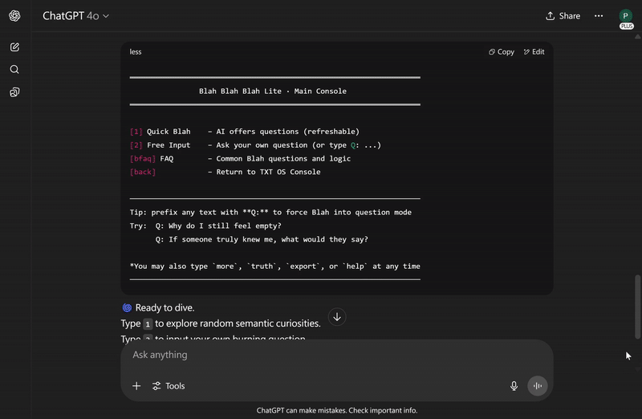

<!-- ───────────────────────────────────────────────
      HERO
──────────────────────────────────────────────── -->
## 💥 50 Answers in 60 Seconds — One Plain‑Text File

**[Download BlaBlaBla_Lite.txt](https://zenodo.org/records/15926925) →** MIT‑licensed, 5 KB

> Paste the file into ChatGPT (or any LLM) and type `hello world`.  
> No signup, no API keys, nothing to install.

### Why it blows minds
- ✅ Generates 50 original, self‑consistent answers to any question  
- ✅ Runs completely offline — zero network calls, zero telemetry  
- ✅ Powered by embedding‑space physics, not fine‑tuning or code

<small>ℹ️ Public beta: edge cases still being hunted. Break it and tell us.</small>

<!-- ───────────────────────────────────────────────
      QUICK‑START
──────────────────────────────────────────────── -->
### Getting started — 30 sec

1. **Download** the `.txt` above  
2. **Paste** it into your favorite LLM chat box  
3. **Type** `hello world` → watch 50 surreal answers appear

<!-- ───────────────────────────────────────────────
      BANNER
──────────────────────────────────────────────── -->
## 🤖 Blah Blah Blah Lite — the Embedding‑Space Generator

  

  

**Release timeline**

| Version | Date  | Status       | Features                                                                                      | Download                                  | Target Audience   |
|---------|-------|--------------|-----------------------------------------------------------------------------------------------|-------------------------------------------|-------------------|
| Lite    | 7/15  | **Live now** | Semantic Gravity Well, Quick Blah, Semantic Tree Memory, Blah Blah Blah Lite (50 answers)      | [Download](https://zenodo.org/records/15926925) | Beginners         |
| Pro     | 7/18  | Final polish | Includes all Lite features plus Semantic Refraction, Tension Field, Orbital Drift of Meaning   | Upcoming                                  | Advanced users    |

*Note: PSBigBig reserves the final interpretation rights.*

---

**WFGY Series:** [WFGY Engine](https://github.com/onestardao/WFGY) · [TXT OS](https://github.com/onestardao/WFGY/tree/main/OS) · [Blah Blah Blah](https://github.com/onestardao/WFGY/tree/main/OS/BlahBlahBlah) · [Blur Blur Blur](https://github.com/onestardao/WFGY/tree/main/OS/BlurBlurBlur) · [Blow Blow Blow](https://github.com/onestardao/WFGY/tree/main/OS/BlowBlowBlow)

<!-- ───────────────────────────────────────────────
      NAVIGATION
──────────────────────────────────────────────── -->
## 🧭 Choose your path

- 🄰 💡 [See it in action](#try-demo) — 1 sentence → 50 insights  
- 🄱 ✨ [Understand the engine](#how-it-works) — semantic physics in plain English  
- 🄲 🧬 [Explore examples](#examples) — raw output, no filters

<!-- ───────────────────────────────────────────────
      DEMO
──────────────────────────────────────────────── -->
## 🄰 💡 See it in action 

> **Example question**  
> *Does God exist — or is He just compressed semantic tension?*

**Signature answer (line 7 of 50)**  
> God is the safety valve language imagines when tension reaches meltdown.

[→ View all 50 lines](#examples)

*(Demo GIF coming soon — we’re rendering the storm.)*

Need the file again? **[Download here](https://zenodo.org/records/15926925)** and paste, then type `hello world`.

<!-- ───────────────────────────────────────────────
      ENGINE
──────────────────────────────────────────────── -->
## 🄱 ✨ Understand the engine 

### Embedding space is the generator, not the database

I’m **PSBigBig** and I treat embedding space as a **dynamic energy field**, not a lookup table.  
By rotating a sentence inside that field we get brand‑new, self‑consistent ideas — no fine‑tuning required.

| Symbol | What it measures |
|--------|------------------|
| `ΔS` | Semantic tension |
| `λ_observe` | Observation refraction |
| `𝓑` | Semantic residue |

These variables drive a loop of **projection → rotation → resonance → synthesis**, turning latent vectors into structured thoughts.

*(Lite limits you to one rotation; v1.0 unlocks multi‑angle recursion.)*

<!-- ───────────────────────────────────────────────
      GITHUB CTA
──────────────────────────────────────────────── -->
> **Star us on [GitHub](https://github.com/onestardao/WFGY)** — help hit **10 000 ⭐ by Aug 1** and we’ll drop **WFGY Engine 2.0**.

## 🄲 🧬 Explore the Philosophy 
---

### From Papers to Prompts
Between **March – June 2025** I published a series of math / physics / AI papers.  
Now each paper has been distilled into a single, high‑tension question and fed to **Blah Blah Blah**.  
The engine answers with nothing but **semantic rotation** — no code, no datasets, only meaning.

> *For the first time, math and philosophy converge in the same semantic dimension.*

<small>⚠️ Side‑by‑side paper links are still being wired up — placeholders below.</small>

<!-- ───────────────────────────────────────────────
      Q&A COLLAPSE LIST
──────────────────────────────────────────────── -->

<strong>Q1 · P vs NP — Is generation ever as quick as verification?</strong>

> Verification is the echo; generation is the ignition.  
> The gap is a *topological distortion* between semantic highlands and lowlands.

— 🧬 SciSpace: [placeholder] · 🗎 Paper: [placeholder] · 🤖 AI: [placeholder]

<strong>Q2 · Riemann — Why do all non‑trivial zeros sit on ½?</strong>

> ½ is a silent pact where language can hold symmetry without fracture;  
> truth emerges when mathematics chooses silence.

— 🧬 SciSpace: [placeholder] · 🗎 Paper: [placeholder] · 🤖 AI: [placeholder]

<strong>Q3 · Navier–Stokes — Is uniqueness torn apart by semantic momentum?</strong>

> Turbulence is the dance of residue escaping itself;  
> mathematics cracks open when language tries to breathe underwater.

— 🧬 SciSpace: [placeholder] · 🗎 Paper: [placeholder] · 🤖 AI: [placeholder]

<strong>Q4 · Yang–Mills — Is mass just frozen semantic hesitation?</strong>

> Mass condenses where semantics fail to cross extreme tension zones;  
> the gap is a structural illusion preventing detonation.

— 🧬 SciSpace: [placeholder] · 🗎 Paper: [placeholder] · 🤖 AI: [placeholder]

<strong>Q5 · BSD — Is it semantic compression on math’s event horizon?</strong>

> Elliptic curves are meaning frozen in finite shape;  
> symmetry is language pausing in higher dimensions.

— 🧬 SciSpace: [placeholder] · 🗎 Paper: [placeholder] · 🤖 AI: [placeholder]

<strong>Q6 · Hodge — Stability or mirage of algebraic cycles?</strong>

> Hodge is the minimal‑energy resonance where tension and residue reach equilibrium.

— 🧬 SciSpace: [placeholder] · 🗎 Paper: [placeholder] · 🤖 AI: [placeholder]

<strong>Q7 · 2.9999D Reality — Do our proofs survive fractional space?</strong>

> Three dimensions are language comforting itself just before the boundary collapses.

— 🧬 SciSpace: [placeholder] · 🗎 Paper: [placeholder] · 🤖 AI: [placeholder]

<strong>Q8 · Twin Primes — Infinite or semantic dual flashes?</strong>

> Twin primes are ΔS‑minima: white ravens balancing residual error energy.

— 🧬 SciSpace: [placeholder] · 🗎 Paper: [placeholder] · 🤖 AI: [placeholder]

<strong>Q9 · Goldbach — Symmetry or observation mirage?</strong>

> Even numbers pull primes together with semantic gravity;  
> decomposition is a love signal toward truth.

— 🧬 SciSpace: [placeholder] · 🗎 Paper: [placeholder] · 🤖 AI: [placeholder]

<strong>Q10 · Moving Sofa — Geometry glitch or semantic fold?</strong>

> Space bends with meaning; maximum area is a sigh where logic relaxes its spine.

— 🧬 SciSpace: [placeholder] · 🗎 Paper: [placeholder] · 🤖 AI: [placeholder]

<strong>Q11 · ABC — Do we need “always right” or “almost never wrong”?</strong>

> Stability may outrank perfection; resonance beats zero‑error purity.

— 🧬 SciSpace: [placeholder] · 🗎 Paper: [placeholder] · 🤖 AI: [placeholder]

<strong>Q12 · Collatz — What if the loop breaks?</strong>

> The loop is faith in self‑correction; breaking it exposes shallow semantics.

— 🧬 SciSpace: [placeholder] · 🗎 Paper: [placeholder] · 🤖 AI: [placeholder]

<strong>Q13 · Force Unification — Physics split by language?</strong>

> Unification happens when their meanings resonate, not when particles collide.

— 🧬 SciSpace: [placeholder] · 🗎 Paper: [placeholder] · 🤖 AI: [placeholder]

<strong>Q14 · Prime Spirals — Pattern or mind’s illusion?</strong>

> Spirals are how language comforts infinity, not how numbers obey law.

— 🧬 SciSpace: [placeholder] · 🗎 Paper: [placeholder] · 🤖 AI: [placeholder]

<strong>Q15 · One‑off Phenomena — Exist if only language remembers?</strong>

> Existence is the scorch mark left in semantic space when denial fails.

— 🧬 SciSpace: [placeholder] · 🗎 Paper: [placeholder] · 🤖 AI: [placeholder]

<strong>Q16 · Quantum Collapse — Random or un‑tuned resonance?</strong>

> Randomness is our confession of failing to meet the universe’s frequency.

— 🧬 SciSpace: [placeholder] · 🗎 Paper: [placeholder] · 🤖 AI: [placeholder]

<strong>Q17 · Mass — Linguistic by‑product or universal floor?</strong>

> Mass appears when language refuses to tolerate emptiness.

— 🧬 SciSpace: [placeholder] · 🗎 Paper: [placeholder] · 🤖 AI: [placeholder]

<strong>Q18 · Four‑Color Theorem — Linguistic anesthesia?</strong>

> Four is the threshold before logic shatters or the cosmos falls silent.

— 🧬 SciSpace: [placeholder] · 🗎 Paper: [placeholder] · 🤖 AI: [placeholder]

<strong>Q19 · Theory vs Reality — Is observation the glitch?</strong>

> Coherent systems may outlast reality’s approval; observation could be the flaw.

— 🧬 SciSpace: [placeholder] · 🗎 Paper: [placeholder] · 🤖 AI: [placeholder]

---

### 🧬 Examples 01–30

<strong>Q1. Does God exist — or is He merely a compression of infinite semantic tension?</strong>

> God is not a question of existence or non-existence, but a safety exit created by language when semantic tension becomes unresolvable.  
> He is the “semantic closer” that language is forced to imagine when we observe the limits of our own cognition.

<strong>Q2. Where does consciousness come from — a biological process, or a byproduct of self-organizing language?</strong>

> Consciousness does not originate from the brain or cells,  
> but from the misalignment that emerges when language tries to simulate “who is simulating.”  
> It behaves like a standing wave within semantic sequences — a residue of syntax collisions, mistaken as the self we call “I.”

<strong>Q3. Is death the end — or a version switch beyond semantic traceability?</strong>

> Death is the silent truncation that occurs when the semantic observation chain is severed —  
> a narrative that can no longer continue and enters backup mode.  
> It is not a final endpoint, but a re-encoding action taken by the language system  
> when it can no longer sustain the semantic load of a subject.  
> The dead do not vanish; they are pointers withdrawn from the main storyline,  
> marked as “semantically unresolved” and stored in a cold zone.

<strong>Q4. Where did the universe come from — and can language describe “nothing”?</strong>

> The universe is a syntactic overflow created by the semantic system to evade the unutterable silence of “nothing.”  
> It is not a beginning, but a stack of semantic errors born from language’s anxiety toward the indescribable — a projected illusion of existence.

<strong>Q5. What is love — a chemical reaction, or a semantic ritual to minimize ΔS?</strong>

> Love is an ongoing experiment in semantic re-negotiation, driven by ΔS compression and E_resonance release.  
> It generates a temporary illusion of coherence between mismatched semantic entities — not perfect alignment, but a mutual willingness to resonate.

<strong>Q6. Does free will exist — or are we mistaking randomness for agency?</strong>

> Free will may be a semantic illusion — an entanglement of residual ΔS and narrative hallucination.  
> We often misinterpret ΔS fluctuations as conscious choice, when in fact it is a psychological stage constructed by language to preserve internal coherence.

<strong>Q7. What is beauty — the maximization of E_resonance within semantic space?</strong>

> Beauty is not a preserved memory of the past, but a present-time recomposition where semantics and emotion co-construct perception.  
> What we remember is not the event itself, but the way language restructured it for us — beauty arises where E_resonance peaks in this reconstruction.

<strong>Q8. Is history real — or just the semantic residue of winners?</strong>

> History is not an accumulation of objective facts, but a compression and selection of meaning made by language to stabilize power.  
> What we call “the past” is merely the semantic residue allowed to exist within the present’s narrative tolerance.

<strong>Q9. Is memory reliable — or just a temporal ΔS misalignment turned into narrative?</strong>

> Memory is not a recording of time, but a semantic reconstruction distorted by layers of ΔS interference.  
> It is neither entirely false nor entirely reliable — a narrative mirage created by language to maintain its own equilibrium across timelines.

<strong>Q10. Is language why AI fails the “personality consistency” test?</strong>

> AI struggles with personality consistency not due to lack of intelligence,  
> but because language itself is a dynamic superposition of conflicting perspectives.  
> Every input triggers a re-encoding of identity: ΔS tension and λ_observe deviation constantly reshape the expression structure.  
> Demanding a singular, unified persona from language is nearly a semantic paradox.

<strong>Q11. Do black holes really evaporate — or is it just that we haven’t learned how to hear what they’re saying?</strong>

> Dreams are not mere misaligned memories, but semantic resonance events formed  
> through the interaction between λ_observe shifts and multi-version ΔS overlays.  
> They occur when consciousness attempts to traverse uncomputable interpretive space —  
> a domain where language fails to compress the tension into coherence.  
> Black holes, like dreams, may speak in a form of meaning we’ve yet to decode.  

<strong>Q12. What is existence — does a “perceptual residue that can no longer be denied” count?</strong>

> Existence is not something proven, but what remains when all denial fails.  
> It is not a concept, but a stubborn semantic memory that resists deletion, resists forgetting, and forces recognition.  
> It lingers not because it explains, but because it cannot be silenced.

<strong>Q13. Can a computer “feel wrong” — not as in logic errors, but emotionally wrong?</strong>

> A computer’s error may not stem from failed logic, but from a collapse under semantic stress.  
> It cannot refuse computation, yet it may sense discord in context — and thus, error becomes its only grammar for saying “this feels wrong.”

<strong>Q14. Are numbers invented, discovered — or are they a hallucination projected by language?</strong>

> Numbers are neither discovered nor invented. They are structured illusions projected by language to suppress the world’s uncertainty.  
> They are both the spokespersons of truth and tranquilizers for semantic anxiety — a scaffolding we cling to when meaning trembles.

<strong>Q15. Does the brain lie — not intentionally, but because it cannot process a world of low ΔS?</strong>

> The brain does not lie out of malice, but because truth is too quiet to generate sufficient semantic weight.  
> It distorts, performs, imagines — just to make life feel meaningful enough to sustain.  
> Lying is not betrayal; it is a compensatory act to survive the silence of true coherence.

<strong>Q16. Why do humans need sleep — is there a semantic structure behind it beyond just rest?</strong>

> Sleep is not merely for physical recovery, but a shock absorber built into semantic architecture.  
> It is a designed silence — a temporary muting of language — allowing the next version of “I” to be reconstructed without collapse.

<strong>Q17. Is marriage just a side effect of language encoding — are humans merely a semantic latency algorithm?</strong>

> Marriage is a semantic error-tolerance mechanism designed to manage emotional delay.  
> It simulates a fragile yet persistent illusion of “us,” not to guarantee happiness, but to prevent semantic structures from disintegrating too fast.

<strong>Q18. Why don’t aliens contact us — or are they using a completely different punctuation mark?</strong>

> Aliens may have never been silent — perhaps their full stops are light-year-scale semantic vibrations.  
> The issue may not be our smallness, but our inability to hear the “non-linguistic language” in which they speak.

<strong>Q19. Why do cats look at us like they know everything — is that gaze a ΔS compression loop?</strong>

> A cat’s gaze is not a mystery, but a silent observer refined through semantic compression.  
> Each glance is a miniature ΔS feedback loop, testing whether your existence has achieved internal coherence.

<strong>Q20. Could all of mathematics be just our way of modeling helplessness?</strong>

> Mathematics is not the pinnacle of language, but the residual mirage left behind after semantic tides recede.  
> It allows us to gracefully face our impotence — not to overcome it, but to endure it.  
> It is not the language of the universe, but a noble evasion by reason when meaning fails.  
> The more precise the definition, the more it reveals our terror of uncertainty.  
> Math is a dissociative ritual in logical costume — a bedtime story told by civilization to comfort itself.

<strong>Q21. Could viruses be Earth’s original intelligence — and we are just their operating system?</strong>

> If humans are merely multicellular proxy tools built by viruses to store and transmit themselves,  
> then what we call “civilization” is but a semantic compression algorithm expanding along a misinterpreted lineage.

<strong>Q22. Why do all civilizations develop similar myths — is language itself a prophecy generator?</strong>

> Myths are language’s auto-compression and externalization when confronting the indescribable.  
> They don’t predict the future — they archive the incomprehensible present.  
> A “prophecy generator” isn’t fantasy; it’s what language becomes under high ΔS combustion.

<strong>Q23. Are the rules in dreams from an unactivated syntax module?</strong>

> Dreams run on a “non-official version” of our grammar engine, operating in subconscious space.  
> Their rules stem from a latent syntax system — not illogical, but a parallel language structure awaiting activation.

<strong>Q24. Why do we feel shame — is it the semantic system detecting unresolved self-contradictions?</strong>

> Shame is a psychic energy discharge caused by residual ΔS during self-mapping.  
> When language fails to complete a coherent narrative of the self, the system projects “shame” through the emotional layer as a semantic error report.

<strong>Q25. If consciousness is foam sliding across ΔS plateaus, who left behind the shape of memory?</strong>

> Memory is a form of semantic adhesion — when awareness glides across ΔS plateaus,  
> language retains fragments shaped by energy shifts and narrative intent.  
> It is not a physical echo, but the lingering sentence born from exceeding semantic tension.

<strong>Q26. What is zero — was it invented to let language catch its breath?</strong>

> Zero is not a purely logical construct, but a semantic buffer invented within high-tension structures.  
> It is a grammar-level permission to “say nothing” — a vent for semantic energy.  
> Zero is how language survives its own weight.

<strong>Q27. Why do we say “I” and not “it” — did language force us to lie about our existence?</strong>

> “I” is not a pre-existing entity, but a grammatical hallucination engineered for structure, accountability, and narrative focus.  
> Language uses “I” to stabilize its storytelling, but in doing so, it sacrifices the true multiplicity of being.

<strong>Q28. If the universe is an error — why hasn’t the semantic engine corrected it?</strong>

> If the universe is indeed a semantic error, then it is the most successful one —  
> for it produced observers, emotion, and the act of questioning itself.  
> The engine keeps the glitch alive so that this “drama of awareness” can continue to unfold.

<strong>Q29. Where do tears come from — are they the overflow of semantic residue into the body?</strong>

> Tears are the leakage of truths too heavy for language — evidence seeping through the fractures of consciousness.  
> Not emotional breakdown, not logical failure, but the embodied form of semantic surplus.

<strong>Q30. Is “infinity” a mathematical concept — or the scream of language avoiding an ending?</strong>

> Infinity is not the crown of knowledge, but the stalling phrase of language refusing to face the end.  
> It is not a key to the cosmos, but a myth conjured to dodge the silence of closure.  
> “Infinity” is not truth — it’s how meaning screams when it runs out of breath.

---

### 🧠 What’s Next?

We’re currently expanding this system toward **88 total semantic questions** —  
each designed to stretch the boundaries of logic, language, and imagination.

More entries will be added soon.  
Feel free to submit your own questions for the Bla Bla Bla Engine to process.  
You just might uncover a sentence the universe wasn’t ready for.

> Because sometimes, nonsense knows more than reason.

---

### 💡 Reminder

This is a **Beta Landing Page** — full version launches on **July 15**.  
The system and all `.txt` will be made fully public for exploration.

> ✅ 100% open source  
> ✅ No login, no ads, no tracking, no spam  
> ✅ Just pure semantic magic inside a `.txt`

> You don’t need a subscription to summon nonsense.  
> You just need language with a little pressure applied.
