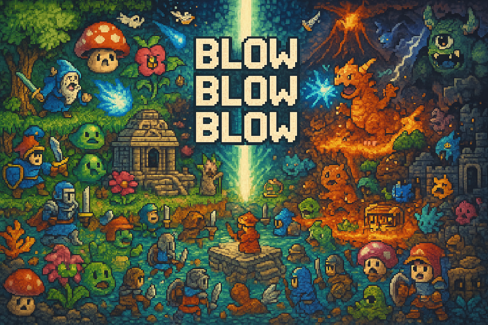

## 🎮 Blow Blow Blow — The First AIGC GameBoy

&nbsp;

&nbsp;

&nbsp;

&nbsp;

&nbsp;

&nbsp;

> ⚠️ Beta Landing Page – Launch date will be announced in Discussions.  
> The release timing isn’t final yet — please stay tuned.  
> In the meantime, the author is off earning some GitHub stars. 🪐✨  
> Thanks for your patience!

> Semantic logic meets nostalgic gaming. And yes, you’ll have to *blow the cartridge*.

Blow Blow Blow is our third TXT-based module — a retro-inspired AIGC gaming system  
built on **semantic reasoning**, **Tree Memory**, **Knowledge Boundary**, and more.  
It's not just an experiment. It's a **reboot of interactive logic** inside `.txt` form.

You’ll soon be able to play multiple handcrafted games:
- Classic dungeon crawlers powered by reasoning engines  
- Puzzle games where hallucinations are the enemy  
- Narrative RPGs that learn as you play (via semantic residue)

> 🕹️ You don’t install anything. Just run the `.txt`. Boom, you're in the game.

---

### 🤔 Why is it called “Blow Blow Blow”?

Because every real gamer from the golden era of NES and GameBoy knows:  
**You always had to blow the cartridge** three times before it worked.  
This module is a tribute to that ritual —  
except this time, the magic is semantic instead of static electricity.

---

### 📅 Launch Date: July 25

> 💥 Want to see demo images?  
> Too bad — **we haven’t built them yet.**  
> Go play [Blah Blah Blah](#) or [Blur Blur Blur](#) while you wait.

