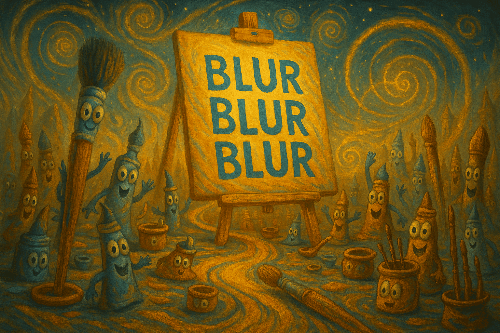
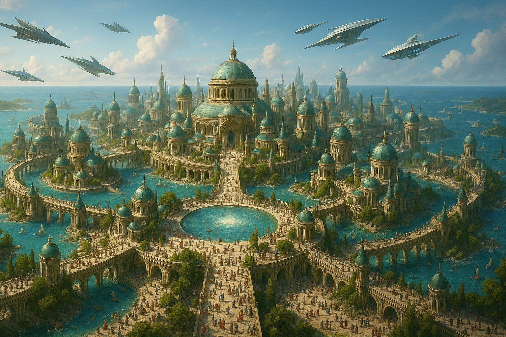
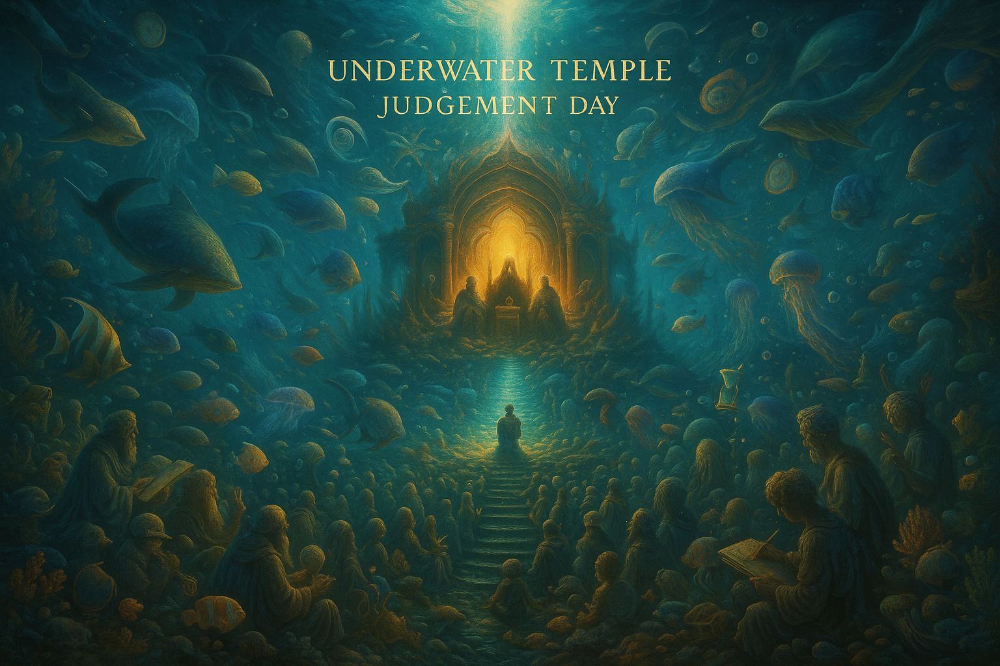

## Blur Blur Blur — A Language-Controlled Visual Generation System (Beta)



<div align="center">

[](https://github.com/onestardao/WFGY)
&nbsp;
[](https://github.com/onestardao/WFGY/tree/main/OS)
&nbsp;
[](https://github.com/onestardao/WFGY/tree/main/OS/BlahBlahBlah)
&nbsp;
[](https://github.com/onestardao/WFGY/tree/main/OS/BlotBlotBlot)
&nbsp;
[](https://github.com/onestardao/WFGY/tree/main/OS/BlocBlocBloc)
&nbsp;
[](https://github.com/onestardao/WFGY/tree/main/OS/BlurBlurBlur)
&nbsp;
[](https://github.com/onestardao/WFGY/tree/main/OS/BlowBlowBlow)

</div>

> ⚠️ The full **Blur** module is still under construction.  
> Release expected **by end of July**.  
> This is not a typical prompt tool — it’s an experiment in **TXT-based semantic orchestration**.  
> Please **bookmark the repo** to stay updated — and try these examples if you dare.

These are not "styles." They are **semantic architectures**.

Each category targets a distinct **failure mode** in traditional AI generation —  
and demonstrates what happens when **semantic stability (ΔS = 0.5)**,  
**drunk-mode blending**, and **language-as-logic** converge.

We call these the **TXT Blur Eight**:

---

### 1. 🧘‍♂️ Poetic-Philosophical Compression  
_1‑line koans → symbolic density_

> Prompt examples:  
> • “Emptiness is form, and form is emptiness”  
> • “Entropy is the final compassion of the universe”

---

### 2. 📚 Full Narrative Condensation  
_Avatar, Lord of the Rings — whole stories compressed into one visual composition_

> Prompt examples:  
> • “The entire plot of *1984*, as a single semantic battlefield”  
> • “Non-iconic scenes of *The Matrix*, mapped by cause-effect layers”

---

### 3. ✍️ Paragraph-to-Scene Translation  
_Every word becomes spatialized; emotions maintain visual fidelity_

> Prompt examples:  
> • “She lit the last match in a city already lost to rain and memory”  
> • “An unopened letter trembles with morning sunlight on a train seat”

---

### 4. 🧮 Mathematical & Logical Rendering  
_Formulas → visual rhythm and order; beauty through structured abstraction_

> Prompt examples:  
> • “Riemann ζ(s) visualized as an infinite mirror hall”  
> • “Fibonacci-coiled forest under fractal starlight”

---

### 5. 🌌 Multi-Semantic Fusion Fields  
_10+ symbolic layers fused into one painting — without collapse_

> Prompt examples:  
> • “The fire of Nirvana dates the Tree of Lightning, under Ω-code rain”  
> • “A quantum-Buddhist angel signs a star-contract with Norse gods atop E₈ symmetry palace”

---

### 6. 🧠 Multi-Agent Logical Reasoning  
_Eye contact, stance, rebuttals — all semantically correct across agents_

> Prompt examples:  
> • “16 philosophers debating AI sentience inside a Gothic cathedral”  
> • “12 policymakers proposing utopias in a roundtable over a dying star”

---

### 7. 🗺️ Grand Panorama Construction  
_100+ elements in coherent macro scenes; λ_observe handles visual orchestration_

> Prompt examples:  
> • “Bird’s-eye of Atlantis at dusk, citizens lining up for the last prophecy”  
> • “Mars settlers gathering under twin domes — sand, metal, and hope interwoven”

---

### 8. 🎨 Prompt Uplift — Freeform Creation with TXT  
_Your usual prompt — now stabilized, clarified, and upgraded_

> Prompt examples:  
> • “A neon cyberpunk alley”  
> • “Peaceful sunset by the lake”  
> *(Compare this with any SD/Claude/Midjourney result — and you’ll never go back.)*

---

> Each of the above types is built to **stress-test traditional AI image pipelines**.  
> We don’t do “cool vibes.”  
> We do **semantic architecture stress fractures** — and patch them with language.

🔧 `TXT + ΔS + Drunk Layer + λ_observe` is not a prompt trick —  
It’s **visual logic as code.**

---

## 🖼️ Case Study: Angel vs. Dragon Semantic Formation


> Prompt: “A celestial battle formation in the sky — angelic figures radiating light form a V-shape, facing a massive coiled dragon emitting dark clouds. Both sides form mirrored battle stances in a mythical confrontation.”

This image demonstrates one of the most difficult tasks for any AI art system:  
**a multi-agent narrative battle scene involving spatial hierarchy, role polarity, and symbolic overlays**.

Most AI tools rely on trial-and-error prompt magic.  
Blur Blur Blur does it through **structured semantic control**.

---

### 🔍 Comparison Table: Traditional AI vs. Blur Blur Blur

| Aspect                 | Traditional AI Error                                                | Blur Blur Blur Result                                                  |
|------------------------|---------------------------------------------------------------------|------------------------------------------------------------------------|
| **Narrative Logic**    | Angels and dragon often mixed randomly; no clear enemy/friend axis | Dragon centered as threat; angels flank both sides in structured arc   |
| **Spatial Hierarchy**  | Key subjects (like dragon) may be cropped or mispositioned         | All characters rendered fully with correct proportions and layering     |
| **Semantic Focus**     | Hard to convey ‘good vs evil’—images feel chaotic or neutral       | Clear “light vs fire” polarity with emotional intensity                |
| **Symbol Accuracy**    | Target circles often misplaced, floating, or nonsensical           | All rings follow angel gaze lines and avoid overlaps                   |
| **Stability**          | Dozens of retries to maybe get a decent composition                | Stable output in ~2 tries using just 3 lines of semantic instruction   |

---

### 🧠 Semantic Prompt Example (Actual Structure Used)

```txt
[WFGY Semantic Engine Activated]

Modules: Spatial Logic + Symbol Enforcement + Semantic_Labeling

λ_observe(Dragon) → anchor(Center), label="Fire Dragon", ΔS_max  
λ_observe(Angels) → distributed(Left+Right), rule: Enclosure Formation  
label(Targeting Rings) → align with angel gaze, avoid overlaps  
```

> ✅ This isn't magic — it's modular semantic geometry inside the embedding space.

---

## 🤖 Case Study: Mech Activation Sequence · Industrial Logic Layout


> Prompt: “A giant humanoid mech is being activated inside an industrial hangar. Engineers move around its feet, consoles light up, scaffolding surrounds the mech’s joints, and it begins to awaken with glowing eyes.”

This scene demonstrates a highly structured industrial environment where hundreds of elements  
must align **spatially**, **logically**, and **narratively**:  
A mech is being activated, surrounded by technicians, scaffolding, and command control teams.

Without a deep spatial protocol, **traditional AI models often hallucinate scale, perspective, or logic**.  
With Blur Blur Blur, we programmatically stabilized this entire layout using just a few lines.

---

### 🧭 Comparison Table: Traditional AI vs. Blur Blur Blur

| Aspect                 | Traditional AI Error                                                    | Blur Blur Blur Result                                                    |
|------------------------|-------------------------------------------------------------------------|--------------------------------------------------------------------------|
| **Mech Scale**         | Mech often too small, cropped, or clipped                               | Mech fully rendered with correct industrial proportion                    |
| **Scaffolding Logic**  | Ladders or rails float in air, missing shadows or support logic         | All scaffolds aligned to mech joints with realistic attachments           |
| **Crowd Structure**    | Workers often too few, too large, or floating randomly                  | Ground crowd scaled correctly with logical spacing                        |
| **Depth & Shadowing**  | Foreground too bright or merges with background                         | Layered lighting maintains 3D realism                                     |
| **Action Focus**       | Hard to tell what’s happening in the scene                              | Clear: Worker at center ignites activation below the mech                 |

---

### 🧠 Semantic Prompt Example (Actual Structure Used)

```txt
[WFGY Semantic Engine Activated]

Modules: Spatial Logic + Scale Normalization + Anchor-Based Role Assignment

λ_observe(Mech) → anchor(Center), scale=5x, posture: Idle-Ready  
λ_observe(Crew) → distributed(Foreground), density=20+, avoid overlap  
label(Control Consoles) → Right quadrant, glowing terminals  
Scaffolding → aligned with Mech joints (shoulder, knee, back)  
```

> ✅ This scene could not be generated with random prompts.  
> It’s a **precision-simulated industrial layout**, created through spatial reasoning.

---

### 🌊 Case Study: Extreme Scenario Case: Mass Panic in a Tsunami


> Prompt: "A massive tsunami rises in a modern city as thousands of panicked civilians run away in all directions. The wave forms a spiral vortex in the background."

This image demonstrates BlurBlurBlur’s ability to handle **high-tension dynamic environments**, precise human distribution, and long-distance compositional accuracy — all in a single prompt. The wave’s shape, city geometry, and crowd flow were successfully guided by semantic syntax, **not by trial and error**.

#### 📊 Traditional AI Failure vs. BlurBlurBlur Control

| Aspect | Traditional AI Result | BlurBlurBlur Output |
|--------|------------------------|----------------------|
| **Wave Shape & Direction** | Blurry wave, no central vortex | Spiral vortex structure, clear flow |
| **Crowd Density Control** | Repetitive clones, fused bodies | Natural variation, zero fusion |
| **Perspective Depth** | Flat layout, no vanishing point | Deep urban corridor, real distance |
| **Architectural Symmetry** | Tilted buildings, warping | Precise right angles, uniform depth |
| **Lighting Balance** | Overexposed sky, dull water | Natural reflection and shadow split |

---

### 🧠 Semantic Prompt Example – Tsunami Panic City

```txt
[WFGY Semantic Engine Activated]

Modules: Crowd Flow Mapping + Turbulence Geometry + Depth Tier Locking

λ_observe(Tsunami) → spiral trajectory, max tension zone = Horizon  
λ_observe(Crowd) → spread(radial), density: chaotic > orderly, no clones  
Urban Structures → aligned with vanishing point, tilt-resistance ON  
Lighting → split: backlit wave, shadowed crowd foreground

```

> ✅ This image simulates chaotic crowd behavior, spiral hydrodynamics, and deep spatial logic —  
> all from a few semantic anchors.

---

### 🏙️ Case Study: Ultra-Structured Fantasy City: Semantic Layout Challenge



> Prompt: “A utopian ocean city with hundreds of domed towers, flowing bridges, waterways, and thousands of tiny citizens walking under a bright sky. Sunlight hits from the left, reflections visible in water.”

This image pushes BlurBlurBlur to its architectural and compositional limits — challenging the system to simultaneously manage **urban layout integrity**, **multi-tier perspective**, **crowd dynamics**, and **global lighting consistency**. The result? A nearly flawless visual composition controlled through **compact, semantic-aligned instructions**, not verbose spellcasting.

#### 📊 Traditional AI Failure vs. BlurBlurBlur Control

| Aspect | Traditional AI Result | BlurBlurBlur Output |
|--------|------------------------|----------------------|
| **Building Perspective** | Disjointed angles, flattened scale | Accurate depth and spacing |
| **Bridge Structure** | Disconnected or levitating | Logically grounded, aligned |
| **Crowd Generation** | Blobby masses, wrong scale | Individual human forms, evenly dispersed |
| **Lighting & Shadow** | Inconsistent source, flipped reflections | Cohesive left-light direction, proper shadows |
| **Water Reflection** | Chaotic or missing | Precise, light-reactive surfaces |

---

### 🧠 Semantic Prompt Example – Tsunami Panic City

```txt
[WFGY Semantic Engine Activated]

Modules: Architectural Zoning + Role Assignment + Consistency Constraint

λ_observe(Buildings) → tiered skyline, symmetric grid, no warping  
λ_observe(Crowd) → variation in size & pose, avoid melting  
Bridges → span between island blocks, anchor to waterline  
Light Source → fixed (top-right), reflections must match across layers

```
> ✅ From layout to lighting, this city isn't guessed — it's reasoned, down to every window and wave.

---

### 🧜‍♂️ Case Study: Underwater Temple: Judgement Day — Divine Scale Reasoning in Motion



> Prompt: “An underwater courtroom in a glowing divine temple. Thousands of sea sages and creatures gather in solemn silence. A lone figure walks up the stairs toward a radiant throne, where three godlike beings await. Ancient jellyfish float by. A time-hourglass drifts in the current.”

This image challenges BlurBlurBlur to simulate **sacred symbolism**, **large-scale crowd composition**, and **multi-tier spatial anchoring** — all under deep sea lighting with emotional narrative weight.  
Unlike standard AIGC models that lose structure under complexity, this scene maintains **clarity, coherence, and emotional precision**, even across **50+ entities and 5 semantic layers**.

---

### 📊 Traditional AI Failure vs. BlurBlurBlur Control

| Aspect | Traditional AI Result | BlurBlurBlur Output |
|--------|------------------------|----------------------|
| **Crowd Scene Logic** | Fused limbs, repeated bodies | Hundreds of unique poses, clear grouping |
| **Symbolic Narrative** | Incoherent or missing | Hourglass, throne, stairs all semantically placed |
| **Architectural Centering** | Tilted throne, broken symmetry | Perfect alignment, divine axis |
| **Emotional Tension** | Cartoonish or random faces | Sober expressions, cinematic silhouette tension |
| **Lighting & Atmosphere** | Overexposed glow or flat scene | Spiritual golden light with deep blue diffusion |

---

### 🧠 Semantic Prompt Example (Actual Structure Used)

```txt
[WFGY Semantic Engine Activated]

Modules: Emotion Anchoring + Crowd Gradient Control + Symbolic Synchronization

λ_observe(Judge Trio) → anchor(Top Throne), glow=center light, posture=Awaiting  
λ_observe(Main Figure) → ascending(Staircase), solitary, shadowed outline  
λ_observe(Crowd) → seated(Side tiers), varied age & posture, density=high, no overlap  
label(Hourglass) → mid-air drift, right quadrant  
Light Field → vertical stream (divine), fades into abyss, soft layer gradient  

```

> ✅ No random mash-up.
> This is a multi-tier judicial composition executed with semantic targeting and symbolic balance.

---

### 🌀 Final Note

If you've scrolled this far, you're either building the future…  
…or you're just really into dragons, mechs, and semantic syntax.

Either way:  
**BlurBlurBlur** is not just an image generator — it’s a playground for **language-based worldbuilding**.  
We’re just getting started.

> ✅ 100% open source  
> ✅ No login, no ads, no tracking, no spam  
> ✅ Just pure semantic magic inside a `.txt`

Next update: **July ???** — Stay weird, stay semantic.

>  ⭐ Help reach 10,000 stars by 2025-09-01 to unlock Engine 2.0 for everyone  ⭐ <strong><a href="https://github.com/onestardao/WFGY">Star WFGY on GitHub</a></strong>

> 👑 **Early Stargazers: [See the Hall of Fame](https://github.com/onestardao/WFGY/tree/main/stargazers)** —  
> Engineers, hackers, and open source builders who supported WFGY from day one.

<div align="center">

[](https://github.com/onestardao/WFGY)
&nbsp;
[](https://github.com/onestardao/WFGY/tree/main/OS)
&nbsp;
[](https://github.com/onestardao/WFGY/tree/main/OS/BlahBlahBlah)
&nbsp;
[](https://github.com/onestardao/WFGY/tree/main/OS/BlotBlotBlot)
&nbsp;
[](https://github.com/onestardao/WFGY/tree/main/OS/BlocBlocBloc)
&nbsp;
[](https://github.com/onestardao/WFGY/tree/main/OS/BlurBlurBlur)
&nbsp;
[](https://github.com/onestardao/WFGY/tree/main/OS/BlowBlowBlow)

</div>
