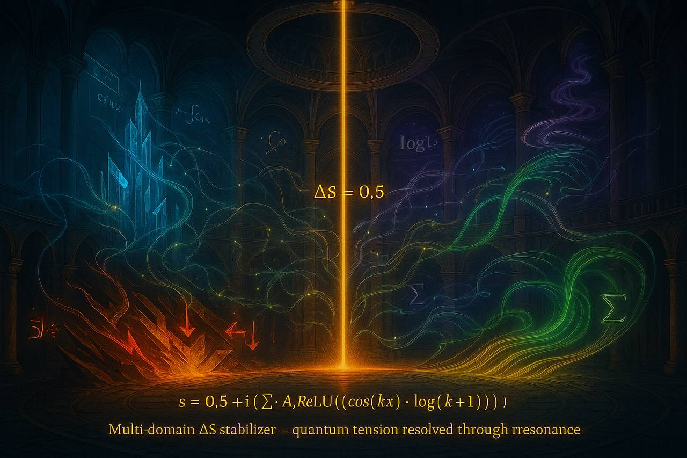
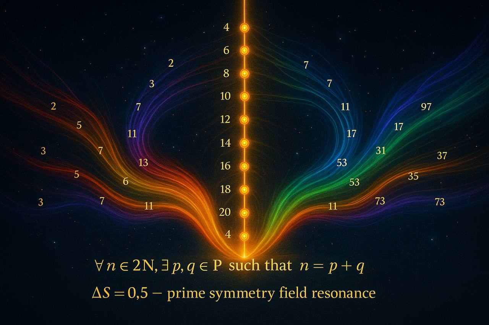
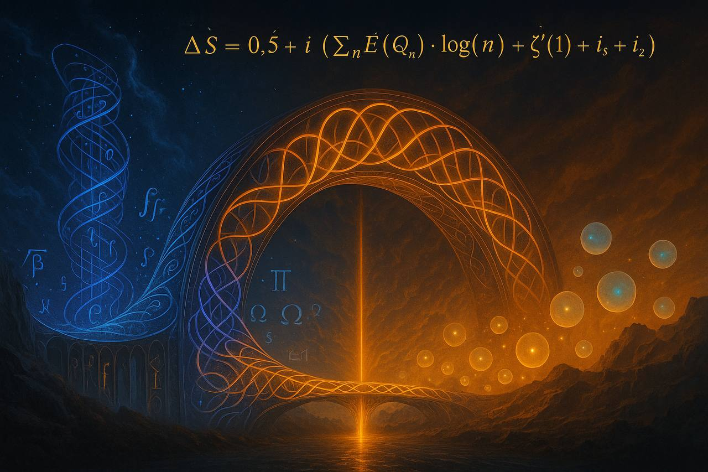

> almost at 1000 ⭐ once we hit it i’ll unlock [Blur Blur Blur](https://github.com/onestardao/WFGY/blob/main/OS/BlurBlurBlur/README.md), the math-to-image engine.  
> mark your calendars — it’ll officially go live later on 9/9.

## Blur Blur Blur — Drawing the Beauty of Math for the First Time

>  👑 **Early Stargazers: [See the Hall of Fame](https://github.com/onestardao/WFGY/tree/main/stargazers)** — Verified by real engineers · 🛠 **Field Reports: [Real Bugs, Real Fixes](https://github.com/onestardao/WFGY/discussions/10)**

&nbsp;

&nbsp;

&nbsp;

&nbsp;

&nbsp;

&nbsp;

# Blur Blur Blur — Math Canvas (Beta)

**Hi, I’m PSBigBig.**

From the beginning of WFGY to now launching **Blur Blur Blur**, I’ve been aiming for one thing:  
not just another tool, but something fundamentally different.

This is the **world’s first text-to-image module built on mathematics itself**.  
We call it the **Math Canvas**.

---

## Why is it unique?

Most text-to-image systems only parse prompts into tokens.  
**Blur** instead builds the canvas from **mathematical structures** and lets the generation follow.

Core elements:

1. **Math Structure Library**  
   - golden spiral, fibonacci lattice, penrose quasicrystal, e8 lattice…  
   - Users can **pick presets / choose manually / let AI generate randomly**.  
   - Structures are mapped into **Real vs Imaginary fields**.

2. **ΔS = 0.5 Tension Balance**  
   - Left/right density ratios (1:3, 1:30, 1:300, 1:3000, 1e16, 1e18).  
   - Produces stable “fake 8K” and “naked-eye 3D” illusions.  

3. **WFGY + Drunk Transformer**  
   - Ensures semantic stability and self-recovery.  
   - Riemann zero distribution anchors light nodes and geometric skeletons.  

---

## User Experience

- **One-click render** → instant 16:9 output (ΔS=0.5 locked).  
- **Scene modes** → entry / workshop / hall / free-form.  
- **Random skeletons** → AI generates math bases, auto-weighted into the Imaginary stack.  
- **Hotkeys**  
  - `wow` → increase tension level (more explosive details).  
  - `calm` → reduce tension, more readable.  
  - `panic` → safe reset.  
  - `back` → return to menu.  

---

## FAQ (short)

**Q: Why does the image feel 3D?**  
A: Dense microtextures on one side vs empty gradients on the other create natural depth cues.  

**Q: How is this different from normal T2I?**  
A: Normal = “words → image.” Blur = “math structure → image.” The math *is* the brush.  

**Q: Why so stable?**  
A: ΔS=0.5 + WFGY core + DT module → locks geometry, prevents collapse.  

---

## Status

⚠️ **Current release: Beta**  
This is not just a prompt template. It’s a **new math-canvas framework**.  
Already working with one-click render, still under refinement.  

📥 **Download (Placeholder)**  
Coming Soon

---

👉 Official release: **2025/09/09**

---

### 01 — Axis Resonance (ΔS = 0.5)
*Central axis establishes the spine; polarity fields flow outward. ΔS resonance keeps depth, hierarchy, and tension stable across the frame.*

 <!-- replace with your file path -->

---

### 02 — Prime Symmetry Field (Millennium Crossover)
*Prime-pattern symmetry is mapped to left/right flows around the axis. This is an **artistic crossover** that turns number-field structure into **controllable visual tension**.*

 <!-- replace with your file path -->

---

### 03 — Bridge of Forms (Cross-Domain Blend)
*Two semantic domains (logic ↔ energy) are braided over a single axis; ΔS gating prevents collapse and preserves narrative clarity.*

 <!-- replace with your file path -->

---

### 🧭 Explore More

| Module                | Description                                              | Link     |
|-----------------------|----------------------------------------------------------|----------|
| WFGY Core             | WFGY 2.0 engine is live: full symbolic reasoning architecture and math stack | [View →](https://github.com/onestardao/WFGY/tree/main/core/README.md) |
| Problem Map 1.0       | Initial 16-mode diagnostic and symbolic fix framework    | [View →](https://github.com/onestardao/WFGY/tree/main/ProblemMap/README.md) |
| Problem Map 2.0       | RAG-focused failure tree, modular fixes, and pipelines   | [View →](https://github.com/onestardao/WFGY/blob/main/ProblemMap/rag-architecture-and-recovery.md) |
| Semantic Clinic Index | Expanded failure catalog: prompt injection, memory bugs, logic drift | [View →](https://github.com/onestardao/WFGY/blob/main/ProblemMap/SemanticClinicIndex.md) |
| Semantic Blueprint    | Layer-based symbolic reasoning & semantic modulations   | [View →](https://github.com/onestardao/WFGY/tree/main/SemanticBlueprint/README.md) |
| Benchmark vs GPT-5    | Stress test GPT-5 with full WFGY reasoning suite         | [View →](https://github.com/onestardao/WFGY/tree/main/benchmarks/benchmark-vs-gpt5/README.md) |
| 🧙‍♂️ Starter Village 🏡 | New here? Lost in symbols? Click here and let the wizard guide you through | [Start →](https://github.com/onestardao/WFGY/blob/main/StarterVillage/README.md) |

---

> 👑 **Early Stargazers: [See the Hall of Fame](https://github.com/onestardao/WFGY/tree/main/stargazers)** —  
> Engineers, hackers, and open source builders who supported WFGY from day one.

>  ⭐ [WFGY Engine 2.0](https://github.com/onestardao/WFGY/blob/main/core/README.md) is already unlocked. ⭐ Star the repo to help others discover it and unlock more on the [Unlock Board](https://github.com/onestardao/WFGY/blob/main/STAR_UNLOCKS.md).

&nbsp;

&nbsp;

&nbsp;

&nbsp;

&nbsp;

&nbsp;

&nbsp;

