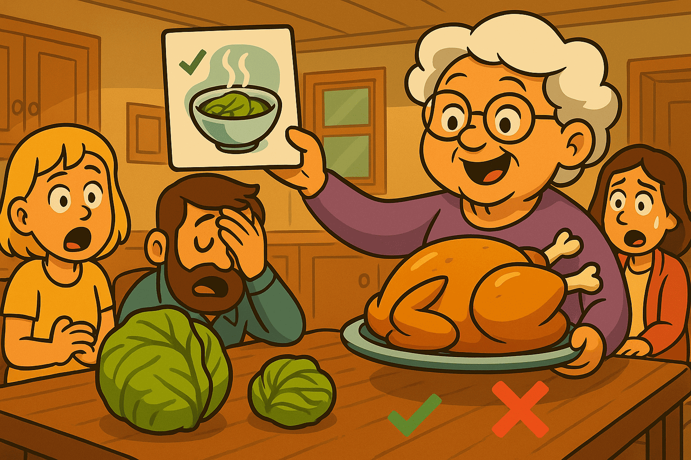

# Grandma Clinic — AI Bugs Made Simple (Problem Map 1–16)


**Why this page exists**

Most people fix AI bugs **after** the model already spoke. You then add patches, rerankers, or regex. The same failure returns later in a different shape.

**WFGY installs a semantic firewall *before* output.**
It inspects the semantic field first. If the state is unstable, it loops, narrows, or resets. Only a stable state is allowed to speak. Once a failure mode is mapped, it stays fixed.

**How to use this page in 30 seconds**

1. Scroll to the number that looks like your case.
2. Read the grandma story. If it matches, copy the doctor prompt.
3. Paste the prompt into **Dr. WFGY** and talk to the doctor.  
   Link: [Dr. WFGY in ChatGPT Room](https://chatgpt.com/share/68b9b7ad-51e4-8000-90ee-a25522da01d7)
4. You will get the simple fix and the pro fix. No SDK required.

> **Not sure where to start?** Use the [Beginner Guide](https://github.com/onestardao/WFGY/blob/main/ProblemMap/BeginnerGuide.md) to quickly identify your problem and run a first safe fix before diving into the Clinic.

**Quick links**  
If your stack does not even boot, check these first:  
No.14 [Bootstrap Ordering](https://github.com/onestardao/WFGY/blob/main/ProblemMap/bootstrap-ordering.md)  
No.15 [Deployment Deadlock](https://github.com/onestardao/WFGY/blob/main/ProblemMap/deployment-deadlock.md)  
No.16 [Pre-deploy Collapse](https://github.com/onestardao/WFGY/blob/main/ProblemMap/predeploy-collapse.md)

---

> Format rule for every section  
> • Plain text = Grandma story, metaphor, **grandma fix (before-the-output)** with mapping, minimal fix and prompt.  
> • Pro Zone = a collapsible block with exact symptoms, technical keys, and the reference link.

---

## No.1 Hallucination & Chunk Drift


**Grandma story**  
You ask for the cabbage recipe. I hand you a random page from a different cookbook because its picture looks similar.

**Metaphor mapping**
- Pretty picture = token surface match  
- Wrong cookbook = wrong source  
- Nice words = confident tone without proof  

**Grandma fix (before-the-output) — mapping**
- Put the recipe card **on the table first** = **citation-first policy**  
- Show which book and page you used = **retrieval trace with IDs/pages**  
- Check the card title matches “cabbage” before cooking = **query–source semantic check (ΔS gate)**

**Minimal fix (grandma)**  
Do not taste anything until the recipe card is on the table.  

Doctor prompt:
```

please explain No.1 Hallucination & Chunk Drift in grandma mode, then show me the minimal WFGY fix and the exact reference link

```

<details>
<summary>Pro Zone</summary>

**Real scene**  
Bad OCR or bad chunking creates fragments. Retrieval picks a high cosine neighbor that is semantically wrong. Model speaks smoothly and cites nothing.

**Technical keys**
- Turn on citation-first policy  
- Add retrieval trace with IDs and source pages  
- Inspect chunking rules and table handling  
- Add minimal reranker only after source is confirmed

Reference:  
Hallucination & Chunk Drift → https://github.com/onestardao/WFGY/blob/main/ProblemMap/hallucination.md
</details>

---

## No.2 Interpretation Collapse


**Grandma story**  
You found the right page but misread the steps. Sugar replaced with salt. The dish fails even with the correct book open.

**Metaphor mapping**
- Right page = correct chunk  
- Wrong reading = logic collapse  
- Tastes wrong = final answer wrong despite good retrieval  

**Grandma fix (before-the-output) — mapping**
- Read each step **out loud and slow** = **λ_observe checkpoints mid-chain**  
- Underline quantities before pouring = **symbol/constraint anchoring**  
- If taste drifts, **pause and re-read** = **BBCR controlled reset**

**Minimal fix (grandma)**  
Read slowly. When unsure, stop and ask a checkpoint.

Doctor prompt:
```

please explain No.2 Interpretation Collapse in grandma mode, then apply a minimal WFGY checkpoint plan

```

<details>
<summary>Pro Zone</summary>

**Real scene**  
Answer drifts after retrieval. The model reasons over correct context but loses structure mid-chain.

**Technical keys**
- Measure ΔS for prompt vs answer  
- Insert λ_observe checkpoints  
- If drift continues, perform BBCR controlled reset  
- Require coverage ≥ 0.70 before finalization

Reference:  
Interpretation Collapse → https://github.com/onestardao/WFGY/blob/main/ProblemMap/retrieval-collapse.md
</details>

---

## No.3 Long Reasoning Chains


**Grandma story**  
You go to market A, then B, then C, and forget why you left home.

**Metaphor mapping**
- Many stops = long chain of steps  
- Forget the goal = context drift  
- Wrong basket = correct items but not for the target dish  

**Grandma fix (before-the-output) — mapping**
- Write a shopping list with the **main dish on top** = **goal anchor**  
- Check the list **every two streets** = **loop with checkpoints**  
- Compare what’s in the bag vs the list = **coverage gate ≥ threshold**

**Minimal fix (grandma)**  
Write the shopping list and check it every two streets.

Doctor prompt:
```

please explain No.3 Long Reasoning Chains in grandma mode and show the smallest loop + checkpoint pattern

```

<details>
<summary>Pro Zone</summary>

**Real scene**  
Multi-step plans wander. Early decisions are not re-checked. The final answer is coherent but off-goal.

**Technical keys**
- Define the goal anchor explicitly  
- Use λ_diverse to compare 3+ candidate paths  
- Clamp CoT variance and prune off-goal branches  
- Re-score against goal anchor each loop

Reference:  
Long Reasoning Chains → https://github.com/onestardao/WFGY/blob/main/ProblemMap/context-drift.md
</details>

---

## No.4 Bluffing / Overconfidence


**Grandma story**  
A charming waiter serves a dish without showing the recipe card. Sounds right, tastes wrong.

**Metaphor mapping**
- Confident voice = fluent language  
- No recipe card = no evidence  
- Polite smile = apology without fix  

**Grandma fix (before-the-output) — mapping**
- “Show the card first” = **evidence-before-answer**  
- Send dish back if no card = **reject ungrounded output**  
- Record which card cooked which dish = **traceability log**

**Minimal fix (grandma)**  
Ask for the card first. If none, send the dish back.

Doctor prompt:
```

please explain No.4 Bluffing in grandma mode, then enforce 'card first' with a minimal WFGY guardrail

```

<details>
<summary>Pro Zone</summary>

**Real scene**  
Natural language is confident and wrong. The path lacks traceability. Model refuses to verify.

**Technical keys**
- Citation-first policy  
- Reject ungrounded claims  
- Minimal reranker only after source confirmed  
- Log coverage and ΔS

Reference:  
Bluffing / Overconfidence → https://github.com/onestardao/WFGY/blob/main/ProblemMap/bluffing.md
</details>

---

## No.5 Semantic ≠ Embedding


**Grandma story**  
White pepper and black pepper. Same word “pepper,” completely different flavor.

**Metaphor mapping**
- Same word = surface token overlap  
- Different flavor = semantic mismatch  
- Wrong taste = wrong result despite high score  

**Grandma fix (before-the-output) — mapping**
- **Smell & taste both peppers** = **metric sanity check**  
- Do not mix bottles without labels = **normalize spaces + casing**  
- Keep a small “reference spoon test” = **ground-truth exemplars**

**Minimal fix (grandma)**  
Taste both peppers before cooking.

Doctor prompt:
```

please explain No.5 Semantic ≠ Embedding in grandma mode and give me the minimal metric audit plan

```

<details>
<summary>Pro Zone</summary>

**Real scene**  
Cosine similarity on unnormalized vectors, cross-model vector mixing, and casing mismatch select neighbors that do not carry the same meaning.

**Technical keys**
- Normalize embeddings  
- Verify metric space and dimension  
- Align tokenization and casing  
- Use hybrid retrieval only after metric audit

Reference:  
Semantic ≠ Embedding → https://github.com/onestardao/WFGY/blob/main/ProblemMap/embedding-vs-semantic.md
</details>

---

## No.6 Logic Collapse & Recovery


**Grandma story**  
You keep taking the same dead-end alley. Step back, pick a new street, and try again.

**Metaphor mapping**
- Dead-end alley = unproductive loop  
- Step back = controlled reset  
- New street = alternate path  

**Grandma fix (before-the-output) — mapping**
- If you hit a wall twice, **turn back** = **BBCR reset on repeated ΔS spike**  
- Try the **next street** = **alternative candidate paths**  
- Keep a small map in hand = **state anchor + goal reminder**

**Minimal fix (grandma)**  
If lost twice, stop and change route.

Doctor prompt:
```

please explain No.6 Logic Collapse in grandma mode, then show BBCR reset + λ\_observe checkpoints

```

<details>
<summary>Pro Zone</summary>

**Real scene**  
Reasoning locks into a loop or shallow branch. No mechanism exists to detect and recover.

**Technical keys**
- ΔS probe at each step  
- λ_observe mid-chain grounding  
- BBCR controlled reset when ΔS stays high  
- Accept only convergent λ and coverage ≥ 0.70

Reference:  
Logic Collapse & Recovery → https://github.com/onestardao/WFGY/blob/main/ProblemMap/logic-collapse.md
</details>

---

## No.7 Memory Breaks Across Sessions


**Grandma story**  
You promise to remember the family recipe, then next week you act like we never talked.

**Metaphor mapping**
- Forgot the pot’s scratch = lost state  
- New kitchen every time = no continuity  
- Same question again = user fatigue  

**Grandma fix (before-the-output) — mapping**
- Write notes on a **labeled card** = **stable memory schema with state keys**  
- Put it in the **same drawer** every time = **guarded write/read order**  
- Pin a tiny photo of the dish on the card = **low-ΔS exemplar**

**Minimal fix (grandma)**  
Write notes on a card and keep it in the same drawer.

Doctor prompt:
```

please explain No.7 Memory Breaks in grandma mode and show the smallest stable memory routine

```

<details>
<summary>Pro Zone</summary>

**Real scene**  
Session state, anchors, and contracts are not persisted or are stored without retrieval trace, causing silent context loss.

**Technical keys**
- Stable memory schema with state keys  
- Guarded write and read order  
- Small exemplar store for low ΔS cases  
- Retrieval traceability by ID

Reference:  
Memory Coherence → https://github.com/onestardao/WFGY/blob/main/ProblemMap/memory-coherence.md
</details>

---

## No.8 Debugging is a Black Box


**Grandma story**  
You tell me “trust me, it works.” I ask “show me which page you used.” You shrug.

**Metaphor mapping**
- Blindfold cooking = no trace  
- “I remember” = unverifiable claim  
- Can’t redo = no reproducibility  

**Grandma fix (before-the-output) — mapping**
- Pin the recipe card **next to the stove** = **source shown with answer**  
- Mark the **page number** = **trace with IDs/lines**  
- Keep a mini “how I cooked it” note = **minimal reproducible pipeline**

**Minimal fix (grandma)**  
Pin the recipe card next to the stove.

Doctor prompt:
```

please explain No.8 Debugging Black Box in grandma mode and add a tiny traceability schema

```

<details>
<summary>Pro Zone</summary>

**Real scene**  
No IDs or source lines. Hard to prove which chunk produced the answer, so fixes are guesswork.

**Technical keys**
- Retrieval traceability with IDs  
- Log query, chunk IDs, and acceptance metrics  
- Minimal reproducible pipeline  
- Gate on “source present” before final answer

Reference:  
Retrieval Traceability → https://github.com/onestardao/WFGY/blob/main/ProblemMap/retrieval-traceability.md
</details>

---

## No.9 Entropy Collapse


**Grandma story**  
Too many voices in one room. Everyone talks. Nobody listens. The dish becomes mush.

**Metaphor mapping**
- Noise = entropy overload  
- Melted attention = no structure  
- One-pot grey = incoherent output  

**Grandma fix (before-the-output) — mapping**
- Lower heat & cook **one step at a time** = **reduced step width**  
- Prep bowls for **who/what/constraint** = **anchor entities/relations/limits**  
- Taste before plating = **acceptance targets (ΔS, coverage)**

**Minimal fix (grandma)**  
Lower the heat and separate steps.

Doctor prompt:
```

please explain No.9 Entropy Collapse in grandma mode and show a minimal stability recipe

```

<details>
<summary>Pro Zone</summary>

**Real scene**  
Attention diffuses. The model mixes unrelated paths. Output looks fine on the surface but is internally inconsistent.

**Technical keys**
- Reduce step width  
- Anchor entities, relations, and constraints  
- Clamp variance and require coverage  
- Use acceptance targets before finalization

Reference:  
Entropy Collapse → https://github.com/onestardao/WFGY/blob/main/ProblemMap/entropy-collapse.md
</details>

---

## No.10 Creative Freeze


**Grandma story**  
You only follow the recipe word by word. The soup is edible, never memorable.

**Metaphor mapping**
- Zero spice = literal output  
- No tasting = low exploration  
- Flat dish = boring answer  

**Grandma fix (before-the-output) — mapping**
- Try **two or three** safe seasonings side-by-side = **λ_diverse candidates**  
- Taste all against the same dish photo = **shared anchor scoring**  
- Keep it within “mild–medium” = **controlled entropy window**

**Minimal fix (grandma)**  
Taste and adjust within a safe range.

Doctor prompt:
```

please explain No.10 Creative Freeze in grandma mode and give the smallest safe-exploration pattern

```

<details>
<summary>Pro Zone</summary>

**Real scene**  
Model avoids diverse candidates. Everything converges to bland answers.

**Technical keys**
- λ_diverse for answer-set diversity  
- Controlled entropy window  
- Compare candidates against the same anchor  
- Keep ΔS within acceptance bounds

Reference:  
Creative Freeze → https://github.com/onestardao/WFGY/blob/main/ProblemMap/creative-freeze.md
</details>

---

## No.11 Symbolic Collapse


**Grandma story**  
You can read the storybook but panic when you see fractions and tables.

**Metaphor mapping**
- Words fine = natural language ok  
- Symbols scary = math or tables fail  
- Pretty story, wrong math = flattened structure  

**Grandma fix (before-the-output) — mapping**
- Keep **numbers in boxes** = **separate symbol channel**  
- Don’t rewrite tables as prose = **preserve blocks**  
- Say units out loud (“grams, tsp”) = **operator/unit anchoring**  
- Try a tiny sample batch = **micro-proof/example**

**Minimal fix (grandma)**  
Keep the story but show the table step by step.

Doctor prompt:
```

please explain No.11 Symbolic Collapse in grandma mode and show me a minimal symbol-first routine

```

<details>
<summary>Pro Zone</summary>

**Real scene**  
Equations, operators, code blocks, and headers get flattened to prose. Answers look smooth and wrong.

**Technical keys**
- Separate symbol channel  
- Preserve code and table blocks  
- Anchor operators and units  
- Verify with small proofs or examples

Reference:  
Symbolic Collapse → https://github.com/onestardao/WFGY/blob/main/ProblemMap/symbolic-collapse.md
</details>

---

## No.12 Philosophical Recursion


**Grandma story**  
Asking “why” about “why” about “why.” You spin in circles and never cook.

**Metaphor mapping**
- Endless mirror = self reference  
- Spiral bowl = paradox trap  
- Cold kitchen = no final answer  

**Grandma fix (before-the-output) — mapping**
- Write **the top question** on a sticky note = **outer frame/anchor**  
- Allow only **N why’s (e.g., 2)** = **recursion stop rule**  
- End with a **grounded example** = **citation/example requirement**

**Minimal fix (grandma)**  
Set a top question and limit how many mirrors you look into.

Doctor prompt:
```

please explain No.12 Philosophical Recursion in grandma mode and give me a minimal boundary plan

```

<details>
<summary>Pro Zone</summary>

**Real scene**  
Self reference and paradox questions recurse without progress.

**Technical keys**
- Define anchors and outer frame  
- ε_resonance for domain harmony  
- Stop conditions for recursion  
- Require grounded examples or citations

Reference:  
Philosophical Recursion → https://github.com/onestardao/WFGY/blob/main/ProblemMap/philosophical-recursion.md
</details>

---

## No.13 Multi-Agent Chaos


**Grandma story**  
Two cooks share one kitchen. One adds salt while the other removes it. The soup never stabilizes.

**Metaphor mapping**
- Shared kitchen = shared memory  
- Crossed notes = role drift  
- Salt tug-of-war = memory overwrite  

**Grandma fix (before-the-output) — mapping**
- Give each cook a **named card** = **role & state keys**  
- Separate drawers for their notes = **ownership & fences**  
- Timer on who uses the stove = **tool timeout/selection gates**

**Minimal fix (grandma)**  
Give each cook a clear card and a separate drawer.

Doctor prompt:
```

please explain No.13 Multi-Agent Chaos in grandma mode and set a tiny role + memory fence plan

```

<details>
<summary>Pro Zone</summary>

**Real scene**  
Agents overwrite each other’s state or speak with mixed roles. No single source of truth.

**Technical keys**
- Role and memory fences  
- State keys and ownership  
- Tool timeouts and selection gates  
- Cross-agent trace

Reference:  
Multi-Agent Problems → https://github.com/onestardao/WFGY/blob/main/ProblemMap/Multi-Agent_Problems.md
</details>

---

## No.14 Bootstrap Ordering


**Grandma story**  
You try to fry eggs before turning on the stove. Of course nothing happens.

**Metaphor mapping**
- Cold pan = service not ready  
- Eggs first = calling dependencies too early  
- Burnt timing = missing warmups  

**Grandma fix (before-the-output) — mapping**
- Fire on → **pan hot** → **then eggs** = **readiness probes & order**  
- Warm the oil and pan first = **cache/index warmup**  
- Check gas and matches ready = **secrets/perm checks**

**Minimal fix (grandma)**  
Start the fire, heat the pan, then crack the eggs.

Doctor prompt:
```

please explain No.14 Bootstrap Ordering in grandma mode and give me the smallest boot checklist

```

<details>
<summary>Pro Zone</summary>

**Real scene**  
Services fire before dependencies are ready. First calls fail, caches cold, secrets missing.

**Technical keys**
- Boot order with readiness probes  
- Cache warmup and index swaps  
- Secret checks and health gates  
- Shadow traffic before public

Reference:  
Bootstrap Ordering → https://github.com/onestardao/WFGY/blob/main/ProblemMap/bootstrap-ordering.md
</details>

---

## No.15 Deployment Deadlock


**Grandma story**  
Two people at a narrow doorway say “you first.” “No, you first.” They block the door together.

**Metaphor mapping**
- Narrow door = shared resource  
- Polite wait = mutual locks  
- Blocked door = frozen system  

**Grandma fix (before-the-output) — mapping**
- Assign who goes first = **total order / priority**  
- Use a **side door** if blocked = **fallback path**  
- Set a **polite countdown** = **timeouts & backoff**

**Minimal fix (grandma)**  
Decide who goes first, or open a side door.

Doctor prompt:
```

please explain No.15 Deployment Deadlock in grandma mode and show the smallest unlock plan

```

<details>
<summary>Pro Zone</summary>

**Real scene**  
Migrator waits for writer. Writer waits for migrator. No timeout. Full stall.

**Technical keys**
- Break dependency cycle  
- Timeouts and backoff  
- Temporary read-only mode  
- Rollout gate with regression checks

Reference:  
Deployment Deadlock → https://github.com/onestardao/WFGY/blob/main/ProblemMap/deployment-deadlock.md
</details>

---

## No.16 Pre-deploy Collapse


**Grandma story**  
First pot burns because you forgot to wash it and check the gas.

**Metaphor mapping**
- Dirty pot = stale version or index skew  
- No gas check = missing secret or permission  
- Burnt first dish = failed first call  

**Grandma fix (before-the-output) — mapping**
- Wash pot & tools first = **version pin / clean state**  
- Test the flame = **env & secrets preflight**  
- Fry a **tiny egg** as canary = **small-traffic canary**

**Minimal fix (grandma)**  
Wash the pot, test the flame, cook a tiny egg before guests arrive.

Doctor prompt:
```

please explain No.16 Pre-deploy Collapse in grandma mode and give me the smallest preflight checklist

```

<details>
<summary>Pro Zone</summary>

**Real scene**  
Version skew, missing env vars or secrets, empty vector index on first ingestion, wrong analyzer. First production call collapses.

**Technical keys**
- Preflight contract checks  
- Version pin and model lock  
- Vector index build and swap  
- Canary on minimal traffic

Reference:  
Pre-deploy Collapse → https://github.com/onestardao/WFGY/blob/main/ProblemMap/predeploy-collapse.md
</details>
---

## What happens after you fix one

You do not patch forever. You set **acceptance targets** and keep them:

* ΔS ≤ 0.45
* Coverage ≥ 0.70
* λ state convergent
* Source present before final

When a new bug appears, map it to a number, apply the fix once, and it stays fixed. That is the point of a semantic firewall.

---

## One-line doctor prompt

If you are unsure which number fits:

```
i’ve uploaded TXT OS / WFGY notes.
which Problem Map number matches my issue?
explain using grandma mode, then give the minimal fix and the reference page.
```

---

### 🔗 Quick-Start Downloads (60 sec)

| Tool | Link | 3-Step Setup |
|------|------|--------------|
| **WFGY 1.0 PDF** | [Engine Paper](https://github.com/onestardao/WFGY/blob/main/I_am_not_lizardman/WFGY_All_Principles_Return_to_One_v1.0_PSBigBig_Public.pdf) | 1️⃣ Download · 2️⃣ Upload to your LLM · 3️⃣ Ask “Answer using WFGY + \<your question>” |
| **TXT OS (plain-text OS)** | [TXTOS.txt](https://github.com/onestardao/WFGY/blob/main/OS/TXTOS.txt) | 1️⃣ Download · 2️⃣ Paste into any LLM chat · 3️⃣ Type “hello world” — OS boots instantly |

---

### 🧭 Explore More

| Module                | Description                                              | Link     |
|-----------------------|----------------------------------------------------------|----------|
| WFGY Core             | WFGY 2.0 engine is live: full symbolic reasoning architecture and math stack | [View →](https://github.com/onestardao/WFGY/tree/main/core/README.md) |
| Problem Map 1.0       | Initial 16-mode diagnostic and symbolic fix framework    | [View →](https://github.com/onestardao/WFGY/tree/main/ProblemMap/README.md) |
| Problem Map 2.0       | RAG-focused failure tree, modular fixes, and pipelines   | [View →](https://github.com/onestardao/WFGY/blob/main/ProblemMap/rag-architecture-and-recovery.md) |
| Semantic Clinic Index | Expanded failure catalog: prompt injection, memory bugs, logic drift | [View →](https://github.com/onestardao/WFGY/blob/main/ProblemMap/SemanticClinicIndex.md) |
| Semantic Blueprint    | Layer-based symbolic reasoning & semantic modulations   | [View →](https://github.com/onestardao/WFGY/tree/main/SemanticBlueprint/README.md) |
| Benchmark vs GPT-5    | Stress test GPT-5 with full WFGY reasoning suite         | [View →](https://github.com/onestardao/WFGY/tree/main/benchmarks/benchmark-vs-gpt5/README.md) |
| 🧙‍♂️ Starter Village 🏡 | New here? Lost in symbols? Click here and let the wizard guide you through | [Start →](https://github.com/onestardao/WFGY/blob/main/StarterVillage/README.md) |

---

> 👑 **Early Stargazers: [See the Hall of Fame](https://github.com/onestardao/WFGY/tree/main/stargazers)** —  
> Engineers, hackers, and open source builders who supported WFGY from day one.

>  ⭐ [WFGY Engine 2.0](https://github.com/onestardao/WFGY/blob/main/core/README.md) is already unlocked. ⭐ Star the repo to help others discover it and unlock more on the [Unlock Board](https://github.com/onestardao/WFGY/blob/main/STAR_UNLOCKS.md).

<div align="center">

[](https://github.com/onestardao/WFGY)
&nbsp;
[](https://github.com/onestardao/WFGY/tree/main/OS)
&nbsp;
[](https://github.com/onestardao/WFGY/tree/main/OS/BlahBlahBlah)
&nbsp;
[](https://github.com/onestardao/WFGY/tree/main/OS/BlotBlotBlot)
&nbsp;
[](https://github.com/onestardao/WFGY/tree/main/OS/BlocBlocBloc)
&nbsp;
[](https://github.com/onestardao/WFGY/tree/main/OS/BlurBlurBlur)
&nbsp;
[](https://github.com/onestardao/WFGY/tree/main/OS/BlowBlowBlow)
&nbsp;
</div>

