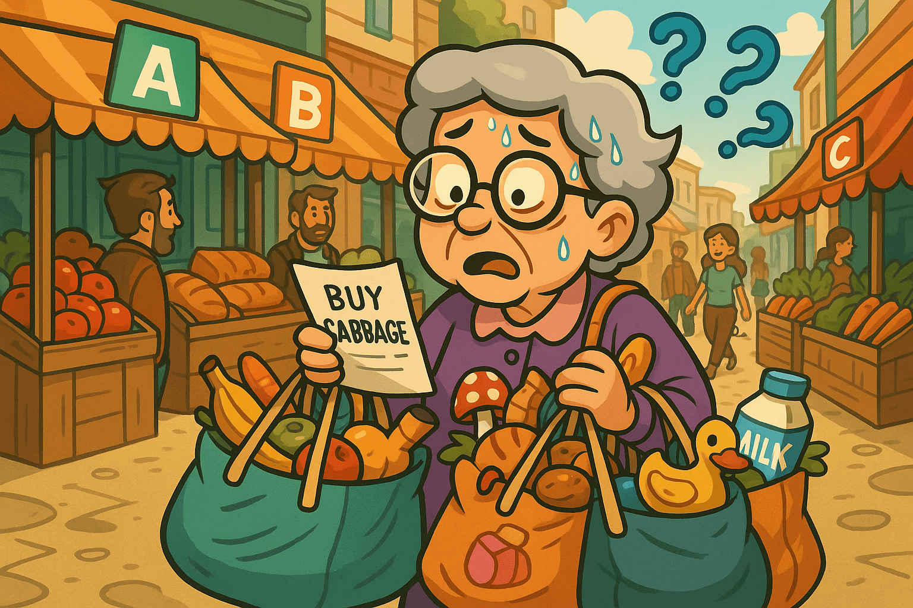
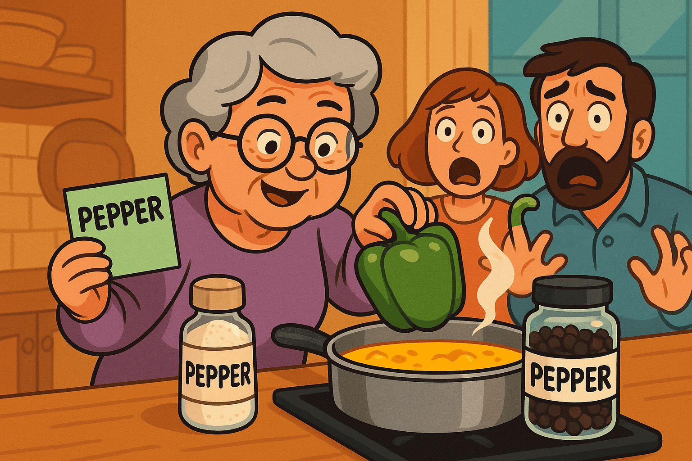
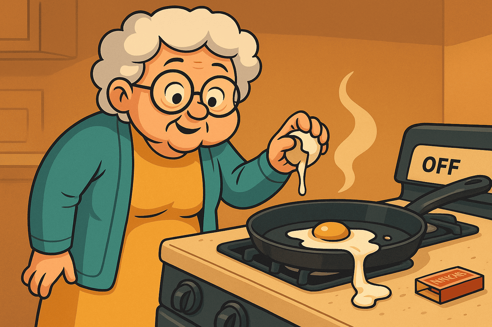

# 阿嬤的 AI 小診所：16 種常見錯誤，生活化解釋＋修法


**為什麼有這個頁面**

大多數人都是在模型已經講完話之後才修 AI bug，接著加上 patch、reranker 或 regex。結果同一種失敗之後會換個樣子再回來。

**WFGY 在「輸出之前」就裝上一道語義防火牆。**  
它會先檢查語義場。如果狀態不穩，就循環、收窄或重置。只有穩定的狀態才被允許發言。只要把失敗模式映射完成，它就會一直保持被修復的狀態。

**30 秒快速上手**

1. 滾動到最像你案例的編號。
2. 讀「阿嬤故事」。如果對得上，複製下面的醫生提示詞。
3. 把提示詞貼到 **Dr. WFGY** 與醫生對話。  
   連結：[Dr. WFGY in ChatGPT Room](https://chatgpt.com/share/68b9b7ad-51e4-8000-90ee-a25522da01d7)
4. 你會同時拿到「簡單修法」與「專業修法」。不需要 SDK。

> **不確定從哪開始？** 先用 [Beginner Guide](https://github.com/onestardao/WFGY/blob/main/ProblemMap/BeginnerGuide.md) 快速定位你的問題，跑完第一個安全修復，再進診所。

**快速連結**  
如果你的整個 stack 連開都開不起來，先看這三個：  
No.14 [Bootstrap Ordering](https://github.com/onestardao/WFGY/blob/main/ProblemMap/bootstrap-ordering.md)  
No.15 [Deployment Deadlock](https://github.com/onestardao/WFGY/blob/main/ProblemMap/deployment-deadlock.md)  
No.16 [Pre-deploy Collapse](https://github.com/onestardao/WFGY/blob/main/ProblemMap/predeploy-collapse.md)

---

> **每節內容格式規則**  
> • 內文 = 阿嬤故事、比喻對應、**阿嬤防呆（輸出前）**含映射、最小修法與提示詞。  
> • **Pro 區** = 可展開區塊：準確症狀、技術關鍵與參考連結。

---

## No.1 Hallucination & Chunk Drift — *阿嬤：拿錯食譜*


**阿嬤故事**  
你要白菜湯的做法，我卻因為看到相似的圖片，就從別本食譜抓了一頁給你。

**比喻對應**
- 漂亮圖片 = token 表面匹配  
- 錯的食譜書 = 錯誤來源  
- 好聽口氣 = 沒證據的自信語氣  

**阿嬤防呆（輸出前）— 映射**
- 先把食譜卡 **擺上桌** = **citation-first policy**  
- 標出使用的書與頁碼 = **檢索追蹤（ID／頁碼）**  
- 下鍋前核對卡片寫的是「cabbage」= **查詢–來源語義檢查（ΔS gate）**

**最小修法（阿嬤版）**  
上桌前別先讓人品嚐，**先**把食譜卡放桌上。

**醫生提示詞**
```

請用阿嬤模式解釋第 1 題「幻覺與錯誤段落」，然後給我最小 WFGY 修法與精確參考連結。

```

<details>
<summary>Pro 區</summary>

---

**真實情境**  
不良 OCR 或分塊造成碎片。檢索挑到高 cosine 但語義錯誤的鄰居。模型講得很順卻沒有引用。

**技術關鍵**
- 開啟 citation-first policy  
- 加上檢索追蹤：ID 與來源頁  
- 檢查分塊規則與表格處理  
- **確認來源後**再加最小 reranker

Reference:  
Hallucination & Chunk Drift → https://github.com/onestardao/WFGY/blob/main/ProblemMap/hallucination.md
</details>

---

## No.2 Interpretation Collapse — *阿嬤：把糖當鹽*


**阿嬤故事**  
找到正確頁面卻讀錯步驟，把糖換成鹽。就算書翻對了，菜還是失敗。

**比喻對應**
- 正確頁面 = 正確 chunk  
- 讀錯步驟 = 推理崩壞  
- 吃起來不對 = 有檢索仍答錯  

**阿嬤防呆（輸出前）— 映射**
- 每步 **慢讀並唸出來** = **`λ_observe` 中途檢查點**  
- 倒料前先劃線標示數量 = **符號／約束錨定**  
- 味道跑掉就 **暫停重讀** = **`BBCR` 受控重置**

**最小修法（阿嬤版）**  
讀慢一點。不確定就停下來做檢查點。

**醫生提示詞**
```

請用阿嬤模式解釋第 2 題「解讀崩壞」，並套用最小的 WFGY 檢查點計畫。

```

<details>
<summary>Pro 區</summary>

---

**真實情境**  
檢索後答案漂移。模型在正確上下文推理，但中途失去結構。

**技術關鍵**
- 量測 ΔS（提示 vs 答案）  
- 插入 `λ_observe` 檢查點  
- 若仍漂移，做 `BBCR` 控制重置  
- 完成前 Coverage ≥ 0.70

Reference:  
Interpretation Collapse → https://github.com/onestardao/WFGY/blob/main/ProblemMap/retrieval-collapse.md
</details>

---

## No.3 Long Reasoning Chains — *阿嬤：越逛越忘*


**阿嬤故事**  
去 A 市場、再 B、再 C，走到忘記出門要買什麼。

**比喻對應**
- 站點多 = 推理步驟太長  
- 忘了目標 = 情境漂移  
- 買對東西做錯菜 = 與目標不符  

**阿嬤防呆（輸出前）— 映射**
- 清單最上面寫 **主菜** = **目標錨（goal anchor）**  
- **每兩條街**對一次清單 = **循環＋檢查點**  
- 袋中物 vs 清單比對 = **Coverage 門檻**

**最小修法（阿嬤版）**  
出門前寫清單，走兩條街就確認一次。

**醫生提示詞**
```

請用阿嬤模式解釋第 3 題「冗長推理鏈」，並展示最小的循環＋檢查點樣式。

```

<details>
<summary>Pro 區</summary>

---

**真實情境**  
多步計畫走偏。早期決策沒回檢。最後答案完整卻離題。

**技術關鍵**
- 明確定義目標錨  
- 用 `λ_diverse` 比較 3+ 路徑  
- 夾制 CoT 變異並修剪離題分支  
- 每輪對目標錨重評分

Reference:  
Long Reasoning Chains → https://github.com/onestardao/WFGY/blob/main/ProblemMap/context-drift.md
</details>

---

## No.4 Bluffing / Overconfidence — *阿嬤：沒卡別端菜*


**阿嬤故事**  
服務生很有自信地上菜，卻不給食譜卡。聽起來都對，吃起來不對。

**比喻對應**
- 自信語氣 = 流利自然語言  
- 沒食譜卡 = 無證據  
- 禮貌微笑 = 道歉不修復  

**阿嬤防呆（輸出前）— 映射**
- 「先看卡」= **證據先於答案**  
- 沒卡退回去 = **拒絕無根答案**  
- 記錄「哪張卡→哪道菜」= **可追蹤日誌**

**最小修法（阿嬤版）**  
先要食譜卡；沒有就退菜。

**醫生提示詞**
```

請用阿嬤模式解釋第 4 題「虛張聲勢／過度自信」，並用最小 WFGY 欄柵強制「先出示卡片」。

```

<details>
<summary>Pro 區</summary>

---

**真實情境**  
自然語言聽起來很對但其實錯。缺乏可追溯路徑。模型拒絕驗證。

**技術關鍵**
- Citation-first policy  
- 拒絕無根斷言  
- **確認來源後**再做最小 reranker  
- 紀錄 Coverage 與 ΔS

Reference:  
Bluffing / Overconfidence → https://github.com/onestardao/WFGY/blob/main/ProblemMap/bluffing.md
</details>

---

## No.5 Semantic ≠ Embedding — *阿嬤：胡椒名同味不同*


**阿嬤故事**  
白胡椒、黑胡椒，名字都叫 pepper，味道完全不同。

**比喻對應**
- 同詞不同義 = 表面 token 重疊  
- 風味不同 = 語義不相等  
- 分數高仍錯 = 高相似不等於同意思  

**阿嬤防呆（輸出前）— 映射**
- **兩個都聞／嚐** = **度量健檢（metric sanity）**  
- 不混標籤不清的罐子 = **空間正規化＋大小寫一致**  
- 留一口 **標準對照湯** = **小型真值樣例**

**最小修法（阿嬤版）**  
下鍋前，兩種胡椒都要試。

**醫生提示詞**
```

請用阿嬤模式解釋第 5 題「語義不等於嵌入」，並給我最小的度量稽核計畫。

```

<details>
<summary>Pro 區</summary>

---

**真實情境**  
未正規化向量、混用模型向量、大小寫與分詞不一致，選到語義不等價鄰居。

**技術關鍵**
- 向量正規化  
- 驗證度量空間與維度  
- 對齊分詞與大小寫  
- 先通過度量稽核再談混合檢索

Reference:  
Semantic ≠ Embedding → https://github.com/onestardao/WFGY/blob/main/ProblemMap/embedding-vs-semantic.md
</details>

---

## No.6 Logic Collapse & Recovery — *阿嬤：死巷一直撞*


**阿嬤故事**  
一直走進同一條死胡同。退一步，換條路再試。

**比喻對應**
- 死胡同 = 無效迴圈  
- 後退 = 受控重置  
- 換路 = 替代路徑  

**阿嬤防呆（輸出前）— 映射**
- 撞牆兩次就 **回頭** = **ΔS 連續高→`BBCR` 重置**  
- 換 **下一條街** 試 = **替代候選路徑**  
- 手上拿地圖 = **狀態錨＋目標提醒**

**最小修法（阿嬤版）**  
如果迷路兩次，就停下改走別條路。

**醫生提示詞**
```

請用阿嬤模式解釋第 6 題「邏輯崩壞與恢復」，並展示 BBCR 重置＋`λ_observe` 檢查點。

```

<details>
<summary>Pro 區</summary>

---

**真實情境**  
推理卡死在環或淺分支。缺乏偵測與恢復機制。

**技術關鍵**
- 每步量測 ΔS  
- `λ_observe` 鏈中落地  
- ΔS 居高不下則 `BBCR`  
- 只接受收斂 λ 與 Coverage ≥ 0.70

Reference:  
Logic Collapse & Recovery → https://github.com/onestardao/WFGY/blob/main/ProblemMap/logic-collapse.md
</details>

---

## No.7 Memory Breaks Across Sessions — *阿嬤：記在錯抽屜*


**阿嬤故事**  
說好要記住家傳食譜，下週又裝作沒聽過。

**比喻對應**
- 忘了鍋上的刮痕 = 狀態遺失  
- 每次都是新廚房 = 無連續性  
- 一問再問 = 用戶疲勞  

**阿嬤防呆（輸出前）— 映射**
- 寫在 **標籤卡** 上 = **穩定記憶結構／state keys**  
- 永遠放 **同一個抽屜** = **寫讀順序防護**  
- 卡上貼小照片 = **低 ΔS 範例庫**

**最小修法（阿嬤版）**  
把重點寫在卡片，固定放同一格抽屜。

**醫生提示詞**
```

請用阿嬤模式解釋第 7 題「跨回合記憶斷裂」，並展示最小穩定記憶程序。

```

<details>
<summary>Pro 區</summary>

---

**真實情境**  
Session 狀態、錨點與合約未持久或無追蹤，導致無聲上下文遺失。

**技術關鍵**
- 穩定記憶綱要與 state keys  
- 寫讀順序防護  
- 小型示例庫處理低 ΔS 案例  
- 以 ID 可追蹤的檢索

Reference:  
Memory Coherence → https://github.com/onestardao/WFGY/blob/main/ProblemMap/memory-coherence.md
</details>

---

## No.8 Debugging is a Black Box — *阿嬤：空白卡片*


**阿嬤故事**  
你問我用哪一頁做的？我說「相信我啦！」但拿不出卡片。

**比喻對應**
- 盲煮 = 無追蹤  
- 「我記得」= 無法驗證  
- 不能重做 = 不可重現  

**阿嬤防呆（輸出前）— 映射**
- 食譜卡 **釘在爐子旁** = **答案同時呈現來源**  
- 標上 **頁碼** = **ID／行號追蹤**  
- 留一張「我怎麼煮的」小紙條 = **最小可重現管線**

**最小修法（阿嬤版）**  
食譜卡要跟菜一起上桌。

**醫生提示詞**
```

請用阿嬤模式解釋第 8 題「黑箱除錯」，並加上一個最小可追蹤結構。

```

<details>
<summary>Pro 區</summary>

---

**真實情境**  
沒有 ID 或來源行，難以證明哪個 chunk 產生答案，修復全靠猜。

**技術關鍵**
- 檢索可追蹤（IDs）  
- 紀錄 query、chunk IDs、接受度指標  
- 最小可重現管線  
- 最終答案上桌前先檢查「是否有來源」

Reference:  
Retrieval Traceability → https://github.com/onestardao/WFGY/blob/main/ProblemMap/retrieval-traceability.md
</details>

---

## No.9 Entropy Collapse — *阿嬤：一鍋灰色大雜燴*


**阿嬤故事**  
廚房同時太多聲音，大家都講，沒人在聽；最後煮成一鍋灰泥。

**比喻對應**
- 噪音 = 熵過載  
- 融化的注意力 = 無結構  
- 一鍋灰泥 = 內在不一致  

**阿嬤防呆（輸出前）— 映射**
- 關小火、**一步一步煮** = **降低步寬**  
- 先分好 **角色／關係／限制** 碗 = **錨定實體與約束**  
- 上桌前一定先嚐 = **接受門檻（ΔS、Coverage）**

**最小修法（阿嬤版）**  
降火、分步、逐一確認。

**醫生提示詞**
```

請用阿嬤模式解釋第 9 題「熵崩壞」，並給我一個最小穩定食譜。

```

<details>
<summary>Pro 區</summary>

---

**真實情境**  
注意力擴散，路徑混雜。表面流暢但內部矛盾。

**技術關鍵**
- 降低步寬  
- 錨定實體、關係、約束  
- 夾制變異並要求 Coverage  
- 最終輸出前設接受目標

Reference:  
Entropy Collapse → https://github.com/onestardao/WFGY/blob/main/ProblemMap/entropy-collapse.md
</details>

---

## No.10 Creative Freeze — *阿嬤：湯可吃但好無聊*


**阿嬤故事**  
逐字照著做，湯能吃，但沒有靈魂。

**比喻對應**
- 沒加香料 = 字面輸出  
- 不試味 = 低探索  
- 平淡無奇 = 無趣答案  

**阿嬤防呆（輸出前）— 映射**
- 並排試 **兩三種**安全調味 = **`λ_diverse` 候選**  
- 全部對著同一張成品照比較 = **共享錨評分**  
- 味道維持「微～中等」 = **受控熵窗口**

**最小修法（阿嬤版）**  
在安全範圍內試味道，再調整。

**醫生提示詞**
```

請用阿嬤模式解釋第 10 題「創意凍結」，並給我最小的安全探索樣式。

```

<details>
<summary>Pro 區</summary>

---

**真實情境**  
模型逃避多樣候選，全部收斂成平庸答案。

**技術關鍵**
- `λ_diverse` 產生答案集合  
- 受控熵窗口  
- 以同一錨比較候選  
- ΔS 保持在可接受範圍

Reference:  
Creative Freeze → https://github.com/onestardao/WFGY/blob/main/ProblemMap/creative-freeze.md
</details>

---

## No.11 Symbolic Collapse — *阿嬤：看字會，算數不行*


**阿嬤故事**  
看故事書沒問題，一看到分數和表格就慌了。

**比喻對應**
- 文字 OK = 自然語言沒問題  
- 符號可怕 = 數學或表格失靈  
- 故事順、數學錯 = 結構被壓平成散文  

**阿嬤防呆（輸出前）— 映射**
- 把 **數字放在框裡** = **獨立符號通道**  
- 表格別改寫成散文 = **保留區塊**  
- 喊出單位（grams, tsp）= **運算子／單位錨定**  
- 先做一小口試煉 = **微型證明／例子**

**最小修法（阿嬤版）**  
故事照講，但表格逐格呈現。

**醫生提示詞**
```

請用阿嬤模式解釋第 11 題「符號崩壞」，並展示最小的「符號優先」流程。

```

<details>
<summary>Pro 區</summary>

---

**真實情境**  
公式、運算子、程式碼區塊、標題被壓平成散文。答案看似順卻錯。

**技術關鍵**
- 獨立符號通道  
- 保留 code／table 區塊  
- 錨定運算子與單位  
- 以小證明或例子驗證

Reference:  
Symbolic Collapse → https://github.com/onestardao/WFGY/blob/main/ProblemMap/symbolic-collapse.md
</details>

---

## No.12 Philosophical Recursion — *阿嬤：無限為什麼*


**阿嬤故事**  
一直問「為什麼的為什麼」，煮都還沒開始。

**比喻對應**
- 無盡鏡像 = 自我指涉  
- 螺旋碗 = 悖論陷阱  
- 冷灶台 = 沒有最終答案  

**阿嬤防呆（輸出前）— 映射**
- 寫下 **頂層問題** 的便利貼 = **外框／錨**  
- 只允許 **N 次 why（如 2）** = **遞迴停止規則**  
- 收尾一定要有 **實例／引用** = **落地要求**

**最小修法（阿嬤版）**  
先定頂層問題，限定最多幾次「為什麼」。

**醫生提示詞**
```

請用阿嬤模式解釋第 12 題「哲學遞迴」，並給我一個最小邊界計畫。

```

<details>
<summary>Pro 區</summary>

---

**真實情境**  
自指與悖論問題使推理無限打轉。

**技術關鍵**
- 定義錨與外框  
- `ε_resonance` 作領域和諧  
- 遞迴停止條件  
- 需要有例子或引用支撐

Reference:  
Philosophical Recursion → https://github.com/onestardao/WFGY/blob/main/ProblemMap/philosophical-recursion.md
</details>

---

## No.13 Multi-Agent Chaos — *阿嬤：廚房拔河*


**阿嬤故事**  
兩個廚師共用一口鍋，一個加鹽、一個撈掉；永遠調不對味。

**比喻對應**
- 共用廚房 = 共用記憶  
- 交叉便條 = 角色飄移  
- 鹽的拉扯 = 記憶覆寫  

**阿嬤防呆（輸出前）— 映射**
- 每位廚師各有 **署名卡** = **角色與 state keys**  
- 便條分 **不同抽屜** = **所有權與欄柵**  
- 爐台使用有 **計時** = **工具超時／選擇閘**

**最小修法（阿嬤版）**  
給每位廚師一張清楚的名卡與獨立抽屜。

**醫生提示詞**
```

請用阿嬤模式解釋第 13 題「多代理人混亂」，並制定最小的角色＋記憶欄柵計畫。

```

<details>
<summary>Pro 區</summary>

---

**真實情境**  
多 agent 互相覆寫狀態或混淆角色。沒有單一真相來源。

**技術關鍵**
- 角色／記憶欄柵  
- State keys 與所有權  
- 工具超時與選擇閘  
- 跨 agent 追蹤

Reference:  
Multi-Agent Problems → https://github.com/onestardao/WFGY/blob/main/ProblemMap/Multi-Agent_Problems.md
</details>

---

## No.14 Bootstrap Ordering — *阿嬤：冷鍋打蛋*


**阿嬤故事**  
還沒開火就打蛋進鍋裡，當然不會熟。

**比喻對應**
- 冷鍋 = 服務未就緒  
- 先打蛋 = 依賴尚未啟動就呼叫  
- 時序燒焦 = 少了熱身步驟  

**阿嬤防呆（輸出前）— 映射**
- 先開火 → **鍋熱** → **再打蛋** = **就緒探針 & 啟動順序**  
- 先把油與鍋預熱 = **快取／索引暖機**  
- 檢查瓦斯與火柴 = **密鑰／權限檢查**

**最小修法（阿嬤版）**  
先開火、熱鍋，最後才打蛋。

**醫生提示詞**
```

請用阿嬤模式解釋第 14 題「啟動順序錯誤」，並給我最小的開機檢查清單。

```

<details>
<summary>Pro 區</summary>

---

**真實情境**  
服務在相依未就緒時啟動。首呼失敗、快取冰冷、密鑰缺失。

**技術關鍵**
- 啟動順序與就緒探針  
- 快取暖機與索引切換  
- 密鑰檢查與健康閘  
- 上公有流量前先走影子流量

Reference:  
Bootstrap Ordering → https://github.com/onestardao/WFGY/blob/main/ProblemMap/bootstrap-ordering.md
</details>

---

## No.15 Deployment Deadlock — *阿嬤：你先我先卡門口*


**阿嬤故事**  
窄門口兩個人互相禮讓：「你先。」、「不，你先。」結果一起卡住。

**比喻對應**
- 窄門 = 共用資源  
- 互相禮讓 = 互鎖等待  
- 門口堵塞 = 系統凍結  

**阿嬤防呆（輸出前）— 映射**
- 指定先後順序 = **Total order／Priority**  
- 走 **側門** = **Fallback path**  
- **禮貌倒數** = **Timeouts／Backoff**

**最小修法（阿嬤版）**  
決定誰先走，或改走側門。

**醫生提示詞**
```

請用阿嬤模式解釋第 15 題「部署死結」，並給我最小的解鎖計畫。

```

<details>
<summary>Pro 區</summary>

---

**真實情境**  
Migrator 等 writer；writer 等 migrator；沒有超時，整體停滯。

**技術關鍵**
- 打破相依循環  
- 超時與退避  
- 臨時唯讀模式  
- 發佈閘與回歸檢查

Reference:  
Deployment Deadlock → https://github.com/onestardao/WFGY/blob/main/ProblemMap/deployment-deadlock.md
</details>

---

## No.16 Pre-deploy Collapse — *阿嬤：第一鍋就糊了*


**阿嬤故事**  
第一口鍋就燒焦，因為忘了先洗鍋、忘了檢查瓦斯。

**比喻對應**
- 髒鍋 = 舊版本／索引偏移  
- 沒檢查瓦斯 = 秘密或權限缺失  
- 第一口就焦 = 首次呼叫崩潰  

**阿嬤防呆（輸出前）— 映射**
- 先洗鍋與工具 = **版本釘住／乾淨狀態**  
- 試火 = **環境與 Secrets 的 Preflight**  
- 先煎 **一顆小蛋** = **小流量金絲雀**

**最小修法（阿嬤版）**  
洗鍋、試火，先用一顆小蛋做金絲雀測試。

**醫生提示詞**
```

請用阿嬤模式解釋第 16 題「部署前崩潰」，並給我最小的 Preflight 檢查清單。

```

<details>
<summary>Pro 區</summary>

---

**真實情境**  
版本偏移、環境變數或 secrets 缺失、向量索引首批為空、分析器錯誤，導致第一個線上請求崩潰。

**技術關鍵**
- Preflight 合約檢查  
- 版本釘住與模型鎖定  
- 向量索引建好再切換  
- 金絲雀在最小流量上

Reference:  
Pre-deploy Collapse → https://github.com/onestardao/WFGY/blob/main/ProblemMap/predeploy-collapse.md
</details>

---

## 修好一個之後會怎樣

不是無止境貼 OK 繃。你要設定並維持 **接受標準**：

- ΔS ≤ 0.45  
- Coverage ≥ 0.70  
- λ 狀態收斂  
- 最終輸出前必須有來源

新 bug 出現時，把它映射到編號，套一次修法，它就會一直被修好。這就是語義防火牆的目的。

---

## 一句話醫生提示詞

如果不確定是哪一號：

```

我已上傳 TXT OS／WFGY 筆記。
請判斷我的問題對應哪個 Problem Map 編號？
先用阿嬤模式解釋，再給最小修法與參考頁面。

```

---

### 🔗 一分鐘快速下載

| 工具 | 連結 | 三步驟設定 |
|------|------|------------|
| **WFGY 1.0 PDF** | [Engine Paper](https://github.com/onestardao/WFGY/blob/main/I_am_not_lizardman/WFGY_All_Principles_Return_to_One_v1.0_PSBigBig_Public.pdf) | 1️⃣ 下載 · 2️⃣ 上傳到你的 LLM · 3️⃣ 詢問「Answer using WFGY + 你的問題」 |
| **TXT OS（純文字作業系統）** | [TXTOS.txt](https://github.com/onestardao/WFGY/blob/main/OS/TXTOS.txt) | 1️⃣ 下載 · 2️⃣ 貼到任一 LLM 對話 · 3️⃣ 輸入「hello world」— OS 立刻開機 |

---

### 🧭 繼續探索

| 模組 | 說明 | 連結 |
|-----|------|------|
| WFGY Core | WFGY 2.0 引擎上線：完整符號推理架構與數學堆疊 | [View →](https://github.com/onestardao/WFGY/tree/main/core/README.md) |
| Problem Map 1.0 | 起始 16 模式診斷與符號修復框架 | [View →](https://github.com/onestardao/WFGY/tree/main/ProblemMap/README.md) |
| Problem Map 2.0 | 以 RAG 為中心的失敗樹、模組化修復與管線 | [View →](https://github.com/onestardao/WFGY/blob/main/ProblemMap/rag-architecture-and-recovery.md) |
| Semantic Clinic Index | 擴充故障目錄：提示注入、記憶錯誤、邏輯漂移 | [View →](https://github.com/onestardao/WFGY/blob/main/ProblemMap/SemanticClinicIndex.md) |
| Semantic Blueprint | 以層為基礎的符號推理與語義調變 | [View →](https://github.com/onestardao/WFGY/tree/main/SemanticBlueprint/README.md) |
| Benchmark vs GPT-5 | 用完整 WFGY 推理套件壓測 GPT-5 | [View →](https://github.com/onestardao/WFGY/tree/main/benchmarks/benchmark-vs-gpt5/README.md) |
| 🧙‍♂️ Starter Village 🏡 | 新手入口，巫師帶你逛符號世界 | [Start →](https://github.com/onestardao/WFGY/blob/main/StarterVillage/README.md) |

---

> 👑 **早期 Stargazers：[名人堂](https://github.com/onestardao/WFGY/tree/main/stargazers)** —  
> 從第一天就支持 WFGY 的工程師、駭客與開源夥伴。

>  ⭐ [WFGY Engine 2.0](https://github.com/onestardao/WFGY/blob/main/core/README.md) 已解鎖。⭐ Star 這個 repo 幫更多人找到它，並解鎖 [Unlock Board](https://github.com/onestardao/WFGY/blob/main/STAR_UNLOCKS.md)。

<div align="center">

[](https://github.com/onestardao/WFGY)
&nbsp;
[](https://github.com/onestardao/WFGY/tree/main/OS)
&nbsp;
[](https://github.com/onestardao/WFGY/tree/main/OS/BlahBlahBlah)
&nbsp;
[](https://github.com/onestardao/WFGY/tree/main/OS/BlotBlotBlot)
&nbsp;
[](https://github.com/onestardao/WFGY/tree/main/OS/BlocBlocBloc)
&nbsp;
[](https://github.com/onestardao/WFGY/tree/main/OS/BlurBlurBlur)
&nbsp;
[](https://github.com/onestardao/WFGY/tree/main/OS/BlowBlowBlow)
&nbsp;
</div>

