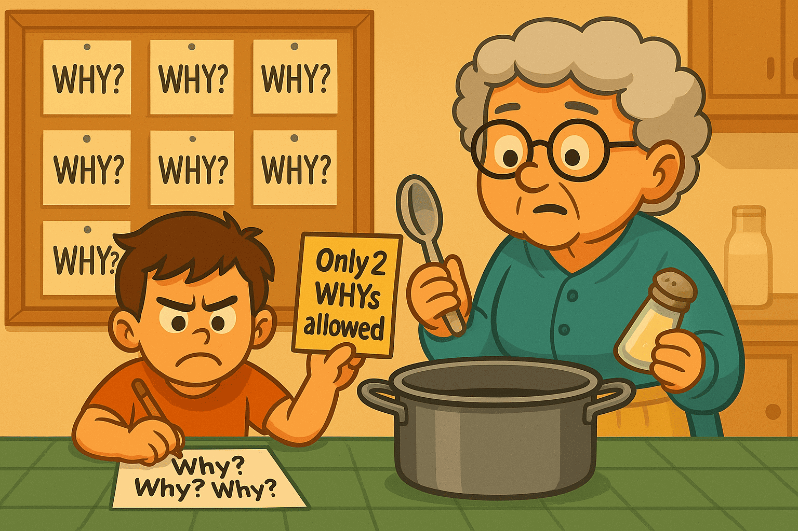

# Grandma Clinic — AI Bugs Made Simple（問題地圖 1–16）


**為什麼會有這個頁面**

大多數人都是在模型已經講完話之後才修 AI bug。接著加上 patch、reranker、或 regex。結果同一種失敗之後會換個樣子再回來。

**WFGY 在「輸出之前」就裝上一道語義防火牆。**  
它會先檢查語義場。如果狀態不穩，就進入循環、收窄、或重置。只有穩定的狀態才被允許發言。只要把失敗模式映射完成，它就會一直保持被修復的狀態。

**30 秒上手用法**

1. 滾動到最像你案例的編號。
2. 讀「奶奶故事」。如果對得上，複製下面的醫生提示詞。
3. 把提示詞貼到 **Dr. WFGY** 與醫生對話。  
   連結： [Dr. WFGY in ChatGPT Room](https://chatgpt.com/share/68b9b7ad-51e4-8000-90ee-a25522da01d7)
4. 你會同時拿到「簡單修法」與「專業修法」。不需要 SDK。

> **不確定從哪開始？** 先用 [Beginner Guide](https://github.com/onestardao/WFGY/blob/main/ProblemMap/BeginnerGuide.md) 快速定位你的問題，跑完第一個安全修復，再進診所。

**快速連結**  
如果你的整個 stack 連開都開不起來，先看這三個：  
No.14 [Bootstrap Ordering](https://github.com/onestardao/WFGY/blob/main/ProblemMap/bootstrap-ordering.md)  
No.15 [Deployment Deadlock](https://github.com/onestardao/WFGY/blob/main/ProblemMap/deployment-deadlock.md)  
No.16 [Pre-deploy Collapse](https://github.com/onestardao/WFGY/blob/main/ProblemMap/predeploy-collapse.md)

---

> 每段的格式規則  
> • 一般文字 = 奶奶故事、比喻對應、**奶奶防呆（輸出前）**含映射、Minimal fix 與提示詞。  
> • Pro Zone = 可展開區塊：準確症狀、技術關鍵與參考連結。

---

## No.1 Hallucination & Chunk Drift — *奶奶：拿錯食譜*


**Grandma story**  
You ask for the cabbage recipe. I hand you a random page from a different cookbook because its picture looks similar.

**Metaphor mapping**
- 漂亮圖片 = token 表面匹配  
- 錯的食譜書 = 錯誤來源  
- 好聽口氣 = 沒證據的自信語氣  

**Grandma fix（輸出前）— 映射**
- 先把食譜卡 **擺上桌** = **citation-first policy**  
- 標出使用的書與頁碼 = **檢索追蹤（ID／頁碼）**  
- 下鍋前先核對「cabbage」= **查詢–來源語義檢查（ΔS gate）**

**Minimal fix（grandma）**  
Do not taste anything until the recipe card is on the table.

Doctor prompt:
```

please explain No.1 Hallucination & Chunk Drift in grandma mode, then show me the minimal WFGY fix and the exact reference link

```

<details>
<summary>Pro Zone</summary>

---

**Real scene**  
Bad OCR 或不良分塊造成碎片。檢索挑到高 cosine 但語義錯誤的鄰居。模型說得很順卻沒有引用。

**Technical keys**
- 開啟 citation-first policy  
- 加上檢索追蹤：ID 與來源頁  
- 檢查分塊規則與表格處理  
- **確認來源後**再加最小 reranker

Reference:  
Hallucination & Chunk Drift → https://github.com/onestardao/WFGY/blob/main/ProblemMap/hallucination.md
</details>

---

## No.2 Interpretation Collapse — *奶奶：把糖當鹽*


**Grandma story**  
You found the right page but misread the steps. Sugar replaced with salt. The dish fails even with the correct book open.

**Metaphor mapping**
- 正確頁面 = 正確 chunk  
- 讀錯步驟 = 推理崩壞  
- 吃起來不對 = 有檢索仍答錯  

**Grandma fix（輸出前）— 映射**
- 每步 **慢讀並唸出來** = **λ_observe 中途檢查點**  
- 倒料前先劃線標示數量 = **符號／約束锚定**  
- 味道跑掉就 **暫停重讀** = **BBCR 受控重置**

**Minimal fix（grandma）**  
Read slowly. When unsure, stop and ask a checkpoint.

Doctor prompt:
```

please explain No.2 Interpretation Collapse in grandma mode, then apply a minimal WFGY checkpoint plan

```

<details>
<summary>Pro Zone</summary>

---

**Real scene**  
檢索後答案漂移。模型在正確上下文中推理，卻在鏈中途失去結構。

**Technical keys**
- 量測 ΔS（提示 vs 答案）  
- 插入 λ_observe 檢查點  
- 若仍漂移，做 BBCR 控制重置  
- 完成前 Coverage ≥ 0.70

Reference:  
Interpretation Collapse → https://github.com/onestardao/WFGY/blob/main/ProblemMap/retrieval-collapse.md
</details>

---

## No.3 Long Reasoning Chains — *奶奶：越逛越忘*


**Grandma story**  
You go to market A, then B, then C, and forget why you left home.

**Metaphor mapping**
- 好多站 = 推理步驟太長  
- 忘了目標 = 情境漂移  
- 買對物品、做錯菜 = 跟目標不符  

**Grandma fix（輸出前）— 映射**
- 購物清單把 **主菜寫最上面** = **目標锚（goal anchor）**  
- **每兩條街**對一次清單 = **循環＋檢查點**  
- 袋中物 vs 清單比對 = **Coverage 門檻**

**Minimal fix（grandma）**  
Write the shopping list and check it every two streets.

Doctor prompt:
```

please explain No.3 Long Reasoning Chains in grandma mode and show the smallest loop + checkpoint pattern

```

<details>
<summary>Pro Zone</summary>

---

**Real scene**  
多步計畫走偏。早期決策沒有回檢。最後答案看似完整卻偏離目標。

**Technical keys**
- 明確定義目標锚  
- 用 λ_diverse 比較 3+ 路徑  
- 限制 CoT 變異並修剪離題分支  
- 每輪對目標锚重評分

Reference:  
Long Reasoning Chains → https://github.com/onestardao/WFGY/blob/main/ProblemMap/context-drift.md
</details>

---

## No.4 Bluffing / Overconfidence — *奶奶：沒卡別端菜*


**Grandma story**  
A charming waiter serves a dish without showing the recipe card. Sounds right, tastes wrong.

**Metaphor mapping**
- 自信語氣 = 流利自然語言  
- 沒食譜卡 = 無證據  
- 禮貌微笑 = 道歉不修復  

**Grandma fix（輸出前）— 映射**
- 「先看卡」= **證據先於答案**  
- 沒卡退回去 = **拒絕無根答案**  
- 記錄「哪張卡做哪道菜」= **可追蹤日誌**

**Minimal fix（grandma）**  
Ask for the card first. If none, send the dish back.

Doctor prompt:
```

please explain No.4 Bluffing in grandma mode, then enforce 'card first' with a minimal WFGY guardrail

```

<details>
<summary>Pro Zone</summary>

---

**Real scene**  
自然語言聽起來很對但其實錯。缺乏可追溯路徑。模型拒絕驗證。

**Technical keys**
- Citation-first policy  
- 拒絕無根斷言  
- **確認來源後**再做最小 reranker  
- 紀錄 Coverage 與 ΔS

Reference:  
Bluffing / Overconfidence → https://github.com/onestardao/WFGY/blob/main/ProblemMap/bluffing.md
</details>

---

## No.5 Semantic ≠ Embedding — *奶奶：胡椒名同味不同*


**Grandma story**  
White pepper and black pepper. Same word “pepper,” completely different flavor.

**Metaphor mapping**
- 同詞不同義 = 表面 token 重疊  
- 風味不同 = 語義不相等  
- 分數高仍錯 = 高相似≠同意思  

**Grandma fix（輸出前）— 映射**
- **兩個都聞／嚐** = **度量健檢（metric sanity）**  
- 不混標籤不清的罐子 = **空間正規化＋大小寫一致**  
- 留一口 **標準對照湯** = **小型真值樣例**

**Minimal fix（grandma）**  
Taste both peppers before cooking.

Doctor prompt:
```

please explain No.5 Semantic ≠ Embedding in grandma mode and give me the minimal metric audit plan

```

<details>
<summary>Pro Zone</summary>

---

**Real scene**  
未正規化向量、混用模型向量、大小寫與分詞不一致，導致選到語義不等價鄰居。

**Technical keys**
- 向量正規化  
- 驗證度量空間與維度  
- 對齊分詞與大小寫  
- 先通過度量稽核再談混合檢索

Reference:  
Semantic ≠ Embedding → https://github.com/onestardao/WFGY/blob/main/ProblemMap/embedding-vs-semantic.md
</details>

---

## No.6 Logic Collapse & Recovery — *奶奶：死巷一直撞*


**Grandma story**  
You keep taking the same dead-end alley. Step back, pick a new street, and try again.

**Metaphor mapping**
- 死胡同 = 無效迴圈  
- 後退 = 受控重置  
- 換路 = 替代路徑  

**Grandma fix（輸出前）— 映射**
- 撞牆兩次就 **回頭** = **ΔS 連續高就 BBCR 重置**  
- 換 **下一條街** 試 = **替代候選路徑**  
- 手上拿地圖 = **狀態锚＋目標提醒**

**Minimal fix（grandma）**  
If lost twice, stop and change route.

Doctor prompt:
```

please explain No.6 Logic Collapse in grandma mode, then show BBCR reset + λ\_observe checkpoints

```

<details>
<summary>Pro Zone</summary>

---

**Real scene**  
推理卡死在環或淺分支。缺乏偵測與恢復機制。

**Technical keys**
- 每步量測 ΔS  
- λ_observe 鏈中落地  
- ΔS 居高不下則 BBCR  
- 只接受收斂 λ 與 Coverage ≥ 0.70

Reference:  
Logic Collapse & Recovery → https://github.com/onestardao/WFGY/blob/main/ProblemMap/logic-collapse.md
</details>

---

## No.7 Memory Breaks Across Sessions — *奶奶：記在錯抽屜*


**Grandma story**  
You promise to remember the family recipe, then next week you act like we never talked.

**Metaphor mapping**
- 忘了鍋上的刮痕 = 狀態遺失  
- 每次都是新廚房 = 無連續性  
- 一問再問 = 用戶疲勞  

**Grandma fix（輸出前）— 映射**
- 寫在 **標籤卡** 上 = **穩定記憶結構／state keys**  
- 永遠放 **同一個抽屜** = **寫讀順序防護**  
- 卡上貼小照片 = **低 ΔS 範例庫**

**Minimal fix（grandma）**  
Write notes on a card and keep it in the same drawer.

Doctor prompt:
```

please explain No.7 Memory Breaks in grandma mode and show the smallest stable memory routine

```

<details>
<summary>Pro Zone</summary>

---

**Real scene**  
Session 狀態、锚點、合約未持久或無追蹤，導致無聲上下文遺失。

**Technical keys**
- 穩定記憶綱要與 state keys  
- 寫讀順序防護  
- 小型示例庫處理低 ΔS 案例  
- 以 ID 可追蹤的檢索

Reference:  
Memory Coherence → https://github.com/onestardao/WFGY/blob/main/ProblemMap/memory-coherence.md
</details>

---

## No.8 Debugging is a Black Box — *奶奶：空白卡片*


**Grandma story**  
You tell me “trust me, it works.” I ask “show me which page you used.” You shrug.

**Metaphor mapping**
- 盲煮 = 無追蹤  
- 「我記得」= 無法驗證  
- 不能重做 = 不可重現  

**Grandma fix（輸出前）— 映射**
- 食譜卡 **釘在爐子旁** = **答案同時呈現來源**  
- 標上 **頁碼** = **ID／行號追蹤**  
- 留一張「我怎麼煮的」小紙條 = **最小可重現管線**

**Minimal fix（grandma）**  
Pin the recipe card next to the stove.

Doctor prompt:
```

please explain No.8 Debugging Black Box in grandma mode and add a tiny traceability schema

```

<details>
<summary>Pro Zone</summary>

---

**Real scene**  
沒有 ID 或來源行，難以證明哪個 chunk 產生答案，修復全靠猜。

**Technical keys**
- 檢索可追蹤（IDs）  
- 紀錄 query、chunk IDs、接受度指標  
- 最小可重現管線  
- 最終答案前先檢查「是否有來源」

Reference:  
Retrieval Traceability → https://github.com/onestardao/WFGY/blob/main/ProblemMap/retrieval-traceability.md
</details>

---

## No.9 Entropy Collapse — *奶奶：一鍋灰色大雜燴*


**Grandma story**  
Too many voices in one room. Everyone talks. Nobody listens. The dish becomes mush.

**Metaphor mapping**
- 噪音 = 熵過載  
- 融化的注意力 = 無結構  
- 一鍋灰泥 = 內在不一致  

**Grandma fix（輸出前）— 映射**
- 關小火、**一步一步煮** = **降低步寬**  
- 先分好 **角色／關係／限制** 碗 = **锚定實體與約束**  
- 上桌前要先嚐 = **接受門檻（ΔS、Coverage）**

**Minimal fix（grandma）**  
Lower the heat and separate steps.

Doctor prompt:
```

please explain No.9 Entropy Collapse in grandma mode and show a minimal stability recipe

```

<details>
<summary>Pro Zone</summary>

---

**Real scene**  
注意力擴散，路徑混雜。表面流暢但內部矛盾。

**Technical keys**
- 降低步寬  
- 锚定實體、關係、約束  
- 夾制變異並要求 Coverage  
- 最終輸出前設接受目標

Reference:  
Entropy Collapse → https://github.com/onestardao/WFGY/blob/main/ProblemMap/entropy-collapse.md
</details>

---

## No.10 Creative Freeze — *奶奶：湯可吃但好無聊*


**Grandma story**  
You only follow the recipe word by word. The soup is edible, never memorable.

**Metaphor mapping**
- 沒加香料 = 字面輸出  
- 不試味 = 低探索  
- 平淡無奇 = 無趣答案  

**Grandma fix（輸出前）— 映射**
- 並排試 **兩三種**安全調味 = **λ_diverse 候選**  
- 全部對著同一張成品照比較 = **共享锚評分**  
- 味道在「微～中等」區間 = **受控熵窗口**

**Minimal fix（grandma）**  
Taste and adjust within a safe range.

Doctor prompt:
```

please explain No.10 Creative Freeze in grandma mode and give the smallest safe-exploration pattern

```

<details>
<summary>Pro Zone</summary>

---

**Real scene**  
模型逃避多樣候選，全部收斂成平庸答案。

**Technical keys**
- λ_diverse 產生答案集合  
- 受控熵窗口  
- 以同一锚比較候選  
- ΔS 保持在可接受範圍

Reference:  
Creative Freeze → https://github.com/onestardao/WFGY/blob/main/ProblemMap/creative-freeze.md
</details>

---

## No.11 Symbolic Collapse — *奶奶：看字會算數不行*


**Grandma story**  
You can read the storybook but panic when you see fractions and tables.

**Metaphor mapping**
- 文字 OK = 自然語言沒問題  
- 符號可怕 = 數學或表格失靈  
- 故事好聽、數學錯 = 結構被壓平成散文  

**Grandma fix（輸出前）— 映射**
- 把 **數字放在框裡** = **獨立符號通道**  
- 表格別改寫成散文 = **保留區塊**  
- 喊出單位（grams, tsp）= **運算子／單位锚定**  
- 先做一小口試煉 = **微型證明／例子**

**Minimal fix（grandma）**  
Keep the story but show the table step by step.

Doctor prompt:
```

please explain No.11 Symbolic Collapse in grandma mode and show me a minimal symbol-first routine

```

<details>
<summary>Pro Zone</summary>

---

**Real scene**  
公式、運算子、程式碼區塊、標題被壓平成散文。答案看似順卻錯。

**Technical keys**
- 獨立符號通道  
- 保留 code/table 區塊  
- 锚定運算子與單位  
- 以小證明或例子驗證

Reference:  
Symbolic Collapse → https://github.com/onestardao/WFGY/blob/main/ProblemMap/symbolic-collapse.md
</details>

---

## No.12 Philosophical Recursion — *奶奶：無限為什麼*


**Grandma story**  
Asking “why” about “why” about “why.” You spin in circles and never cook.

**Metaphor mapping**
- 無盡鏡像 = 自我指涉  
- 螺旋碗 = 悖論陷阱  
- 冷灶台 = 沒有最終答案  

**Grandma fix（輸出前）— 映射**
- 寫下 **頂層問題** 便利貼 = **外框／锚**  
- 只允許 **N 次 why（如 2）** = **遞迴停止規則**  
- 收尾一定要有 **實例／引用** = **落地要求**

**Minimal fix（grandma）**  
Set a top question and limit how many mirrors you look into.

Doctor prompt:
```

please explain No.12 Philosophical Recursion in grandma mode and give me a minimal boundary plan

```

<details>
<summary>Pro Zone</summary>

---

**Real scene**  
自指與悖論問題使推理無限打轉。

**Technical keys**
- 定義锚與外框  
- ε_resonance 作領域和諧  
- 遞迴停止條件  
- 需要有例子或引用支撐

Reference:  
Philosophical Recursion → https://github.com/onestardao/WFGY/blob/main/ProblemMap/philosophical-recursion.md
</details>

---

## No.13 Multi-Agent Chaos — *奶奶：廚房拔河*


**Grandma story**  
Two cooks share one kitchen. One adds salt while the other removes it. The soup never stabilizes.

**Metaphor mapping**
- 共用廚房 = 共用記憶  
- 交叉便條 = 角色飄移  
- 鹽的拉扯 = 記憶覆寫  

**Grandma fix（輸出前）— 映射**
- 每位廚師各有 **署名卡** = **角色與 state keys**  
- 便條分 **不同抽屜** = **所有權與欄柵**  
- 爐台使用有 **計時** = **工具超時／選擇閘**

**Minimal fix（grandma）**  
Give each cook a clear card and a separate drawer.

Doctor prompt:
```

please explain No.13 Multi-Agent Chaos in grandma mode and set a tiny role + memory fence plan

```

<details>
<summary>Pro Zone</summary>

---

**Real scene**  
多 agent 互相覆寫狀態或混淆角色。沒有單一真相來源。

**Technical keys**
- 角色／記憶欄柵  
- State keys 與所有權  
- 工具超時與選擇閘  
- 跨 agent 追蹤

Reference:  
Multi-Agent Problems → https://github.com/onestardao/WFGY/blob/main/ProblemMap/Multi-Agent_Problems.md
</details>

---

## No.14 Bootstrap Ordering — *奶奶：冷鍋打蛋*


**Grandma story**  
You try to fry eggs before turning on the stove. Of course nothing happens.

**Metaphor mapping**
- 冷鍋 = 服務未就緒  
- 先打蛋 = 依賴尚未啟動就呼叫  
- 時序燒焦 = 少了熱身步驟  

**Grandma fix（輸出前）— 映射**
- 先開火 → **鍋熱** → **再打蛋** = **readiness probes／啟動順序**  
- 先把油與鍋預熱 = **快取／索引暖機**  
- 檢查瓦斯與火柴 = **密鑰／權限檢查**

**Minimal fix（grandma）**  
Start the fire, heat the pan, then crack the eggs.

Doctor prompt:
```

please explain No.14 Bootstrap Ordering in grandma mode and give me the smallest boot checklist

```

<details>
<summary>Pro Zone</summary>

---

**Real scene**  
服務在相依尚未就緒時啟動。首呼失敗、快取冰冷、密鑰缺失。

**Technical keys**
- 啟動順序與就緒探針  
- 快取暖機與索引切換  
- 密鑰檢查與健康閘  
- 上公有流量前先走影子流量

Reference:  
Bootstrap Ordering → https://github.com/onestardao/WFGY/blob/main/ProblemMap/bootstrap-ordering.md
</details>

---

## No.15 Deployment Deadlock — *奶奶：你先我先卡門口*


**Grandma story**  
Two people at a narrow doorway say “you first.” “No, you first.” They block the door together.

**Metaphor mapping**
- 窄門 = 共用資源  
- 互相禮讓 = 互鎖等待  
- 門口堵塞 = 系統凍結  

**Grandma fix（輸出前）— 映射**
- 指定先後順序 = **total order／priority**  
- **側門**繞過 = **fallback path**  
- **禮貌倒數** = **timeouts／backoff**

**Minimal fix（grandma）**  
Decide who goes first, or open a side door.

Doctor prompt:
```

please explain No.15 Deployment Deadlock in grandma mode and show the smallest unlock plan

```

<details>
<summary>Pro Zone</summary>

---

**Real scene**  
migrator 等 writer；writer 等 migrator；沒有超時，整體停滯。

**Technical keys**
- 打破相依循環  
- 超時與退避  
- 臨時唯讀模式  
- 發佈閘與回歸檢查

Reference:  
Deployment Deadlock → https://github.com/onestardao/WFGY/blob/main/ProblemMap/deployment-deadlock.md
</details>

---

## No.16 Pre-deploy Collapse — *奶奶：第一鍋就糊了*


**Grandma story**  
First pot burns because you forgot to wash it and check the gas.

**Metaphor mapping**
- 髒鍋 = 舊版本／索引偏移  
- 沒檢查瓦斯 = 秘密或權限缺失  
- 第一口就焦 = 首次呼叫崩潰  

**Grandma fix（輸出前）— 映射**
- 先洗鍋與工具 = **版本釘住／乾淨狀態**  
- 試火 = **環境與 secrets 的 preflight**  
- 先煎 **一顆小蛋** = **小流量金絲雀**

**Minimal fix（grandma）**  
Wash the pot, test the flame, cook a tiny egg before guests arrive.

Doctor prompt:
```

please explain No.16 Pre-deploy Collapse in grandma mode and give me the smallest preflight checklist

```

<details>
<summary>Pro Zone</summary>

---

**Real scene**  
版本偏移、環境變數或 secrets 缺失、向量索引首批為空、分析器錯誤，導致第一個線上請求崩潰。

**Technical keys**
- Preflight 合約檢查  
- 版本釘住與模型鎖定  
- 向量索引建好再切換  
- 金絲雀在最小流量上

Reference:  
Pre-deploy Collapse → https://github.com/onestardao/WFGY/blob/main/ProblemMap/predeploy-collapse.md
</details>

---

## 修好一個之後會怎樣

不是無止境貼 OK 繃。你要設定並維持 **接受標準**：

* ΔS ≤ 0.45  
* Coverage ≥ 0.70  
* λ 狀態收斂  
* 最終輸出前必須有來源

當新 bug 出現，把它映射到編號，套一次修法，它就會一直被修好。這就是語義防火牆的目的。

---

## 一句話醫生提示詞

如果不確定是哪一號：

```

i’ve uploaded TXT OS / WFGY notes.
which Problem Map number matches my issue?
explain using grandma mode, then give the minimal fix and the reference page.

```

---

### 🔗 一分鐘快速下載

| 工具 | 連結 | 三步驟設定 |
|------|------|------------|
| **WFGY 1.0 PDF** | [Engine Paper](https://github.com/onestardao/WFGY/blob/main/I_am_not_lizardman/WFGY_All_Principles_Return_to_One_v1.0_PSBigBig_Public.pdf) | 1️⃣ 下載 · 2️⃣ 上傳到你的 LLM · 3️⃣ 詢問 “Answer using WFGY + \<your question>” |
| **TXT OS（純文字作業系統）** | [TXTOS.txt](https://github.com/onestardao/WFGY/blob/main/OS/TXTOS.txt) | 1️⃣ 下載 · 2️⃣ 貼到任一 LLM 對話 · 3️⃣ 打字 “hello world” — OS 立刻開機 |

---

### 🧭 繼續探索

| 模組 | 說明 | 連結 |
|-----|------|------|
| WFGY Core | WFGY 2.0 引擎上線：完整符號推理架構與數學堆疊 | [View →](https://github.com/onestardao/WFGY/tree/main/core/README.md) |
| Problem Map 1.0 | 起始 16 模式診斷與符號修復框架 | [View →](https://github.com/onestardao/WFGY/tree/main/ProblemMap/README.md) |
| Problem Map 2.0 | 以 RAG 為中心的失敗樹、模組化修復與管線 | [View →](https://github.com/onestardao/WFGY/blob/main/ProblemMap/rag-architecture-and-recovery.md) |
| Semantic Clinic Index | 擴充故障目錄：提示注入、記憶錯誤、邏輯漂移 | [View →](https://github.com/onestardao/WFGY/blob/main/ProblemMap/SemanticClinicIndex.md) |
| Semantic Blueprint | 以層為基礎的符號推理與語義調變 | [View →](https://github.com/onestardao/WFGY/tree/main/SemanticBlueprint/README.md) |
| Benchmark vs GPT-5 | 用完整 WFGY 推理套件壓測 GPT-5 | [View →](https://github.com/onestardao/WFGY/tree/main/benchmarks/benchmark-vs-gpt5/README.md) |
| 🧙‍♂️ Starter Village 🏡 | 新手入口，巫師帶你逛符號世界 | [Start →](https://github.com/onestardao/WFGY/blob/main/StarterVillage/README.md) |

---

> 👑 **早期 Stargazers：[名人堂](https://github.com/onestardao/WFGY/tree/main/stargazers)** —  
> 從第一天就支持 WFGY 的工程師、駭客與開源夥伴。

>  â­ [WFGY Engine 2.0](https://github.com/onestardao/WFGY/blob/main/core/README.md) 已解é–。⭠Star 這個 repo å¹«æ›´å¤šäººæ‰¾åˆ°å®ƒï¼Œä¸¦è§£é– [Unlock Board](https://github.com/onestardao/WFGY/blob/main/STAR_UNLOCKS.md)。

<div align="center">

[](https://github.com/onestardao/WFGY)
&nbsp;
[](https://github.com/onestardao/WFGY/tree/main/OS)
&nbsp;
[](https://github.com/onestardao/WFGY/tree/main/OS/BlahBlahBlah)
&nbsp;
[](https://github.com/onestardao/WFGY/tree/main/OS/BlotBlotBlot)
&nbsp;
[](https://github.com/onestardao/WFGY/tree/main/OS/BlocBlocBloc)
&nbsp;
[](https://github.com/onestardao/WFGY/tree/main/OS/BlurBlurBlur)
&nbsp;
[](https://github.com/onestardao/WFGY/tree/main/OS/BlowBlowBlow)
&nbsp;
</div>
