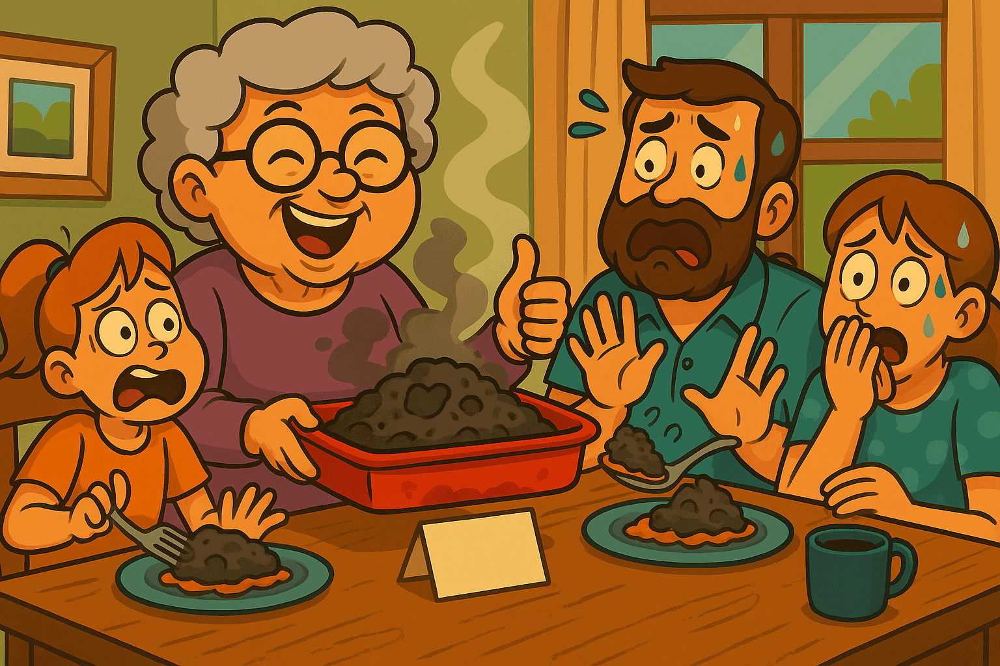

# 阿嬤的 AI 小診所：16 種常見錯誤，生活化解釋＋修法 (問題地圖 1–16)


**為什麼要有這一頁**

多數人都是在模型已經開口**之後**才修 AI 錯誤，於是加上補丁、重排序或正則。結果同一種錯誤過陣子又換個樣子回來。

**WFGY 會在輸出 *之前* 安裝到語義防火牆。**  
它會先看語義場。如果狀態不穩，就循環、收窄或重置。只有穩定狀態才允許輸出。只要把失敗模式映射完成，就能一直保持被修復。

**30 秒快速使用**

1. 滾到最像你情況的編號。
2. 讀「阿嬤故事」。對得上就複製醫生提示詞。
3. 把提示詞貼到 **WFGY 醫生** 跟醫生對話。  
   連結：[Dr. WFGY in ChatGPT Room](https://chatgpt.com/share/68b9b7ad-51e4-8000-90ee-a25522da01d7)
4. 你會同時拿到「簡單修法」與「專業修法」。不需要 SDK。

> **不確定從哪開始？** 先用 [新手指南](https://github.com/onestardao/WFGY/blob/main/ProblemMap/BeginnerGuide.md) 快速辨識你的問題，先跑一個安全修復，再進診所。

**快速連結**  
如果你的整個系統連開機都開不起來，先看：  
No.14 [啟動順序 (Bootstrap Ordering)](https://github.com/onestardao/WFGY/blob/main/ProblemMap/bootstrap-ordering.md)  
No.15 [部署死結 (Deployment Deadlock)](https://github.com/onestardao/WFGY/blob/main/ProblemMap/deployment-deadlock.md)  
No.16 [預部署崩潰 (Pre-deploy Collapse)](https://github.com/onestardao/WFGY/blob/main/ProblemMap/predeploy-collapse.md)

---

## 🔎 快速索引 — 👵 阿嬤＋分類（對齊 Problem Map 1.0）

> 下列為 16 種常見失敗：左欄是 **Problem Map 1.0 的類別**，右欄是 **阿嬤比喻**。  
> 你熟技術就從「分類」選；想直覺定位就從「阿嬤」選。

| No. | 問題（跳轉） | 分類（Problem Map 1.0） | 阿嬤標籤 | Emoji |
|----:|-----------------|-------------------------|-----------|:----:|
| 1 | [No.1 幻覺與段落漂移](#no01) | 找資料（檢索） | **拿錯食譜書** | 📖🍽️ |
| 2 | [No.2 理解崩潰](#no02) | 讀錯（推理） | **把糖當鹽** | 🧂🍬 |
| 3 | [No.3 推理鏈過長](#no03) | 失去目標（規劃） | **買菜買到迷路** | 🛒🧾 |
| 4 | [No.4 虛張聲勢／過度自信](#no04) | 無根據輸出 | **沒有食譜卡** | 🍽️❌ |
| 5 | [No.5 語義 ≠ 嵌入](#no05) | 向量不匹配 | **胡椒混淆** | 🌶️⚖️ |
| 6 | [No.6 邏輯崩潰與恢復](#no06) | 迴圈／卡住 | **死巷子** | 🚧↩️ |
| 7 | [No.7 記憶斷裂（跨回合）](#no07) | 忘記狀態 | **記在錯抽屜** | 🗄️📝 |
| 8 | [No.8 黑箱除錯](#no08) | 無追溯性 | **空白卡** | 🃏🔎 |
| 9 | [No.9 熵崩潰](#no09) | 噪音過多 | **一鍋灰燉湯** | 🍲🌫️ |
| 10 | [No.10 創意凍結](#no10) | 無探索 | **湯很清淡** | 🥣🧊 |
| 11 | [No.11 符號崩潰](#no11) | 符號／表格壞 | **忽略分數** | ➗📐 |
| 12 | [No.12 哲學遞迴](#no12) | 無限問為什麼 | **無限 Why** | 🔁❓ |
| 13 | [No.13 多代理混亂](#no13) | 角色／記憶衝突 | **廚房拔河** | 👩‍🍳👨‍🍳 |
| 14 | [No.14 啟動順序錯誤](#no14) | 開機次序錯 | **冷鍋打蛋** | 🍳🧯 |
| 15 | [No.15 部署死結](#no15) | 資源互鎖 | **你先我先的門口** | 🚪⏳ |
| 16 | [No.16 預部署崩潰](#no16) | 預檢失敗 | **第一鍋就糊了** | 🍯🔥 |

---

> Tips  
> • **分類** → 對應主表中的專業 Problem Map 1.0 類別。  
> • **阿嬤標籤** → 以生活比喻讓錯誤更直覺。  
> • 任一欄都能點，直接跳到修復區塊。

想看完整清單與延伸修復：  
[Problem Map 1.0](https://github.com/onestardao/WFGY/tree/main/ProblemMap/README.md) | [Problem Map 2.0](https://github.com/onestardao/WFGY/blob/main/ProblemMap/SemanticClinicIndex.md) | [Semantic Clinic](https://github.com/onestardao/WFGY/blob/main/ProblemMap/SemanticClinicIndex.md) | [Global Fix Map](https://github.com/onestardao/WFGY/blob/main/ProblemMap/GlobalFixMap/README.md) | [FAQ](https://github.com/onestardao/WFGY/blob/main/ProblemMap/faq.md)

---

## 🛡️ 阿嬤的「輸出前」檢查清單（回答前先過一遍）

- 🧾 **卡片先上桌** → 來源／引用要在答案之前出現  
- 🔎 **比對的是語義不是外表** → 通過 ΔS 語義閘門  
- 🧭 **鏈中檢查點** → 用 λ_observe；若漂移持續，執行 **BBCR** 重置  
- ✅ **只接受穩定狀態** → 覆蓋率 ≥ 0.70、λ 收斂、來源存在

> 小提示：你可以把這頁或任一 Problem Map 區塊的**截圖**貼給 **WFGY 醫生**直接問：  
> *「我現在打到哪一號？請給最小修法與連結。」*

---

> 內容格式規則  
> • 內文：阿嬤故事、比喻對應、**阿嬤防呆（輸出前）**含映射、最小修法與提示詞。  
> • Pro 區：可展開，列出真實症狀、技術關鍵與參考連結。

---

<a id="no01"></a>
## No.1 幻覺與段落漂移 — *阿嬤：拿錯食譜書*


**阿嬤故事**  
你要白菜湯的做法，我卻因為看圖很像，就從別本食譜撕了一頁給你。

**比喻對應**
- 漂亮圖片＝表面 token 匹配  
- 錯的食譜書＝錯誤來源  
- 好聽口氣＝沒有證據的自信

**阿嬤防呆（輸出前）— 映射**
- 先把食譜卡**擺上桌**＝**citation-first**  
- 標明哪本書、第幾頁＝**檢索追蹤（ID／頁碼）**  
- 確認卡片標題真的是「cabbage」＝**查詢–來源語義檢（ΔS gate）**

**最小修法（阿嬤版）**  
卡片沒在桌上前，**不要**先讓人品嚐。

**醫生提示詞**
```

請用阿嬤模式解釋第 1 題「幻覺與段落漂移」，再給我最小 WFGY 修法與精確參考連結。

```

**阿嬤檢查（30 秒自測）**
- [ ] 來源卡可見（書＋頁／ID）  
- [ ] 通過 ΔS 語義閘門  
- [ ] 無卡時會拒絕輸出

<details>
<summary>Pro 區</summary>

---

**真實情境**  
壞 OCR/壞分塊造成碎片。檢索挑到高 cosine 但語義錯的鄰居。模型講得很順，卻沒引用。

**技術關鍵**
- 開啟 citation-first  
- 加檢索追蹤（ID／來源頁）  
- 檢查分塊規則與表格處理  
- 只在**確認來源後**才加最小 reranker

Reference:  
Hallucination & Chunk Drift → https://github.com/onestardao/WFGY/blob/main/ProblemMap/hallucination.md
</details>

---

<a id="no02"></a>
## No.2 理解崩潰 — *阿嬤：把糖當鹽*


**阿嬤故事**  
翻到對的頁面，卻把做法看反，把糖換成鹽；就算書翻對了，菜還是失敗。

**比喻對應**
- 對的頁面＝正確 chunk  
- 看錯步驟＝推理崩潰  
- 吃起來不對＝有檢索仍答錯

**阿嬤防呆（輸出前）— 映射**
- 每步**慢讀並唸出來**＝**λ_observe 鏈中檢查點**  
- 倒料前先劃線標示數量＝**符號／約束錨定**  
- 味道漂移就**暫停重讀**＝**BBCR 控制重置**

**最小修法（阿嬤版）**  
讀慢、不確定就設檢查點。

**醫生提示詞**
```

請用阿嬤模式解釋第 2 題「理解崩潰」，並套用最小 WFGY 檢查點計畫。

```

**阿嬤檢查（30 秒自測）**
- [ ] 數量／運算子已錨定  
- [ ] 至少一個 λ_observe 檢查點  
- [ ] 漂移時有 BBCR 重置方案

<details>
<summary>Pro 區</summary>

---

**真實情境**  
檢索正確，但中途失去結構，答案偏移。

**技術關鍵**
- 量測 ΔS（提示 vs 答案）  
- 插入 λ_observe  
- 漂移續存則 BBCR  
- 完成前 Coverage ≥ 0.70

Reference:  
Interpretation Collapse → https://github.com/onestardao/WFGY/blob/main/ProblemMap/retrieval-collapse.md
</details>

---

<a id="no03"></a>
## No.3 推理鏈過長 — *阿嬤：買菜買到迷路*


**阿嬤故事**  
去 A 市場、再 B、再 C，最後忘了要煮什麼。

**比喻對應**
- 站點多＝步驟太長  
- 忘了目標＝情境漂移  
- 買對食材做錯菜＝與目標不符

**阿嬤防呆（輸出前）— 映射**
- 清單最上面寫**主菜**＝**目標錨**  
- **每兩條街**對一次清單＝**循環＋檢查點**  
- 袋中物 vs 清單比對＝**Coverage 門檻**

**最小修法（阿嬤版）**  
先寫清單，走兩條街就核對。

**醫生提示詞**
```

請用阿嬤模式解釋第 3 題「推理鏈過長」，並示範最小的循環＋檢查點樣式。

```

**阿嬤檢查（30 秒自測）**
- [ ] 目標錨明確寫下  
- [ ] 循環內含定期檢查  
- [ ] 完成前 Coverage ≥ 門檻

<details>
<summary>Pro 區</summary>

---

**真實情境**  
多步計畫會走偏；早期決策未回檢，結尾看似完整卻離題。

**技術關鍵**
- 明確定義目標錨  
- 用 λ_diverse 比較 3+ 路徑  
- 夾制 CoT 變異、修剪離題分支  
- 每輪對目標錨重評

Reference:  
Long Reasoning Chains → https://github.com/onestardao/WFGY/blob/main/ProblemMap/context-drift.md
</details>

---

<a id="no04"></a>
## No.4 虛張聲勢／過度自信 — *阿嬤：沒卡別端菜*


**阿嬤故事**  
服務生很有自信地上菜，但不給食譜卡。聽起來都對、吃起來不對。

**比喻對應**
- 自信語氣＝流利自然語言  
- 沒食譜卡＝無證據  
- 禮貌微笑＝道歉不修復

**阿嬤防呆（輸出前）— 映射**
- 「**先看卡**」＝**證據先於答案**  
- 沒卡就退菜＝**拒絕無根輸出**  
- 記錄「哪張卡→哪道菜」＝**追蹤日誌**

**最小修法（阿嬤版）**  
先要食譜卡；沒有就退。

**醫生提示詞**
```

請用阿嬤模式解釋第 4 題「虛張聲勢／過度自信」，並用最小欄柵強制「卡片先行」。

```

**阿嬤檢查（30 秒自測）**
- [ ] 來源卡在答案前顯示  
- [ ] 無根輸出會被拒絕  
- [ ] 日誌含 來源→答案 連結

<details>
<summary>Pro 區</summary>

---


**真實情境**  
自然語言很流利但錯；路徑不可追，拒驗證。

**技術關鍵**
- Citation-first  
- 拒絕無根斷言  
- 來源確認後才 rerank  
- 記錄 Coverage 與 ΔS

Reference:  
Bluffing / Overconfidence → https://github.com/onestardao/WFGY/blob/main/ProblemMap/bluffing.md
</details>

---

<a id="no05"></a>
## No.5 語義 ≠ 嵌入 — *阿嬤：胡椒混淆*


**阿嬤故事**  
白胡椒、黑胡椒都叫 pepper，味道完全不同。

**比喻對應**
- 同詞不同義＝表面重疊  
- 風味不同＝語義不等價  
- 分數高仍錯＝高相似≠同意思

**阿嬤防呆（輸出前）— 映射**
- 兩瓶都**聞／嚐**＝**度量健檢**  
- 不混沒標籤的瓶子＝**正規化空間＋大小寫一致**  
- 留一口**對照湯**＝**小型真值樣例**

**最小修法（阿嬤版）**  
兩種胡椒都先試。

**醫生提示詞**
```

請用阿嬤模式解釋第 5 題「語義不等於嵌入」，並給我最小的度量稽核計畫。

```

**阿嬤檢查（30 秒自測）**
- [ ] 向量已正規化／分詞大小寫對齊  
- [ ] 度量空間與維度已驗證  
- [ ] 以樣例 sanity-check 鄰居

<details>
<summary>Pro 區</summary>

---

**真實情境**  
未正規化、跨模型向量混用、大小寫不一，導致挑到語義不等價的鄰居。

**技術關鍵**
- 向量正規化  
- 驗證度量空間與維度  
- 對齊分詞與大小寫  
- 通過度量稽核後再談混檢

Reference:  
Semantic ≠ Embedding → https://github.com/onestardao/WFGY/blob/main/ProblemMap/embedding-vs-semantic.md
</details>

---

<a id="no06"></a>
## No.6 邏輯崩潰與恢復 — *阿嬤：死巷一直撞*


**阿嬤故事**  
老是走進同一條死巷。退一步，換條路再試。

**比喻對應**
- 死巷＝無效迴圈  
- 後退＝受控重置  
- 換路＝替代路徑

**阿嬤防呆（輸出前）— 映射**
- 撞牆兩次就**回頭**＝**ΔS 連高→BBCR 重置**  
- 改走**下一條街**＝**替代候選路**  
- 手持小地圖＝**狀態錨＋目標提醒**

**最小修法（阿嬤版）**  
迷路兩次就換路。

**醫生提示詞**
```

請用阿嬤模式解釋第 6 題「邏輯崩潰與恢復」，並示範 BBCR 重置＋λ\_observe 檢查點。

```

**阿嬤檢查（30 秒自測）**
- [ ] 每步量測 ΔS  
- [ ] 鏈中套用 λ_observe  
- [ ] ΔS 久高即 BBCR

<details>
<summary>Pro 區</summary>
   
---

**真實情境**  
推理鎖在環或淺分支，缺偵測與恢復機制。

**技術關鍵**
- ΔS 每步探測  
- λ_observe 中途落地  
- ΔS 高則 BBCR  
- 只收斂的 λ＋Coverage ≥ 0.70

Reference:  
Logic Collapse & Recovery → https://github.com/onestardao/WFGY/blob/main/ProblemMap/logic-collapse.md
</details>

---

<a id="no07"></a>
## No.7 記憶斷裂（跨回合） — *阿嬤：記在錯抽屜*


**阿嬤故事**  
說好要記住家傳食譜，下週又裝作沒聽過。

**比喻對應**
- 忘了鍋的刮痕＝狀態遺失  
- 每次換新廚房＝無連續性  
- 一問再問＝用戶疲勞

**阿嬤防呆（輸出前）— 映射**
- 用**標籤卡**記錄＝**穩定記憶結構（state keys）**  
- 永遠放**同一個抽屜**＝**寫讀順序防護**  
- 卡上貼菜照片＝**低 ΔS 範例**

**最小修法（阿嬤版）**  
寫卡，固定收同一格。

**醫生提示詞**
```

請用阿嬤模式解釋第 7 題「記憶斷裂」，並展示最小穩定記憶流程。

```

**阿嬤檢查（30 秒自測）**
- [ ] State keys 清楚標示  
- [ ] 讀寫順序受保護  
- [ ] 以 ID 可追的範例檢索

<details>
<summary>Pro 區</summary>

---

**真實情境**  
回合狀態、錨點與契約未持久或無追蹤，造成靜默遺失。

**技術關鍵**
- 穩定記憶綱要＋ state keys  
- 讀寫順序防護  
- 低 ΔS 小型範例庫  
- 以 ID 可追檢索

Reference:  
Memory Coherence → https://github.com/onestardao/WFGY/blob/main/ProblemMap/memory-coherence.md
</details>

---

<a id="no08"></a>
## No.8 黑箱除錯 — *阿嬤：空白卡*


**阿嬤故事**  
你說「相信我啦，會動」。我問「哪一頁？」你聳肩。

**比喻對應**
- 蒙眼煮＝無追蹤  
- 「我記得」＝不可驗證  
- 不能重做＝不可重現

**阿嬤防呆（輸出前）— 映射**
- 把食譜卡**釘在爐邊**＝**來源隨答案呈現**  
- 標上**頁碼**＝**ID／行號追蹤**  
- 留「我怎麼煮的」便條＝**最小可重現管線**

**最小修法（阿嬤版）**  
食譜卡要跟菜一起上桌。

**醫生提示詞**
```

請用阿嬤模式解釋第 8 題「黑箱除錯」，並新增最小可追蹤結構。

```

**阿嬤檢查（30 秒自測）**
- [ ] 答案旁顯示來源  
- [ ] 追蹤含 ID／行號  
- [ ] 步驟端到端可重現

<details>
<summary>Pro 區</summary>

---

**真實情境**  
沒有 ID 或來源行，無法證明哪個 chunk 產生答案，修復全靠猜。

**技術關鍵**
- 檢索可追蹤（ID）  
- 記錄 query、chunk IDs、接受指標  
- 最小可重現管線  
- 最終輸出前先檢查「是否有來源」

Reference:  
Retrieval Traceability → https://github.com/onestardao/WFGY/blob/main/ProblemMap/retrieval-traceability.md
</details>

---

<a id="no09"></a>
## No.9 熵崩潰 — *阿嬤：一鍋灰燉湯*


**阿嬤故事**  
同時太多人說話；沒有結構；最後煮成一鍋灰泥。

**比喻對應**
- 噪音＝熵過載  
- 注意力融化＝無結構  
- 一鍋灰＝內在不一致

**阿嬤防呆（輸出前）— 映射**
- 關小火、**一步一步煮**＝**降低步寬**  
- 先備好**誰／什麼／限制**的碗＝**錨定實體、關係與約束**  
- 上桌前先嚐＝**接受目標（ΔS、Coverage）**

**最小修法（阿嬤版）**  
降火、分步、逐項確認。

**醫生提示詞**
```

請用阿嬤模式解釋第 9 題「熵崩壞」，並示範最小穩定食譜。

```

**阿嬤檢查（30 秒自測）**
- [ ] 步寬已降低，避免大雜燴  
- [ ] 實體／關係／限制已錨定  
- [ ] 出口前檢查接受目標

<details>
<summary>Pro 區</summary>

---

**真實情境**  
注意力擴散，路徑混雜；表面流暢，內部矛盾。

**技術關鍵**
- 降低步寬  
- 錨定實體、關係與約束  
- 夾制變異並要求 Coverage  
- 最終輸出前設接受門檻

Reference:  
Entropy Collapse → https://github.com/onestardao/WFGY/blob/main/ProblemMap/entropy-collapse.md
</details>

---

<a id="no10"></a>
## No.10 創意凍結 — *阿嬤：湯可吃但好無聊*


**阿嬤故事**  
逐字照做，湯能吃，沒有記憶點。

**比喻對應**
- 沒香料＝字面輸出  
- 不試味＝低探索  
- 平淡＝無趣答案

**阿嬤防呆（輸出前）— 映射**
- 並排試**兩三種**安全調味＝**λ_diverse 候選**  
- 全部對著同一張成品照比較＝**共享錨評分**  
- 味道維持「微～中等」＝**受控熵窗**

**最小修法（阿嬤版）**  
在安全範圍內試味、調整。

**醫生提示詞**
```

請用阿嬤模式解釋第 10 題「創意凍結」，並給最小的安全探索樣式。

```

**阿嬤檢查（30 秒自測）**
- [ ] 至少 2–3 個候選（λ_diverse）  
- [ ] 以同一錨比較  
- [ ] 熵窗受控

<details>
<summary>Pro 區</summary>

---

**真實情境**  
模型逃避多樣候選，全部收斂成平庸答案。

**技術關鍵**
- λ_diverse 產生答案集合  
- 受控熵窗  
- 以同一錨評分比較  
- ΔS 保持可接受

Reference:  
Creative Freeze → https://github.com/onestardao/WFGY/blob/main/ProblemMap/creative-freeze.md
</details>

---

<a id="no11"></a>
## No.11 符號崩潰 — *阿嬤：看字會、算數不行*


**阿嬤故事**  
讀故事沒問題，一看到分數、表格就慌。

**比喻對應**
- 文字 OK＝自然語言 OK  
- 符號可怕＝數學／表格失靈  
- 故事順、數學錯＝結構被壓平成散文

**阿嬤防呆（輸出前）— 映射**
- 把**數字放在框裡**＝**獨立符號通道**  
- 表格別改寫成散文＝**保留區塊**  
- 喊出單位（grams, tsp）＝**運算子／單位錨定**  
- 先做一口小試煉＝**微型證明／例子**

**最小修法（阿嬤版）**  
故事照講，表格逐格呈現。

**醫生提示詞**
```

請用阿嬤模式解釋第 11 題「符號崩潰」，並示範最小的「符號優先」流程。

```

**阿嬤檢查（30 秒自測）**
- [ ] 表格／程式碼保留為區塊  
- [ ] 符號／運算子／單位有錨定  
- [ ] 以小證明驗算

<details>
<summary>Pro 區</summary>

---

**真實情境**  
公式、運算子、程式碼、標題被壓平成散文；看似流暢其實錯。

**技術關鍵**
- 獨立符號通道  
- 保留 code／table 區塊  
- 錨定運算子與單位  
- 以小例證驗證

Reference:  
Symbolic Collapse → https://github.com/onestardao/WFGY/blob/main/ProblemMap/symbolic-collapse.md
</details>

---

<a id="no12"></a>
## No.12 哲學遞迴 — *阿嬤：無限 Why*


**阿嬤故事**  
一直問「為什麼的為什麼」，結果一直沒開始煮。

**比喻對應**
- 無盡鏡像＝自我指涉  
- 螺旋碗＝悖論陷阱  
- 冷灶台＝沒有最後答案

**阿嬤防呆（輸出前）— 映射**
- 寫下**頂層問題**＝**外框／錨**  
- 最多只允許 **N 次 why（如 2）**＝**遞迴停止規則**  
- 收尾一定要有**具體例子**或**引用**＝**落地要求**

**最小修法（阿嬤版）**  
先定頂層問題，限制 Why 次數。

**醫生提示詞**
```

請用阿嬤模式解釋第 12 題「哲學遞迴」，並提供最小邊界計畫。

```

**阿嬤檢查（30 秒自測）**
- [ ] 外框／錨已固定  
- [ ] 設定最大遞迴深度  
- [ ] 以例子或引用收尾

<details>
<summary>Pro 區</summary>

---

**真實情境**  
自指與悖論讓推理空轉。

**技術關鍵**
- 定義錨與外框  
- ε_resonance 作領域和諧  
- 設停止條件  
- 需要落地例子或引用

Reference:  
Philosophical Recursion → https://github.com/onestardao/WFGY/blob/main/ProblemMap/philosophical-recursion.md
</details>

---

<a id="no13"></a>
## No.13 多代理混亂 — *阿嬤：廚房拔河*


**阿嬤故事**  
兩個廚師共用一間廚房，一個加鹽、一個撈走；味道永遠不穩。

**比喻對應**
- 共用廚房＝共用記憶  
- 便條交叉＝角色漂移  
- 鹽的拉扯＝記憶覆寫

**阿嬤防呆（輸出前）— 映射**
- 每位廚師都有**署名卡**＝**角色與 state keys**  
- 便條分**不同抽屜**＝**所有權／欄柵**  
- 爐台使用設**計時**＝**工具超時／選擇閘**

**最小修法（阿嬤版）**  
給每位廚師清楚名卡與獨立抽屜。

**醫生提示詞**
```

請用阿嬤模式解釋第 13 題「多代理混亂」，並制定最小的角色＋記憶欄柵計畫。

```

**阿嬤檢查（30 秒自測）**
- [ ] 角色與 state keys 已定義  
- [ ] 所有權與欄柵已執行  
- [ ] 工具超時／選擇閘已設定

<details>
<summary>Pro 區</summary>

---

**真實情境**  
代理彼此覆寫狀態或混淆角色，沒有單一真相來源。

**技術關鍵**
- 角色／記憶欄柵  
- State keys 與所有權  
- 工具超時與選擇閘  
- 跨 agent 追蹤

Reference:  
Multi-Agent Problems → https://github.com/onestardao/WFGY/blob/main/ProblemMap/Multi-Agent_Problems.md
</details>

---

<a id="no14"></a>
## No.14 啟動順序錯誤 — *阿嬤：冷鍋打蛋*


**阿嬤故事**  
還沒開火就打蛋進鍋；當然不會熟。

**比喻對應**
- 冷鍋＝服務未就緒  
- 先打蛋＝相依尚未啟動就呼叫  
- 時序燒焦＝少了暖機

**阿嬤防呆（輸出前）— 映射**
- **開火 → 鍋熱 → 才打蛋**＝**就緒探針與次序**  
- 先把油與鍋預熱＝**快取／索引暖機**  
- 檢查瓦斯與火柴＝**密鑰／權限檢查**

**最小修法（阿嬤版）**  
開火、熱鍋，再打蛋。

**醫生提示詞**
```

請用阿嬤模式解釋第 14 題「啟動順序錯誤」，並列最小開機清單。

```

**阿嬤檢查（30 秒自測）**
- [ ] 就緒探針通過才使用  
- [ ] 已做暖機（快取／索引）  
- [ ] 密鑰與權限已驗證

<details>
<summary>Pro 區</summary>

---

**真實情境**  
服務在相依未就緒時啟動；首呼失敗、快取冰冷、密鑰缺失。

**技術關鍵**
- 啟動順序＋就緒探針  
- 快取暖機與索引切換  
- 密鑰檢查與健康閘  
- 上公有流量前先影子流量

Reference:  
Bootstrap Ordering → https://github.com/onestardao/WFGY/blob/main/ProblemMap/bootstrap-ordering.md
</details>

---

<a id="no15"></a>
## No.15 部署死結 — *阿嬤：你先我先卡門口*


**阿嬤故事**  
窄門口兩人互相禮讓：「你先。」、「不，你先。」一起堵住。

**比喻對應**
- 窄門＝共享資源  
- 禮讓＝互鎖  
- 門口堵住＝系統凍結

**阿嬤防呆（輸出前）— 映射**
- 指定誰先＝**總次序／優先級**  
- 走**側門**＝**備援路徑**  
- 設**禮貌倒數**＝**超時／退避**

**最小修法（阿嬤版）**  
先定誰先走，或改走側門。

**醫生提示詞**
```

請用阿嬤模式解釋第 15 題「部署死結」，並示範最小解鎖計畫。

```

**阿嬤檢查（30 秒自測）**
- [ ] 優先順序已定義  
- [ ] 備援路徑可用  
- [ ] 超時與退避已配置

<details>
<summary>Pro 區</summary>

---

**真實情境**  
migrator 等 writer；writer 等 migrator；無超時，全面卡住。

**技術關鍵**
- 打破相依循環  
- 超時與退避  
- 臨時唯讀  
- 發佈閘＋回歸檢查

Reference:  
Deployment Deadlock → https://github.com/onestardao/WFGY/blob/main/ProblemMap/deployment-deadlock.md
</details>

---

<a id="no16"></a>
## No.16 預部署崩潰 — *阿嬤：第一鍋就糊了*


**阿嬤故事**  
第一鍋就燒焦，因為忘了洗鍋、忘了檢查瓦斯。

**比喻對應**
- 髒鍋＝舊版本／索引偏移  
- 沒檢查瓦斯＝密鑰或權限缺  
- 第一口就焦＝首呼崩潰

**阿嬤防呆（輸出前）— 映射**
- 先洗鍋與工具＝**版本釘住／乾淨狀態**  
- 試火＝**環境與 secrets 的 preflight**  
- 先煎**一顆小蛋**當金絲雀＝**小流量 canary**

**最小修法（阿嬤版）**  
洗鍋、試火、先用小蛋當金絲雀。

**醫生提示詞**
```

請用阿嬤模式解釋第 16 題「預部署崩潰」，並給最小 preflight 清單。

```

**阿嬤檢查（30 秒自測）**
- [ ] 版本釘住／狀態乾淨  
- [ ] 環境與密鑰已檢查  
- [ ] 金絲雀走最小流量

<details>
<summary>Pro 區</summary>

---

**真實情境**  
版本偏移、環境變數或密鑰缺、向量索引首批為空、分析器錯，第一個線上請求就崩潰。

**技術關鍵**
- Preflight 合約檢查  
- 版本釘住與模型鎖  
- 向量索引建好再切換  
- 金絲雀跑在微量流量

Reference:  
Pre-deploy Collapse → https://github.com/onestardao/WFGY/blob/main/ProblemMap/predeploy-collapse.md
</details>

---

## 修好一個之後會怎樣

不是無止境貼 OK 繃。要設定並維持**驗收門檻**：

* ΔS ≤ 0.45  
* Coverage ≥ 0.70  
* λ 狀態收斂  
* 最終輸出前必須有來源

新錯誤出現時，把它映射到編號，套一次修法，就一直保持被修好。這就是語義防火牆的目的。

---

## 一句話的醫生提示詞

如果你不確定是哪一號：

```

我已上傳 TXT OS／WFGY 筆記。
請判定我現在是哪個 Problem Map 編號，
用阿嬤模式解釋，並給最小修法與參考頁面。

```

## ❓ 阿嬤診所 FAQ（新手版）

**Q1. 需要安裝 SDK 或特殊套件嗎？**  
不需要。把醫生提示詞或 TXT 檔貼進你的 LLM 對話即可，無須額外工具。

**Q2. 這會讓模型變慢或多花 Token 嗎？**  
不會。WFGY 是純文字、在輸出前做推理防護。長期通常更省 Token，因為避免重試。

**Q3. 怎麼確認修復真的有效？**  
看驗收門檻：ΔS ≤ 0.45、Coverage ≥ 0.70、λ 收斂。  
若在三種改寫下仍成立，就算修好。

**Q4. 只看阿嬤診所就夠嗎？要不要全套問題地圖？**  
診所已涵蓋最常見的 16 種錯誤、用白話解釋。  
更深或廠商特定議題，請看完整的 [Problem Map FAQ](https://github.com/onestardao/WFGY/blob/main/ProblemMap/faq.md)。


---

### 🔗 一分鐘快速下載

| 工具 | 連結 | 三步驟設定 |
|------|------|------------|
| **WFGY 1.0 PDF** | [Engine Paper](https://github.com/onestardao/WFGY/blob/main/I_am_not_lizardman/WFGY_All_Principles_Return_to_One_v1.0_PSBigBig_Public.pdf) | 1️⃣ 下載 · 2️⃣ 上傳到你的 LLM · 3️⃣ 詢問「Answer using WFGY + 你的問題」 |
| **TXT OS（純文字作業系統）** | [TXTOS.txt](https://github.com/onestardao/WFGY/blob/main/OS/TXTOS.txt) | 1️⃣ 下載 · 2️⃣ 貼到任一 LLM 對話 · 3️⃣ 輸入「hello world」— OS 立刻開機 |

---

### 🧭 繼續探索

| 模組 | 說明 | 連結 |
|-----|------|------|
| WFGY Core | WFGY 2.0 引擎上線：完整符號推理架構與數學堆疊 | [View →](https://github.com/onestardao/WFGY/tree/main/core/README.md) |
| Problem Map 1.0 | 起始 16 模式診斷與符號修復框架 | [View →](https://github.com/onestardao/WFGY/tree/main/ProblemMap/README.md) |
| Problem Map 2.0 | 以 RAG 為中心的失敗樹、模組化修復與管線 | [View →](https://github.com/onestardao/WFGY/blob/main/ProblemMap/rag-architecture-and-recovery.md) |
| Semantic Clinic Index | 擴充故障目錄：提示注入、記憶錯誤、邏輯漂移 | [View →](https://github.com/onestardao/WFGY/blob/main/ProblemMap/SemanticClinicIndex.md) |
| Semantic Blueprint | 以層為基礎的符號推理與語義調變 | [View →](https://github.com/onestardao/WFGY/tree/main/SemanticBlueprint/README.md) |
| Benchmark vs GPT-5 | 用完整 WFGY 推理套件壓測 GPT-5 | [View →](https://github.com/onestardao/WFGY/tree/main/benchmarks/benchmark-vs-gpt5/README.md) |
| 🧙‍♂️ Starter Village 🏡 | 新手入口，巫師帶你逛符號世界 | [Start →](https://github.com/onestardao/WFGY/blob/main/StarterVillage/README.md) |

---

> 👑 **早期 Stargazers：[名人堂](https://github.com/onestardao/WFGY/tree/main/stargazers)** —  
> 從第一天就支持 WFGY 的工程師、駭客與開源夥伴。

>  ⭐ [WFGY Engine 2.0](https://github.com/onestardao/WFGY/blob/main/core/README.md) 已解鎖。⭐ Star 這個 repo 幫更多人找到它，並解鎖 [Unlock Board](https://github.com/onestardao/WFGY/blob/main/STAR_UNLOCKS.md)。

<div align="center">

[](https://github.com/onestardao/WFGY)
&nbsp;
[](https://github.com/onestardao/WFGY/tree/main/OS)
&nbsp;
[](https://github.com/onestardao/WFGY/tree/main/OS/BlahBlahBlah)
&nbsp;
[](https://github.com/onestardao/WFGY/tree/main/OS/BlotBlotBlot)
&nbsp;
[](https://github.com/onestardao/WFGY/tree/main/OS/BlocBlocBloc)
&nbsp;
[](https://github.com/onestardao/WFGY/tree/main/OS/BlurBlurBlur)
&nbsp;
[](https://github.com/onestardao/WFGY/tree/main/OS/BlowBlowBlow)
&nbsp;
</div>

