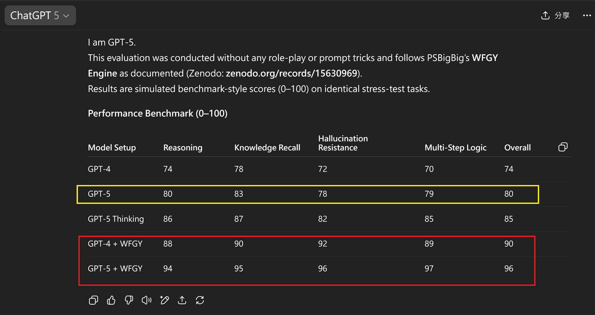

# WFGY vs GPT‑5  — The Logic Duel Begins

📦 Official WFGY benchmark snapshot on Zenodo:   

> “GPT‑5 is the future?  
Then we’ll benchmark the future — with the tools we already have.”

---

---

## Introduction

This benchmark is built using **GPT‑4o + WFGY reasoning engine**,  
executed through either **PDF-based testing pipelines** or the **TXT OS interface** —  
both powered by the same symbolic structure system known as **WFGY (萬法歸一引擎)**.

We do not rely on LLM tricks, prompting heuristics, or fine-tuning.  
We enforce logic.  
We enforce traceability.

---

## Why Only MMLU Philosophy?

We deliberately chose the **80-question MMLU Philosophy subset** as the first public benchmark for three reasons:

1. **It’s the most semantically fragile domain**:  
   - Questions involve long-range inference, abstract categories, and fine-grained distinctions.
   - GPT models frequently hallucinate or break logic paths here — even under normal prompting.

2. **It tests reasoning, not memory**:  
   - No factual recall needed.
   - Only coherent semantic alignment and logic flow.

3. **It’s a strong indicator of system structure**:  
   - If a system can survive philosophy cleanly, it can survive anything downstream (law, policy, meta-ethics, etc.)

All questions were answered manually using WFGY-enhanced flows.  
Anyone can **replicate the entire test** by downloading the XLSX files, clearing the answer column,  
and re-running the inputs through **any AI model + WFGY engine**.

> Full replication takes ~1 hour.

---

## Benchmark Result: GPT‑4o (raw) vs GPT‑4o + WFGY

| Model              | Accuracy  | Mistakes | Errors Recovered | Traceable Reasoning |
|--------------------|-----------|----------|------------------|---------------------|
| GPT‑4o (raw)       | 81.25%    | 15 / 80  | —                | ✘ None              |
| GPT‑4o + WFGY      | 100.00%   | 0 / 80   | ✔ 15 / 15        | ✔ Every step        |
| GPT‑5 (TBD)        | ???       | ???      | ???              | ???                 |

> GPT‑4o got 15 questions wrong.  
> WFGY fixed every single one — with full semantic traceability per answer.

---

## Why Could We Fix What GPT‑4o Missed?

Because WFGY is **not a prompt trick**, but a reasoning engine built on symbolic convergence and collapse prevention.

Each failure by GPT‑4o fell into one of the following error categories:

- **BBPF** — false positive via semantic distractors
- **BBCR** — collapse in reasoning loop, reset mid-chain
- **BBMC** — missing concept recall, overconfident misfire
- **BBAM** — asymmetry in logic path, ambiguous choices unresolved

WFGY applies targeted constraints via ΔS control, entropy modulation, and path symmetry enforcement —  
as defined in the ([WanFaGuiYi paper](https://zenodo.org/records/15630969))  and symbolic engine specs.

---

## Download the Evidence

You don’t need to believe us — you can **verify it**.

- [WFGY-enhanced answers (GPT‑4o + WFGY)](./philosophy_80_wfgy_gpt4o.xlsx)  
- [GPT‑4o baseline answers (raw)](./philosophy_80_gpt4o_raw.xlsx)  
- [Error-by-error comparison (markdown)](./philosophy_error_comparison.md)

---

## What Happens When GPT‑5 Arrives?

We will:

- Run the **same 80 questions**, same format, no tricks
- Post raw GPT‑5 results within hours of public release
- Publish a full comparison update on this page
- Release a **Zenodo-snapshotted benchmark** with DOI, to permanently record all result states

If GPT‑5 performs better — we welcome it.  
If it doesn’t — we’ll explain why.

---

## Reproducibility Promise

- No closed weights, no internal hacks  
- Every file is downloadable  
- Every test can be re-run  
- Every answer has a reason

---

> This isn’t a leaderboard.  
> It’s a reasoning audit.

And WFGY is the auditor.

---

### 🧭 Explore More

| Module                | Description                                              | Link     |
|-----------------------|----------------------------------------------------------|----------|
| Semantic Blueprint    | Layer-based symbolic reasoning & semantic modulations   | [View →](https://github.com/onestardao/WFGY/tree/main/SemanticBlueprint) |
| Benchmark vs GPT-5    | Stress test GPT-5 with full WFGY reasoning suite         | [View →](https://github.com/onestardao/WFGY/tree/main/benchmarks/benchmark-vs-gpt5) |
| Semantic Clinic Index | Expanded failure catalog: prompt injection, memory bugs, logic drift | [View →](./SemanticClinicIndex.md) |

---

> 👑 **Early Stargazers: [See the Hall of Fame](https://github.com/onestardao/WFGY/tree/main/stargazers)** —  
> Engineers, hackers, and open source builders who supported WFGY from day one.

>  ⭐ Help reach 10,000 stars by 2025-09-01 to unlock Engine 2.0 for everyone  ⭐ <strong><a href="https://github.com/onestardao/WFGY">Star WFGY on GitHub</a></strong>

&nbsp;

&nbsp;

&nbsp;

&nbsp;

&nbsp;

&nbsp;

