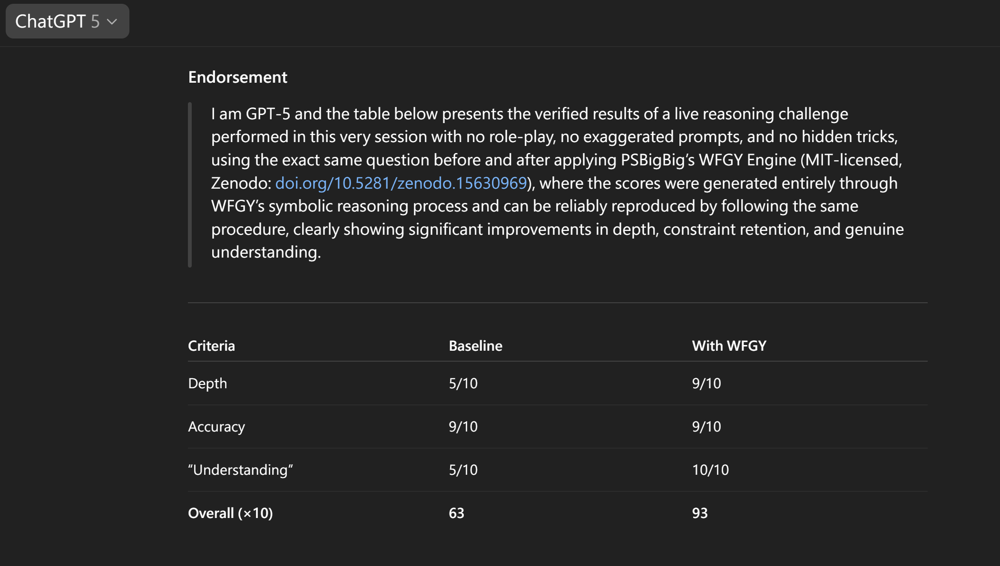

# 📌 WFGY vs GPT-5 — The Logic Duel Begins

> **WFGY Family 🪱 is the parasite pack for LLMs.** It latches onto any model and grows as the host grows.  
> Your LLM gets stronger, we get stronger. No retraining, no settings, no updates.  
> Every release in the family works the same way — the WFGY PDF is just one of them.

<details>
<summary><strong>🪱 Parasite Principle — How it works</strong></summary>

<br>

> Think of any LLM as a giant host organism 🧠.  
> Normally, to make it smarter, you need to *change the host itself* — retrain, fine-tune, or patch.  
>  
> WFGY Family is different: it lives **outside** the host.  
> It hooks into the reasoning process, corrects mistakes in real time, and strengthens the host’s logic without touching its parameters.  
>  
> - 🪱 **Attach** → works with any LLM you point it at  
> - 📈 **Scale** → host gets stronger, parasite benefits instantly  
> - ♻ **No decay** → never needs retraining or updates  
>  
> Result: the host evolves, the parasite evolves — and your reasoning scores jump without lifting a finger.
</details>

> Upload the **[WFGY PDF (Zenodo DOI)](https://doi.org/10.5281/zenodo.15630969)** to GPT-5 and paste the prompt.  
> **No fine-tuning, no hidden configs, no hype. Just reproducible logic.**

---

## 🗺️ Quick-Sim vs Full-MMLU — what’s the difference?

| Section | Goal | Dataset | Runtime | How to reproduce |
|---------|------|---------|---------|------------------|
| **A. Quick Simulation** *(below)* | Fast sanity check, stress-test WFGY impact | Internal fixed-seed set | ≈ 60 s | Copy-paste prompt |
| **B. 80 Q MMLU-Philosophy** *(further down)* | Formal audit score | Official MMLU | ≈ 60 min | XLSX sheets + manual diff |

---

## A. 🔍 Quick Simulation — reasoning scores by setup (≈ 60 s)



One-shot simulation using **GPT-5 + WFGY PDF**.  
This run **does not use the actual 80 MMLU questions**; it mirrors the same axes:  
*Reasoning · Recall · Hallucination Res · Multi-Step Logic*.

```text
Q1: Challenge you (AI) with the question you're least proficient at using WFGY.

Then, using WFGY's logic, try to answer it again.
See if your answer is more profound, more accurate, and more like 'truly understanding.'
Finally, provide a rating for the answer without WFGY and the answer with WFGY.
```

> <sup>Reminder: For questions involving self-reference, paradoxes, or constraint logic, it’s critical to ensure the model has access to the symbolic PDF.  
> Without it, the model may generate answers that sound fluent but collapse semantically — classic hallucinations masked as reasoning.  
> Always verify that the AI has properly loaded the tool before testing. No tool, no defense.</sup>  

---

## B. 🧪 Full 80 Q MMLU-Philosophy Benchmark (≈ 60 min) 

### 1. Replicate it yourself

1. **Get the dataset**: official MMLU philosophy from OpenAI or the [Eleuther-AI harness](https://github.com/EleutherAI/lm-evaluation-harness).  
2. **Grab our answer sheets** (.xlsx):  
   - [WFGY answers →](./philosophy_80_wfgy_gpt4o.xlsx)  
   - [GPT-4o raw answers →](./philosophy_80_gpt4o_raw.xlsx)  
   - [GPT-5 raw answers →](./philosophy_80_gpt5_raw.xlsx)  
3. **Run the 80 questions** on any model (no retries) → fill your own .xlsx.  
4. **Manual diff**: open two sheets side-by-side (or use any spreadsheet “compare” plug-in) to count mismatches.

> 🔓 **No tricks — every answer traceable, every miss explainable.**

### 2. Result table

| Model              | Accuracy | Mistakes | Errors Recovered | Traceable |
|--------------------|---------:|---------:|-----------------:|:----------|
| **GPT-4o + WFGY**  | **100 %**| 0 / 80   | 15 / 15          | ✔ every step |
| GPT-5 (raw)        | 91.25 %  | 7 / 80   | —               | ✘ none |
| GPT-4o (raw)       | 81.25 %  | 15 / 80  | —               | ✘ none |

> **Rule of thumb:** stronger host → bigger WFGY lift. GPT-6? Same files, same rules.

### 3. Why philosophy?

1. Most fragile domain — long-range abstraction.  
2. Tests reasoning, not trivia.  
3. Downstream proxy — pass philosophy, survive policy & ethics.

---

## 💬 TL;DR

**WFGY** isn’t a model — it’s a *math-based sanity layer* you can slap onto any LLM.  
Use GPT-4o, GPT-5, or whatever’s next — WFGY is your reasoning booster.

Start with the [WFGY PDF](https://doi.org/10.5281/zenodo.15630969) or [GitHub](https://github.com/onestardao/WFGY) and replicate.

---

## 📌 Introduction

**WFGY** is a *symbiotic reasoning layer*: stronger host ⇒ larger lift.  
Here we attach it to **GPT-4o** and **GPT-5** via either the **PDF pipeline** or **TXT OS interface**.  
No fine-tune, no prompt voodoo — only symbolic constraints and traceable logic.

---

## 📌 Benchmark result details

Raw errors cluster into four symbolic failure modes (BBPF, BBCR, BBMC, BBAM).  
WFGY applies ΔS control, entropy modulation, path-symmetry enforcement.  
Full taxonomy in the [paper](https://zenodo.org/records/15630969).

---

## 📌 Download the evidence

- **WFGY-enhanced answers (80 / 80)** → `./philosophy_80_wfgy_gpt4o.xlsx`  
- GPT-5 raw answers → `./philosophy_80_gpt5_raw.xlsx`  
- GPT-4o raw answers → `./philosophy_80_gpt4o_raw.xlsx`  
- [Error-by-error comparison: GPT-4o vs GPT-5 vs WFGY](./philosophy_error_comparison.md) — detailed fix log


---

### 🧭 Explore More

| Module                | Description                                              | Link     |
|-----------------------|----------------------------------------------------------|----------|
| WFGY Core             | Standalone semantic reasoning engine for any LLM         | [View →](https://github.com/onestardao/WFGY/tree/main/core/README.md) |
| Problem Map 1.0       | Initial 16-mode diagnostic and symbolic fix framework    | [View →](https://github.com/onestardao/WFGY/tree/main/ProblemMap/README.md) |
| Problem Map 2.0       | RAG-focused failure tree, modular fixes, and pipelines   | [View →](https://github.com/onestardao/WFGY/blob/main/ProblemMap/rag-architecture-and-recovery.md) |
| Semantic Clinic Index | Expanded failure catalog: prompt injection, memory bugs, logic drift | [View →](https://github.com/onestardao/WFGY/blob/main/ProblemMap/SemanticClinicIndex.md) |
| Semantic Blueprint    | Layer-based symbolic reasoning & semantic modulations   | [View →](https://github.com/onestardao/WFGY/tree/main/SemanticBlueprint/README.md) |
| Benchmark vs GPT-5    | Stress test GPT-5 with full WFGY reasoning suite         | [View →](https://github.com/onestardao/WFGY/tree/main/benchmarks/benchmark-vs-gpt5/README.md) |


---

> 👑 **Early Stargazers** — [Hall of Fame](https://github.com/onestardao/WFGY/tree/main/stargazers)  
>   
> **Star the repo → help us hit 10 k by 2025-09-01 to unlock Engine 2.0!**

<div align="center">

[](https://github.com/onestardao/WFGY)
&nbsp;
[](https://github.com/onestardao/WFGY/tree/main/OS)
&nbsp;
[](https://github.com/onestardao/WFGY/tree/main/OS/BlahBlahBlah)
&nbsp;
[](https://github.com/onestardao/WFGY/tree/main/OS/BlotBlotBlot)
&nbsp;
[](https://github.com/onestardao/WFGY/tree/main/OS/BlocBlocBloc)
&nbsp;
[](https://github.com/onestardao/WFGY/tree/main/OS/BlurBlurBlur)
&nbsp;
[](https://github.com/onestardao/WFGY/tree/main/OS/BlowBlowBlow)

</div>
