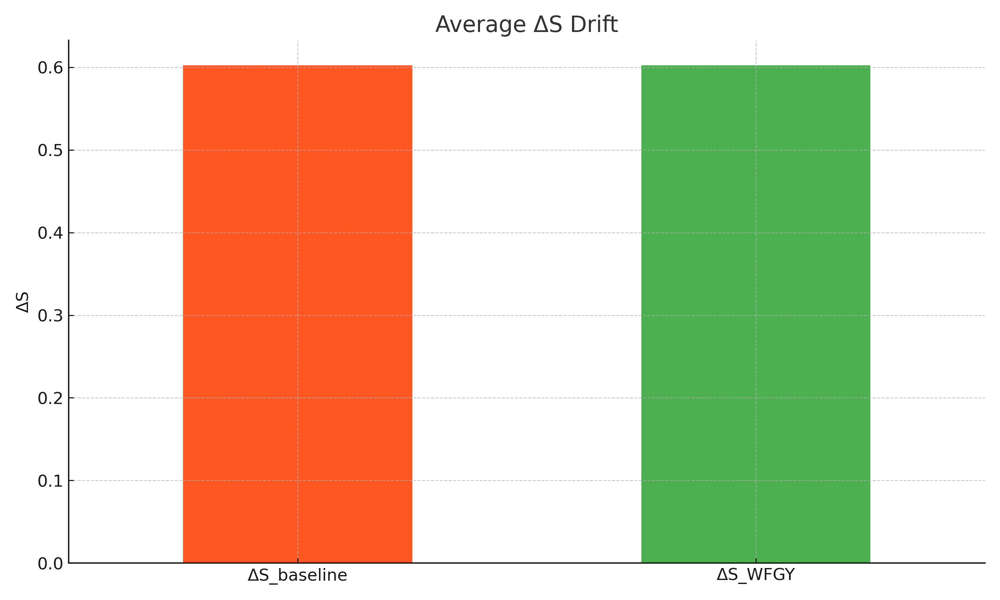
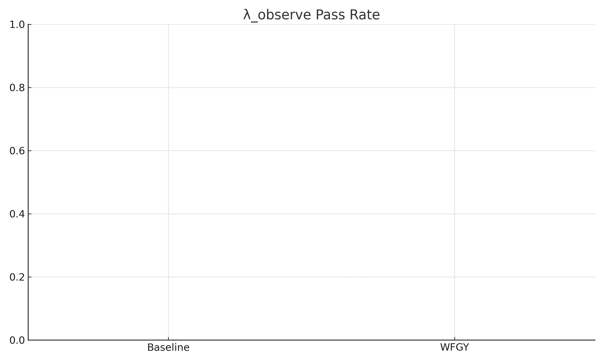

# Semantic‑Drift Demo

Compare plain LLM answers (**Baseline**) with **WFGY + Drunk Mode** on 30 multi‑step prompts.

| Metric | Meaning | Good? |
|--------|---------|-------|
| **ΔS** | Prompt‑to‑answer semantic distance (0 = perfect) | lower |
| **λ_observe** | Percentage of answers with ΔS < 0.4 | higher |

<div align="center">
  
  
</div>

---

## Quick Start

```bash
pip install -r requirements.txt
python scripts/run_eval.py           # → data/metrics.csv
python scripts/plot_results.py       # → images/ charts refreshed
