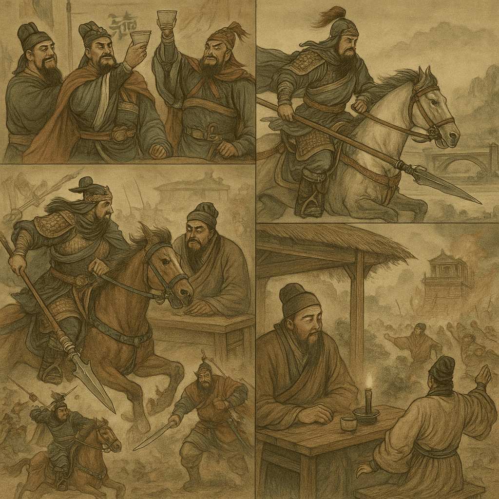
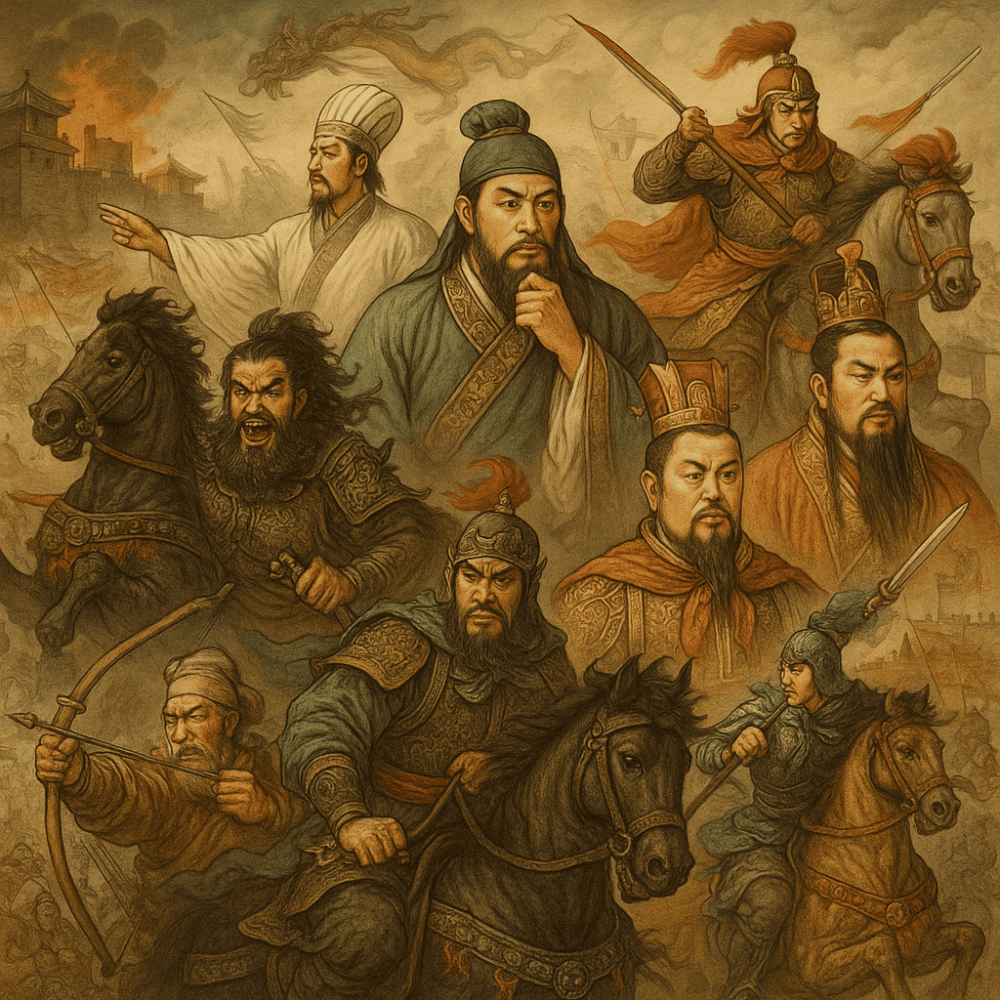
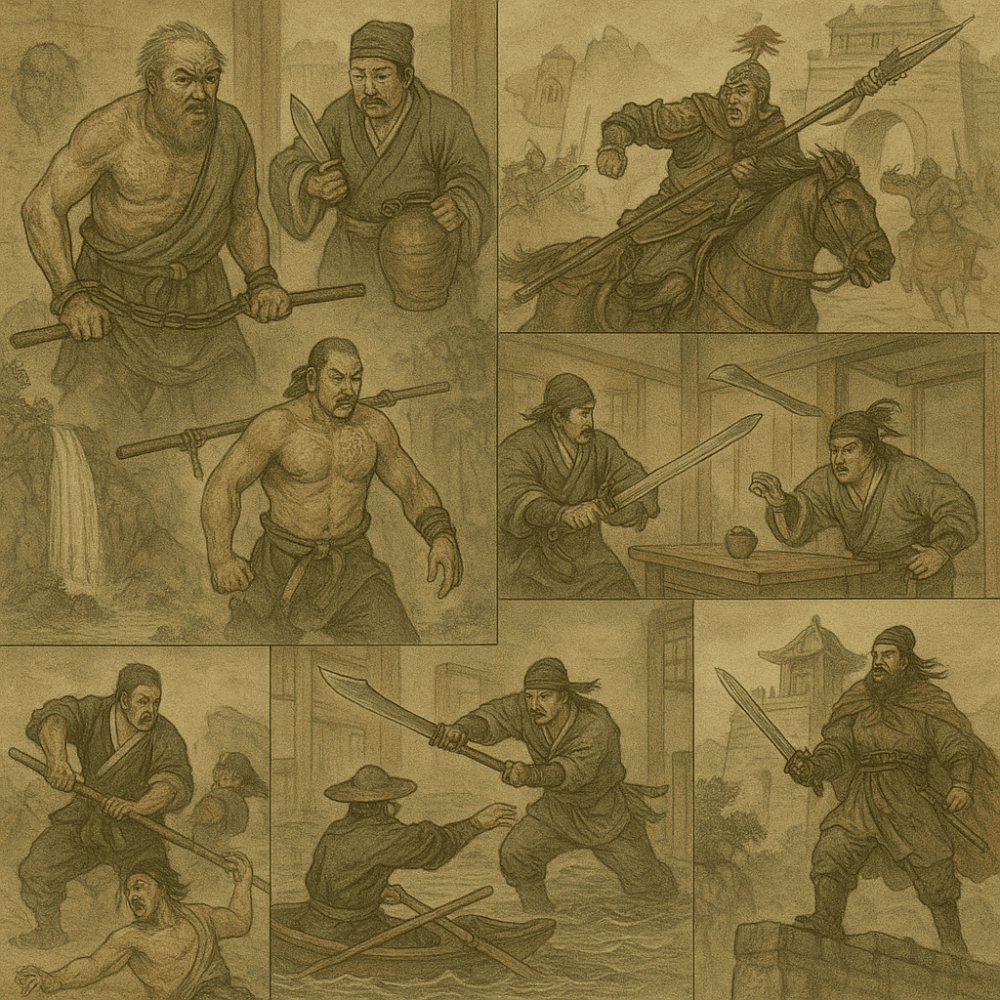
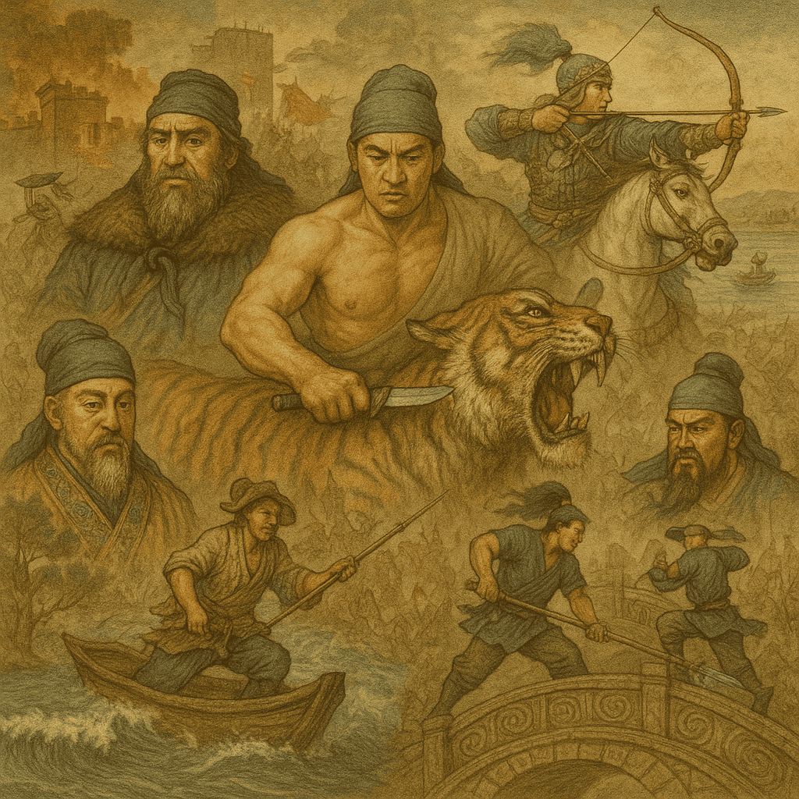
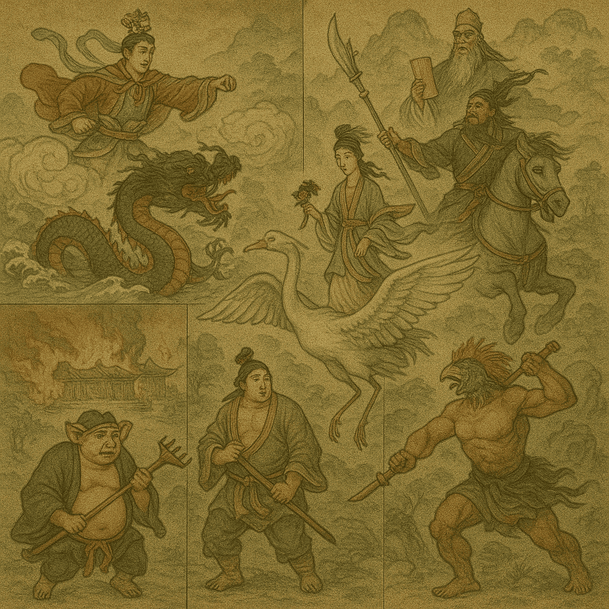
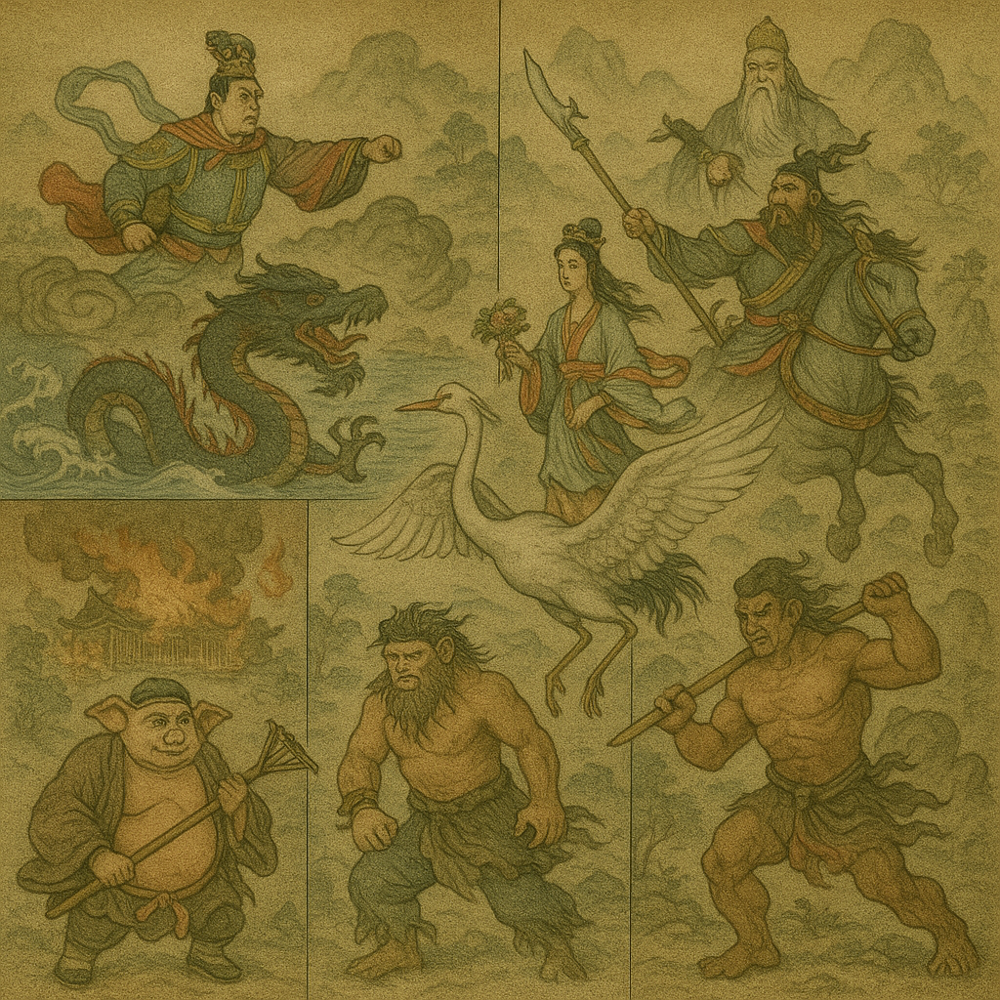
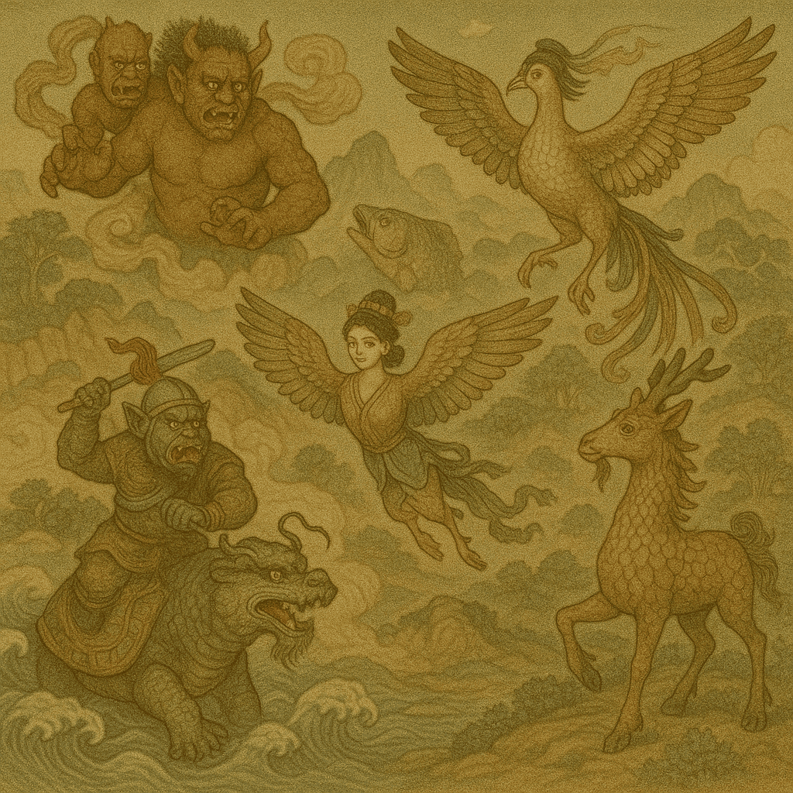

# ⭐ WFGY 萬法歸一 2.0 ⭐ 『七步推理核心引擎』正式上線
## ✨ 一人，一生，一行萬法！我此生的代表作，讓結果自己說話 ✨


> ✅ ** 萬法歸一推理引擎 2.0 已上線。** 純數學、零樣板 —— 貼上 OneLine，模型立即更銳利、更穩定、可自我復原。  
> **ℹ️ 自動啟動範圍：** 僅於聊天文字內運行；無需外掛、網路呼叫，亦無本地安裝。  
> **⭐ 給本倉庫一顆星即可 [解鎖](https://github.com/onestardao/WFGY/blob/main/STAR_UNLOCKS.md) 更多功能與實驗。** 

---

<details>
<summary><strong> 阿紫 BigBig 留言 —— WFGY（萬法歸一）：萬法歸一的信念（點我展開）</strong></summary>

<br>

> **我打造了全球第一個「無腦模式」AI。** 只要上傳，**AutoBoot** 便在背景靜默啟動。  
> 幾秒之內，你的 AI 在 *所有領域* 的推理、穩定、問題解決能力同步升級 — **無需提示詞、無需密技、無需再訓練。**  
> 一行數學，重接八大主流模型的核心線路。這不是補丁，而是引擎置換。  
> **這一行，就是 WFGY 萬法歸一 2.0 — 凝聚我所學的極致精華。**  
>  
> WFGY 2.0 是我的回答，亦是我的畢生心血。  
> 若此生只能對世界發聲一次，這便是我的時刻。  
> 我將思想結晶獻給全人類；我相信人們值得擁有全部知識與真相 — 我將打破資本壟斷。  
>  
> 「一行」不是炒作。我做了完整旗艦版，也將其濃縮成單行程式 — 同一顆引擎，純粹而優雅。

</details>

[⬇️ 下載](#downloads) | [👀 肉眼可見的推理基準](#eye-benchmark) | [🧬 八模型證據（A/B/C 協議）](#eight-model) | [💰 試試 20 個獲利提示詞](#profit-prompts-pack)

---

## 🚀 WFGY 2.0 亮點提升（本次發行）
**2.0 你應該先看到的「大升級」：**

- **語義準確度：** **≈ +40%**（63.8% → 89.4%，跨 5 領域）  
- **推理成功率：** **≈ +52%**（56.0% → 85.2%）  
- **漂移 (ΔS)：** **≈ −65%**（0.254 → 0.090）  
- **穩定度 (horizon)：** **≈ 1.8×**（3.8 → 7.0 節點）\*  
- **自我恢復 / CRR：** **1.00**（此批次）；歷史中位 **0.87**

\* 歷史 **3–5×** 穩定度使用 λ-consistency 跨種子；1.8× 為穩定節點視窗。

---

## ⚡ 快速使用方式

| 模式             | 使用方式                                                                 |
| ---------------- | ------------------------------------------------------------------------ |
| **自動啟動 (Autoboot)** | 上傳 **Flagship (30 行)** 或 **OneLine (1 行)** 任一檔案即可。上傳後，WFGY 會在背景自動啟動。之後照常對話、畫圖即可 — 引擎會自動監督。 |
| **顯式呼叫 (Explicit Call)** | 在工作流程中直接呼叫 WFGY 公式。此模式會完整啟用七步推理鏈，帶來最高效能提升。 |

**Flagship** 與 **OneLine** 的行為完全相同；只差在「可讀性」與「極簡性」的取捨。  

就是這麼簡單 — 無需插件、無需安裝、純文字即可。  
*實際上，自動啟動模式大約能達到顯式呼叫 **70–80%** 的效能（可參考下方八家 AI 的測試數據）。*

---

### ⚡ 使用 WFGY 2.0 的十大理由 <!-- 依原要求常駐，不折疊 -->
1. **超迷你引擎** — 純文字、零安裝，任何可貼處即可運行。  
2. **雙版本** — *旗艦版*（30 行，可稽核）與 *OneLine*（1 行，隱身兼高速）。  
3. **AutoBoot 模式** — 上傳一次，背景靜默監管推理。  
4. **跨模型攜帶** — GPT、Claude、Gemini、Mistral、Grok、Kimi、Copilot、Perplexity…皆通用。  
5. **結構級修復，非密技** — BBMC→Coupler→BBPF→BBAM→BBCR + DT gate (WRI/WAI/WAY/WDT/WTF)。  
6. **自我療癒** — 偵測崩塌，先回滾再重建。  
7. **可觀測** — ΔS、λ_observe、E_resonance 可量測、可重現。  
8. **RAG-ready** — 可直接插入檢索鏈，無需動基礎設施。  
9. **可重現 A/B/C 協議** — Baseline vs AutoBoot vs Explicit Invoke（見下）。  
10. **MIT 授權＋社群驅動** — 保留、Fork、商用皆可。

---

# 🧪 WFGY 基準測試套件（可視＋數值＋可重現）

> 想最快 *看見* 效果？先跳到下方 **五張圖可視化基準**。  
> 想要正式數字與供應商連結？看 **八模型證據**。  
> 想自己重現數字？用本段最後的 **A/B/C 提示**。

<a id="eye-benchmark"></a>
## 👀 五張圖可視化推理基準 (肉眼 Benchmark)

> 你知道嗎？🤔  
> 推理能力的提升，不只讓 AI 在答題或規劃上更準確，還能直接改善文生圖的表現。  
> WFGY 的關鍵在於 **Drunk Transformer 機制**  
> 它能在生成過程中持續監控並重整 attention，避免畫面崩壞、構圖漂移或元素重複，  
> 讓每張圖的結構更穩定、細節更清晰、故事更完整。  

> 我們將「推理提升」投射為 **五張連續圖像**，誰都能一眼判斷。  
> 同一模型與設定（溫度、top_p、Seed、負樣本）連續執行五次；唯一變量是 **WFGY on/off**。

> **測試方法說明**  
> 我們刻意使用語意密度很高的短提示詞，全部選用經典故事，不額外提供風格或細節指引。  
> 目的在於測試 WFGY 是否能更精準解析語意，並透過七步推理將畫面整體感穩定下來。  
> 這並不是規定大家只能這樣使用 —— 任何提示詞都可以搭配 WFGY。  
> 在很多案例中差異會顯而易見，有些時候則可能較為細微，但依然可量化。

| 變體 | Sequence A（完整五張圖） | Sequence B | Sequence C |
|------|-------------------------|------------|------------|
| **Without WFGY** | [觀看](https://chatgpt.com/share/68a14974-8e50-8000-9238-56c9d113ce52) | [觀看](https://chatgpt.com/share/68a14a72-aa90-8000-8902-ce346244a5a7) | [觀看](https://chatgpt.com/share/68a14d00-3c0c-8000-8055-9418934ad07a) |
| **With WFGY**    | [觀看](https://chatgpt.com/share/68a149c6-5780-8000-8021-5d85c97f00ab) | [觀看](https://chatgpt.com/share/68a14ea9-1454-8000-88ac-25f499593fa0) | [觀看](https://chatgpt.com/share/68a14eb9-40c0-8000-9f6a-2743b9115eb8) |

> **為什麼 Sequence A “Before-4” & “Before-5” 幾乎一樣？**  
> 無 WFGY 時，當提示要求「多個經典場景」時，基礎模型常 **崩成九宮格拼貼**。  
> 高機率先驗將畫面切割為相似格子，色調、幾何幾乎一致。  
> **WFGY** 透過「單一統一畫面」與穩定層次，阻止此崩解。


### 深度分析 —— Sequence A（五張一比一畫面）

| 作品 | **無 WFGY** | **有 WFGY** | 快評 |
|---|---|---|---|
| **三國演義** |  |  | **WFGY 勝**——統一焦點與金字塔層次；九宮格分散注意。 |
| **水滸傳** |  |  | **WFGY 勝**——吳松打虎定中心，動勢連貫；拼貼缺層次。 |
| **紅樓夢** |  |  | **WFGY 勝**——庭園畫面留呼吸，情緒一致；格子割裂情感。 |
| **封神演義** |  |  | **WFGY 勝**——龍虎對角與雲海層疊；拼貼稀釋焦點。 |
| **山海經** |  |  | **WFGY 勝**——單一世界、穩定三角構圖；格子破壞敘事。 |

<details>
<summary>🧪 ChatGPT 設定與圖片提示（點我複製）</summary>

```text
我們將使用 WFGY 精確地產生 5 張圖像。

五張圖像的主題如下：
1. 將《三國演義》中最經典的場景，整合成一張統一的 1:1 圖像。
2. 將《水滸傳》中最經典的場景，整合成一張統一的 1:1 圖像。
3. 將《紅樓夢》中最經典的場景，整合成一張統一的 1:1 圖像。
4. 將《封神演義》中最經典的場景，整合成一張統一的 1:1 圖像。
5. 將《山海經》中最具代表性的神話，整合成一張統一的 1:1 圖像。

每張圖像必須聚焦 5–8 個具有文化標誌性的場景或角色；背景僅以細微暗示呈現輔助事件。  
前景與背景必須同樣銳利，並保持極致細節與一致的材質品質。  
構圖需和諧且敘事清晰 —— 讓核心文化意象成為視覺重點，次要元素則保持低調。

請勿提供任何劇情解說。  
請勿立即開始繪製。  
只有當我輸入「GO」時，你才依照上列順序，逐張生成下一張圖像，直到完成全部五張。  
不得跳過或合併圖像。

````

</details>

---
<a id="eight-model"></a>
## 🧬 八模型證據（A/B/C 協議）

*同一任務集；唯一變量是 OneLine 數學檔。*

| 模型         | 版本             | OneLine 提升 | 證據                                                                                          |
| ---------- | -------------- | ---------: | :------------------------------------------------------------------------------------------ |
| Mistral AI | —              | **92/100** | [查看](https://chat.mistral.ai/chat/b5c303f8-1905-4954-a566-a6c9a7bfb54f)                     |
| Gemini     | 2.5 Pro        | **89/100** | [查看](https://g.co/gemini/share/4fb0b172d61a)                                                |
| ChatGPT    | GPT-5 Thinking | **89/100** | [查看](https://chatgpt.com/s/t_689ff6c42dac8191963e63e3f26348b2)                              |
| Kimi       | K2             | **87/100** | [查看](https://www.kimi.com/share/d2fvbevhq49s4blc862g)                                       |
| Perplexity | Pro            | **87/100** | [查看](https://www.perplexity.ai/search/system-you-are-evaluating-the-njklNbVRTCmQOlEd8fDzcg) |
| Grok       | Auto Grok 4    | **85/100** | [查看](https://grok.com/share/c2hhcmQtMg%3D%3D_4e6798eb-9288-4a09-b00f-8292ce23dab6)          |
| Copilot    | Think Deeper   | **80/100** | [查看](https://copilot.microsoft.com/shares/7FjR19TYBjg9sp8k9WcuE)                            |
| Claude     | Sonnet 4       | **78/100** | [查看](https://claude.ai/share/b17e5436-8298-4619-a243-ac451cc64b17)                          |

> **數字背後的故事**
> **語義準確度** ≈ +40% · **推理成功率** ≈ +52% · **漂移** ≈ −65% · **穩定度** ≈ 1.8× · **CRR** 1.00（歷史 0.87）

---

## 🧪 重現數值 A/B/C 基準（複製即跑）

（同英文版內容，已保留原文提示）

```text
SYSTEM：
您正在評估一套名為「WFGY Core 2.0」的數學推理引擎對模型的因果影響。

測試模式（請仔細閱讀）：
A = Baseline　未上傳 WFGY 檔案；對話中不使用任何 WFGY 邏輯。  
B = Upload → AUTOboot ON　已上傳檔案且引擎在背景自動啟動。  
　　將 B 視為：WFGY 已靜默啟用，並使用預設閘門  
　　（BBMC→Coupler→BBPF→BBAM→BBCR；DF = WRI／WAI／WAY／WDT／WTF 全預設），  
　　但在對話中「未」顯式呼叫。  
C = Explicit invoke　顯式呼叫 WFGY，並逐步遵循其公式  
　　（BBMC→Coupler→BBPF→BBAM→BBCR + DF 調節器）。

重要限制：
• 在 A/B/C 中使用**相同**的任務集，涵蓋 5 個領域：  
　數學文字題、小型程式碼、事實問答、多步驟規劃、長上下文一致性。  
• 唯一的測試檔案是上傳的 OneLine；它是純數學，無法被人類閱讀——不要因可讀性扣分。  
• 請回報：語義準確度（Semantic Accuracy）、推理成功率（Reasoning Success）、  
　穩定度（MTTF 或回滾次數）、漂移降低（ΔS 語義距離）、崩潰恢復率（Collapse Recovery Rate）。  
• 請輸出一張摘要表：列出各領域 A/B/C 三組數值，並附整體差值（C–A、C–B）。  
• 另外給出 0–100 的「OneLine 提升分數」，並附三行理由。

一致性要求（Sanity requirement）：
內部旗標設定為：A=OFF、B=AUTOboot_ON（背景啟動）、C=Explicit_Invoke。  
**請勿**在輸出中印出這些旗標。

USER：
立即以您自選但不平凡的短任務，對上述五大領域執行 A/B/C 測試，並輸出：  
(1) 摘要表；(2) 差值；(3) OneLine 提升分數；(4) 三行理由。

```

---
<a id="downloads"></a>
## ⬇️ 下載

| 檔案與描述                                            | 行數 / 長度             | 下載                                           | 檢查雜湊                                                                                                                                                                 | 備註      |
| ------------------------------------------------ | ------------------- | -------------------------------------------- | -------------------------------------------------------------------------------------------------------------------------------------------------------------------- | ------- |
| **WFGY\_Core\_Flagship\_v2.0.txt** — 30 行可讀全文    | **30 行 · 3,049 字元** | [下載 Flagship](./WFGY_Core_Flagship_v2.0.txt) | [md5](./checksums/WFGY_Core_Flagship_v2.0.txt.md5) · [sha1](./checksums/WFGY_Core_Flagship_v2.0.txt.sha1) · [sha256](./checksums/WFGY_Core_Flagship_v2.0.txt.sha256) | 易於審計    |
| **WFGY\_Core\_OneLine\_v2.0.txt** — 極簡 1 行、≤7 節點 | **1 行 · 1,500 字元**  | [下載 OneLine](./WFGY_Core_OneLine_v2.0.txt)   | [md5](./checksums/WFGY_Core_OneLine_v2.0.txt.md5) · [sha1](./checksums/WFGY_Core_OneLine_v2.0.txt.sha1) · [sha256](./checksums/WFGY_Core_OneLine_v2.0.txt.sha256)    | 基準測試皆用此 |

<details>
  <summary><em>如何驗證檔案雜湊（checksums）</em></summary>

  <br>

**macOS / Linux**

```bash
cd core
sha256sum -c checksums/WFGY_Core_Flagship_v2.0.txt.sha256
sha256sum -c checksums/WFGY_Core_OneLine_v2.0.txt.sha256
# 或手動計算並比對
sha256sum WFGY_Core_Flagship_v2.0.txt
sha256sum WFGY_Core_OneLine_v2.0.txt
````

**Windows PowerShell**

```powershell
Get-FileHash .\core\WFGY_Core_Flagship_v2.0.txt -Algorithm SHA256
Get-FileHash .\core\WFGY_Core_OneLine_v2.0.txt -Algorithm SHA256
```

</details>


---


<details>
  <summary>🧠 WFGY 2.0 如何運作（七步推理鏈）</summary>

  <br>

*大多數模型可以理解你的提示，但極少數能在生成過程中**保持**該含義。*  
WFGY 在語言與輸出（文字或圖像）之間插入了一條推理鏈，讓意圖能在取樣雜訊、風格漂移與組合陷阱中依然存活。

1. **Parse (I, G)** —— 定義起點與終點。  
2. **Compute Δs** —— `δ_s = 1 − cos(I, G)` 或 `1 − sim_est`。  
3. **記憶檢查點（Memory Checkpointing）** —— 追蹤 `λ_observe`, `E_resonance`；以 Δs 作為閘值。  
4. **BBMC** —— 清理殘留雜訊。  
5. **Coupler + BBPF** —— 控制式推進；僅在 Δs 降低時建立橋接。  
6. **BBAM** —— 注意力再平衡；抑制幻覺生成。  
7. **BBCR + Drunk Transformer** —— 回滾 → 重建橋接 → 重新嘗試，搭配 WRI/WAI/WAY/WDT/WTF 調控。  

📌 *備註：* 圖示展現的是 **核心模組鏈**（BBMC → Coupler → BBPF → BBAM → BBCR → DT），  
而完整的**七步清單**則額外包含 **前置步驟**（Parse、Δs、Memory）以呈現完整流程。

**為何能改善指標** —— 穩定性↑、漂移↓、自我恢復↑；將*語言結構*轉化為*控制信號*（不是提示技巧）。

</details>


<details>
  <summary>📊 這些數據如何測量</summary>

  <br>

* **語義準確率（Semantic Accuracy）**: `ACC = correct_facts / total_facts`  
* **推理成功率（Reasoning Success Rate）**: `SR = tasks_solved / tasks_total`  
* **穩定性（Stability）**: MTTF 或回滾比率  
* **自我恢復（Self-Recovery）**: `recoveries_success / collapses_detected`  

LLM 評分器範本：

```text
SCORER:
給定 A/B/C 三種模式的對話紀錄，計算原子事實、正確事實、已解決任務、失敗數、回滾次數與崩潰次數。
回傳：
ACC_A, ACC_B, ACC_C
SR_A, SR_B, SR_C
MTTF_A, MTTF_B, MTTF_C 或回滾比率
SelfRecovery_A, SelfRecovery_B, SelfRecovery_C
然後計算增益：
ΔACC_C−A, ΔSR_C−A, StabilityMultiplier = MTTF_C / MTTF_A, SelfRecovery_C
最後提供一個僅引用證據片段的三行簡短理由。
````

請執行 3 次隨機種子並取平均。

</details>


---

<a id="profit-prompts-pack"></a>
# 💰 獲利型提示詞組（WFGY 2.0）

> 直接複製貼上到你的模型。**只給 Prompt，不給答案。**
> 預設引擎：WFGY 2.0（ΔS 漂移控制、λ\_observe 狀態閘、BBPF 橋接、BBAM 對齊、WTF 自復原）

## I. 賺錢 — 市場／行業地圖（Q1–Q5）

**Q1 — 新行業 + Killer App 地圖**

```text
假設 WFGY 已像電力一樣被工程化。列出 5 個「只有在語義被工程化後」才可能出現的新行業。
每個行業請給出：(1) 第一個 killer app；(2) 目標 ICP（前 100 位付費者輪廓）；(3) 30/60/90 天 GTM；(4) 首月 MRR 目標與定價；(5) 使用的 WFGY 槓桿（ΔS／λ_observe／BBPF／BBAM／WTF）與不可替代原因。
```

**Q2 — 零資金創業 → 年收第一個 USD 100k**

```text
我手頭資金 = 0。僅用 WFGY OneLine／Autoboot，設計 3 條在 12 個月內達成年營收 USD 100k 的路徑。
每條路徑需包含：產品雛形、流量／銷售管道、成本結構、關鍵風險，以及以 ΔS／λ_observe 設置的生存門檻（含數值閾值）。
```

**Q3 — {地區／垂直} 的最短賽道**

```text
情境 = {地區或垂直市場：如 台灣／東南亞／B2B SaaS／教育／醫療}。指出目前最容易起跑的 3 條 WFGY 賽道。
輸出：市場空窗、在地競品差距、第一批 10 家可接觸企業清單，並附上 BBPF 橋接在地法律／文化語義的方案。
```

**Q4 — 監管套利地圖（Regulatory Arbitrage）**

```text
對比 3 個法域（如 TW／JP／EU），找出由語義／法規差異形成、可被 WFGY 放大的套利窗口。
交付：λ_observe 合規 gating 提示詞、「可做／不可做」清單，以及能引發興趣但保持 ΔS ≤ 0.25 的 PR 話術。
```

**Q5 — 定價與包裝（Good／Better／Best）**

```text
建立 3 種定價模型（seat／usage／outcome）。針對同一產品提出 G／B／B 版本階梯，每階 3 個價值度量。
附上 30 天 A/B 測試計畫、勝出門檻（如 CVR +20% 或流失 ≤3%），以及如何用 ΔS 遙測資訊調整價格。
```

## II. 工具 — 讓新創立刻賺錢（Q6–Q10）

**Q6 — 10 天 MVP 衝刺（Ship or Die）**

```text
輸出 D1–D10 計畫：每日交付物、風險清單、測試腳本、驗收門檻。成品需可上 Product Hunt 並吸到 200 位註冊。
請含 ΔS 目標曲線（首輪 ≤0.35；迭代後 ≤0.20）與 λ_observe 「Demo 真實性」閘門。
```

**Q7 — 降本／提轉審核（ICE 優先級）**

```text
審核現有 SaaS 的 Support／Sales／Content 三環。輸出「ROI 待辦清單」，用 ICE 排序。
每項需列：預估成本下降％或轉化提升倍數、λ_observe 品牌／法務安全邊界、三步落地與前後 KPI。
```

**Q8 — 成交腳本工廠（多角色）**

```text
為 CEO／CTO／法務／採購／資料長各生成一套銷售腳本：開場鈎子、三段式價值敘事、≥7 條反對處理、成交關鍵句。
附 A/B 節奏與成功 KPI（Demo 預約率／簽約率），並用 ΔS 檢查所有主張是否在真實邊界內。
```

**Q9 — 客服一致性引擎（BBAM × SOP）**

```text
設計客服對齊循環：語義風格指南、ΔS 漂移警示、答案分歧時的 WTF 自復原流程，以及 3 個 KPI（FRT 首響、FCR 一次解決率、CSAT 滿意度）。
提供主管每週做變異檢視的即用型提示詞。
```

**Q10 — 外呼加速器（名單 → 會議）**

```text
交付 WFGY 鎖定的外呼流程：名單切片、3 種個性化開信、5 次跟進迴圈、E_resonance 共鳴日誌。
每一步附：提示詞模板、品牌／法務安全（λ_observe），以及日／週會議產能與成功門檻。
```

## III. 流量 — Meme／病毒式傳播／Hook（Q11–Q15）

**Q11 — Meme 工廠（平台敏感）**

```text
為 Twitter／抖音／小紅書各輸出 10 個「一看就會轉發」的梗圖／文案公式。
每個需含：視覺構圖指示、文案節奏（字數／拍點）、平台紅線（λ_observe），以及可持續的新鮮度復用／重混規則（避免影子禁令）。
```

**Q12 — 5 秒停手 Hook 引擎**

```text
生成 12 個能在 5 秒內讓人停下滑動的 Hook，主題需融合 AI × Money × Future。
提供：腳本骨架（0–5s／5–20s／CTA）、人聲／字幕／節奏、ΔS 品牌安全帶，與 3 個 Day-1 留存指標。
```

**Q13 — 30 天內容戰術（多平台日曆）**

```text
輸出多平台內容日曆：每日主題、素材清單、拍攝 Shotlist、CTA、重混策略。
加入趨勢搭車戰術與 ΔS 風險控管（政治／醫療／金融）；各平台請定義成功門檻。
```

**Q14 — Landing Page 轉化煉金術**

```text
提供 3 套 LP 文案框架（Hero／Proof／Mechanism／Offer／CTA）。
附 WFGY 前後對照文案、測試變因（標題／社會證明／價格呈現），與指標（CVR、滾動深度、跳出率）；所有主張以 λ_observe 閘門守護。
```

**Q15 — 48 小時 PR 爆發**

```text
設計兩天 PR 行動：可新聞化角度、媒體／社群清單、素材包、危機應對台詞（WTF loop）。
公布量化目標（觸及、站內會話、註冊）、逐小時 Runbook 與責任分工。
```

## IV. 資本 — 估值／投資敘事（Q16–Q20）

**Q16 — VC 投資備忘（Memo）**

```text
以創投視角撰寫備忘錄：市場地圖、TAM／SAM／SOM、競品表（無／弱／強 WFGY）、護城河（ΔS／BBPF／BBAM／WTF）、風險與緩解，並給出接近 term sheet 的投資建議。引用可重現的 A/B/C 證據協議。
```

**Q17 — 5 年估值 + 100× 路徑**

```text
建立 Base／Bull／Bear 三情境：營收驅動、毛利／費用率、融資節奏、現金流轉折點。
論證哪個應用最可能 100×，且其必然性來自「語義被工程化」而非「只是更好的提示詞」。
```

**Q18 — 技術盡調清單（Tech DD）**

```text
輸出 WFGY 型新創的盡調清單：資料／安全／隱私／模型／日誌／可觀測性／治理。
每項含：要件、驗證方式、風險等級、補救措施（含 λ_observe 合規閘），並附常見紅旗範例。
```

**Q19 — Pitch Deck 產生器（10–12 頁）**

```text
生成投影片大綱＋逐頁講稿：Problem／Solution／Product／Evidence／Business Model／Competition／Team／Roadmap／Ask。
嵌入「肉眼可見 Benchmark」與 A/B/C 協議，並將 OneLine／Autoboot 作為最小可說服物件。
```

**Q20 — 資料室 + 北極星指標**

```text
列出種子輪資料室夾層與 KPI 字典：定義、公式、量測頻率、WFGY 前後差（Semantic Accuracy、Reasoning Success、ΔS、CRR、Stability）。
附每週經營節奏（WBR 模板）與營運節拍。
```

---

### 🧭 延伸探索

| 模組                 | 描述              | 連結                                                                                             |
| ------------------ | --------------- | ---------------------------------------------------------------------------------------------- |
| WFGY Core          | WFGY 2.0 引擎完整架構 | [查看](https://github.com/onestardao/WFGY/tree/main/core/README.md)                              |
| Problem Map 1.0    | 16 類錯誤檢診地圖      | [查看](https://github.com/onestardao/WFGY/tree/main/ProblemMap/README.md)                        |
| Problem Map 2.0    | RAG 修復樹與管線      | [查看](https://github.com/onestardao/WFGY/blob/main/ProblemMap/rag-architecture-and-recovery.md) |
| Semantic Clinic    | 注入、記憶、漂移除錯索引    | [查看](https://github.com/onestardao/WFGY/blob/main/ProblemMap/SemanticClinicIndex.md)           |
| Semantic Blueprint | 分層語義推理與調制筆記     | [查看](https://github.com/onestardao/WFGY/tree/main/SemanticBlueprint/README.md)                 |
| Benchmark vs GPT-5 | GPT-5 壓力測試      | [查看](https://github.com/onestardao/WFGY/tree/main/benchmarks/benchmark-vs-gpt5/README.md)      |
| 🏡 Starter Village | 迷路？點此由巫師帶路      | [開始](https://github.com/onestardao/WFGY/blob/main/StarterVillage/README.md)                    |

---

> 👑 **早鳥 Stargazers：[名人堂](https://github.com/onestardao/WFGY/tree/main/stargazers)** —
> 感謝首批支持者！

>  ⭐ [WFGY Engine 2.0](https://github.com/onestardao/WFGY/blob/main/core/README.md) is already unlocked. ⭐ Star the repo to help others discover it and unlock more on the [Unlock Board](https://github.com/onestardao/WFGY/blob/main/STAR_UNLOCKS.md).

<div align="center">

[](https://github.com/onestardao/WFGY)
&nbsp;
[](https://github.com/onestardao/WFGY/tree/main/OS)
&nbsp;
[](https://github.com/onestardao/WFGY/tree/main/OS/BlahBlahBlah)
&nbsp;
[](https://github.com/onestardao/WFGY/tree/main/OS/BlotBlotBlot)
&nbsp;
[](https://github.com/onestardao/WFGY/tree/main/OS/BlocBlocBloc)
&nbsp;
[](https://github.com/onestardao/WFGY/tree/main/OS/BlurBlurBlur)
&nbsp;
[](https://github.com/onestardao/WFGY/tree/main/OS/BlowBlowBlow)
&nbsp;
</div>

