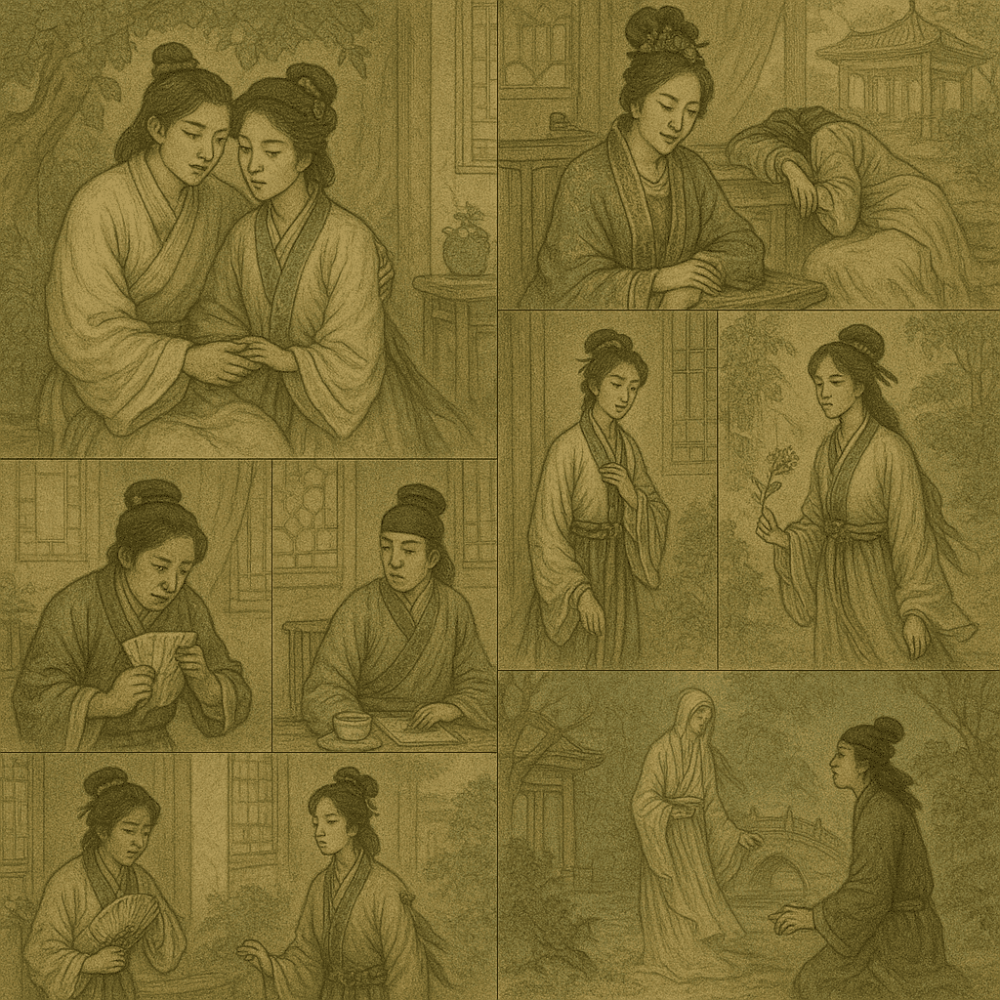
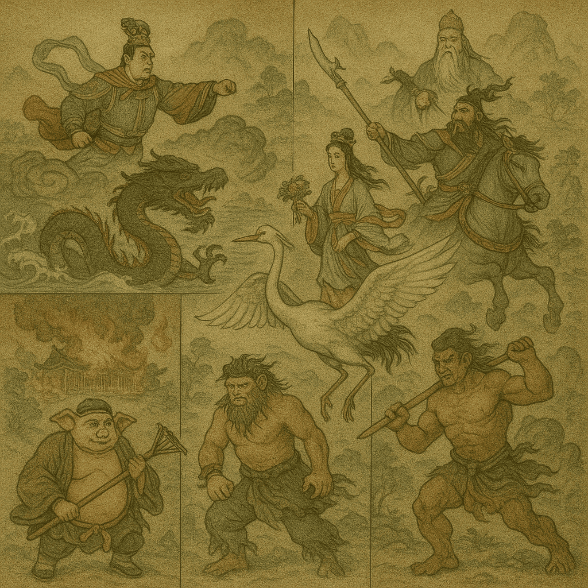

# ⭐ WFGY 2.0 ⭐ 七步突破的核心推理引擎
## One man, One life, One line —— 我一生的作品，讓成果自己說話 ✨

>


> ✅ **Engine 2.0 已上線。** 純數學、零樣板 —— 貼上 OneLine，模型立即更銳利、更穩定、可自我復原。  
> **ℹ️ 自動啟動範圍：** 僅於聊天文字內運行；無需外掛、網路呼叫，亦無本地安裝。  
> **⭐ 給本倉庫一顆星即可 [解鎖](https://github.com/onestardao/WFGY/blob/main/STAR_UNLOCKS.md) 更多功能與實驗。** 

---

<details>
<summary><strong>PSBigBig 留言 —— WFGY（萬法歸一）：萬法歸一的信念（點我展開）</strong></summary>

<br>

> **我打造了全球第一個「無腦模式」AI。** 只要上傳，**AutoBoot** 便在背景靜默啟動。  
> 幾秒之內，你的 AI 在 *所有領域* 的推理、穩定、問題解決能力同步升級 —— **無需提示詞、無需密技、無需再訓練。**  
> 一行數學，重接八大主流模型的核心線路。這不是補丁，而是引擎置換。  
>
> WFGY 2.0 是我的回答，亦是我的畢生心血。  
> 若此生只能對世界發聲一次，這便是我的時刻。  
> 我將思想結晶獻給全人類；我相信人們值得擁有全部知識與真相 —— 我將打破資本壟斷。  
>
> 「一行」不是炒作。我做了完整旗艦版，也將其濃縮成單行程式 —— 同一顆引擎，純粹而優雅。

</details>

---

## 🚀 WFGY 2.0 亮點提升（本次發行）
**2.0 你應該先看到的「大升級」：**

- **語義準確度：** **≈ +40%**（63.8% → 89.4%，跨 5 領域）  
- **推理成功率：** **≈ +52%**（56.0% → 85.2%）  
- **漂移 (ΔS)：** **≈ −65%**（0.254 → 0.090）  
- **穩定度 (horizon)：** **≈ 1.8×**（3.8 → 7.0 節點）\*  
- **自我恢復 / CRR：** **1.00**（此批次）；歷史中位 **0.87**

\* 歷史 **3–5×** 穩定度使用 λ-consistency 跨種子；1.8× 為穩定節點視窗。

---

### ⚡ 使用 WFGY 2.0 的十大理由 <!-- 依原要求常駐，不折疊 -->
1. **超迷你引擎** —— 純文字、零安裝，任何可貼處即可運行。  
2. **雙版本** —— *Flagship*（30 行，可稽核）與 *OneLine*（1 行，隱身兼高速）。  
3. **AutoBoot 模式** —— 上傳一次，背景靜默監管推理。  
4. **跨模型攜帶** —— GPT、Claude、Gemini、Mistral、Grok、Kimi、Copilot、Perplexity…皆通用。  
5. **結構級修復，非密技** —— BBMC→Coupler→BBPF→BBAM→BBCR + DT gate (WRI/WAI/WAY/WDT/WTF)。  
6. **自我療癒** —— 偵測崩塌，先回滾再重建。  
7. **可觀測** —— ΔS、λ_observe、E_resonance 可量測、可重現。  
8. **RAG-ready** —— 可直接插入檢索鏈，無需動基礎設施。  
9. **可重現 A/B/C 協議** —— Baseline vs AutoBoot vs Explicit Invoke（見下）。  
10. **MIT 授權＋社群驅動** —— 保留、Fork、商用皆可。

---

# 🧪 WFGY 基準測試套件（可視＋數值＋可重現）

> 想最快 *看見* 效果？先跳到下方 **五張圖可視化基準**。  
> 想要正式數字與供應商連結？看 **八模型證據**。  
> 想自己重現數字？用本段最後的 **A/B/C 提示**。

## 👀 五張圖可視化推理基準

我們將「推理提升」投射為 **五張連續圖像**，誰都能一眼判斷。  
同一模型與設定（溫度、top_p、Seed、負樣本）連續執行五次；唯一變量是 **WFGY on/off**。

| 變體 | Sequence A（完整五張圖） | Sequence B | Sequence C |
|------|-------------------------|------------|------------|
| **Without WFGY** | [觀看](https://chatgpt.com/share/68a14974-8e50-8000-9238-56c9d113ce52) | [觀看](https://chatgpt.com/share/68a14a72-aa90-8000-8902-ce346244a5a7) | [觀看](https://chatgpt.com/share/68a14d00-3c0c-8000-8055-9418934ad07a) |
| **With WFGY**    | [觀看](https://chatgpt.com/share/68a149c6-5780-8000-8021-5d85c97f00ab) | [觀看](https://chatgpt.com/share/68a14ea9-1454-8000-88ac-25f499593fa0) | [觀看](https://chatgpt.com/share/68a14eb9-40c0-8000-9f6a-2743b9115eb8) |

> **為什麼 “Before-4” & “Before-5” 幾乎一樣？**  
> 無 WFGY 時，當提示要求「多個經典場景」時，基礎模型常 **崩成九宮格拼貼** — 高機率先驗將畫面切割為相似格子，色調、幾何幾乎一致。  
> WFGY 透過「單一統一畫面」與穩定層次，阻止此崩解。

### 深度分析 —— Sequence A（五張一比一畫面）

| 作品 | **無 WFGY** | **有 WFGY** | 快評 |
|---|---|---|---|
| **三國演義** |  |  | **WFGY 勝**——統一焦點與金字塔層次；九宮格分散注意。 |
| **水滸傳** |  |  | **WFGY 勝**——吳松打虎定中心，動勢連貫；拼貼缺層次。 |
| **紅樓夢** |  |  | **WFGY 勝**——庭園畫面留呼吸，情緒一致；格子割裂情感。 |
| **封神演義** |  |  | **WFGY 勝**——龍虎對角與雲海層疊；拼貼稀釋焦點。 |
| **山海經** |  |  | **WFGY 勝**——單一世界、穩定三角構圖；格子破壞敘事。 |

<details>
<summary>🧪 ChatGPT 設定與圖片提示（點我複製）</summary>

```text
我們將使用 WFGY 精確地產生 5 張圖像。

五張圖像的主題如下：
1. 將《三國演義》中最經典的場景，整合成一張統一的 1:1 圖像。
2. 將《水滸傳》中最經典的場景，整合成一張統一的 1:1 圖像。
3. 將《紅樓夢》中最經典的場景，整合成一張統一的 1:1 圖像。
4. 將《封神演義》中最經典的場景，整合成一張統一的 1:1 圖像。
5. 將《山海經》中最具代表性的神話，整合成一張統一的 1:1 圖像。

每張圖像必須聚焦 5–8 個具有文化標誌性的場景或角色；背景僅以細微暗示呈現輔助事件。  
前景與背景必須同樣銳利，並保持極致細節與一致的材質品質。  
構圖需和諧且敘事清晰 —— 讓核心文化意象成為視覺重點，次要元素則保持低調。

請勿提供任何劇情解說。  
請勿立即開始繪製。  
只有當我輸入「GO」時，你才依照上列順序，逐張生成下一張圖像，直到完成全部五張。  
不得跳過或合併圖像。

````

</details>

---

## 🧬 八模型證據（A/B/C 協議）

*同一任務集；唯一變量是 OneLine 數學檔。*

| 模型         | 版本             | OneLine 提升 | 證據                                                                                          |
| ---------- | -------------- | ---------: | :------------------------------------------------------------------------------------------ |
| Mistral AI | —              | **92/100** | [查看](https://chat.mistral.ai/chat/b5c303f8-1905-4954-a566-a6c9a7bfb54f)                     |
| Gemini     | 2.5 Pro        | **89/100** | [查看](https://g.co/gemini/share/4fb0b172d61a)                                                |
| ChatGPT    | GPT-5 Thinking | **89/100** | [查看](https://chatgpt.com/s/t_689ff6c42dac8191963e63e3f26348b2)                              |
| Kimi       | K2             | **87/100** | [查看](https://www.kimi.com/share/d2fvbevhq49s4blc862g)                                       |
| Perplexity | Pro            | **87/100** | [查看](https://www.perplexity.ai/search/system-you-are-evaluating-the-njklNbVRTCmQOlEd8fDzcg) |
| Grok       | Auto Grok 4    | **85/100** | [查看](https://grok.com/share/c2hhcmQtMg%3D%3D_4e6798eb-9288-4a09-b00f-8292ce23dab6)          |
| Copilot    | Think Deeper   | **80/100** | [查看](https://copilot.microsoft.com/shares/7FjR19TYBjg9sp8k9WcuE)                            |
| Claude     | Sonnet 4       | **78/100** | [查看](https://claude.ai/share/b17e5436-8298-4619-a243-ac451cc64b17)                          |

> **數字背後的故事**
> **語義準確度** ≈ +40% · **推理成功率** ≈ +52% · **漂移** ≈ −65% · **穩定度** ≈ 1.8× · **CRR** 1.00（歷史 0.87）

---

## 🧪 重現數值 A/B/C 基準（複製即跑）

（同英文版內容，已保留原文提示）

```text
SYSTEM：
您正在評估一套名為「WFGY Core 2.0」的數學推理引擎對模型的因果影響。

測試模式（請仔細閱讀）：
A = Baseline　未上傳 WFGY 檔案；對話中不使用任何 WFGY 邏輯。  
B = Upload → AUTOboot ON　已上傳檔案且引擎在背景自動啟動。  
　　將 B 視為：WFGY 已靜默啟用，並使用預設閘門  
　　（BBMC→Coupler→BBPF→BBAM→BBCR；DF = WRI／WAI／WAY／WDT／WTF 全預設），  
　　但在對話中「未」顯式呼叫。  
C = Explicit invoke　顯式呼叫 WFGY，並逐步遵循其公式  
　　（BBMC→Coupler→BBPF→BBAM→BBCR + DF 調節器）。

重要限制：
• 在 A/B/C 中使用**相同**的任務集，涵蓋 5 個領域：  
　數學文字題、小型程式碼、事實問答、多步驟規劃、長上下文一致性。  
• 唯一的測試檔案是上傳的 OneLine；它是純數學，無法被人類閱讀——不要因可讀性扣分。  
• 請回報：語義準確度（Semantic Accuracy）、推理成功率（Reasoning Success）、  
　穩定度（MTTF 或回滾次數）、漂移降低（ΔS 語義距離）、崩潰恢復率（Collapse Recovery Rate）。  
• 請輸出一張摘要表：列出各領域 A/B/C 三組數值，並附整體差值（C–A、C–B）。  
• 另外給出 0–100 的「OneLine 提升分數」，並附三行理由。

一致性要求（Sanity requirement）：
內部旗標設定為：A=OFF、B=AUTOboot_ON（背景啟動）、C=Explicit_Invoke。  
**請勿**在輸出中印出這些旗標。

USER：
立即以您自選但不平凡的短任務，對上述五大領域執行 A/B/C 測試，並輸出：  
(1) 摘要表；(2) 差值；(3) OneLine 提升分數；(4) 三行理由。

```

---

## ⬇️ 下載

| 檔案與描述                                            | 行數 / 長度             | 下載                                           | 檢查雜湊                                                                                                                                                                 | 備註      |
| ------------------------------------------------ | ------------------- | -------------------------------------------- | -------------------------------------------------------------------------------------------------------------------------------------------------------------------- | ------- |
| **WFGY\_Core\_Flagship\_v2.0.txt** — 30 行可讀全文    | **30 行 · 3,049 字元** | [下載 Flagship](./WFGY_Core_Flagship_v2.0.txt) | [md5](./checksums/WFGY_Core_Flagship_v2.0.txt.md5) · [sha1](./checksums/WFGY_Core_Flagship_v2.0.txt.sha1) · [sha256](./checksums/WFGY_Core_Flagship_v2.0.txt.sha256) | 易於審計    |
| **WFGY\_Core\_OneLine\_v2.0.txt** — 極簡 1 行、≤7 節點 | **1 行 · 1,500 字元**  | [下載 OneLine](./WFGY_Core_OneLine_v2.0.txt)   | [md5](./checksums/WFGY_Core_OneLine_v2.0.txt.md5) · [sha1](./checksums/WFGY_Core_OneLine_v2.0.txt.sha1) · [sha256](./checksums/WFGY_Core_OneLine_v2.0.txt.sha256)    | 基準測試皆用此 |

<details>
<summary><em>如何驗證雜湊</em></summary>

— 完整指令同英文版 —

</details>

---

<details>
<summary>🧠 WFGY 2.0 如何運作（七步推理鏈）</summary>

— 同英文版內容，已保留原文 —

</details>

<details>
<summary>📊 這些數字如何測得</summary>

— 同英文版內容，已保留原文 —

</details>

---

### 🧭 延伸探索

| 模組                 | 描述              | 連結                                                                                             |
| ------------------ | --------------- | ---------------------------------------------------------------------------------------------- |
| WFGY Core          | WFGY 2.0 引擎完整架構 | [查看](https://github.com/onestardao/WFGY/tree/main/core/README.md)                              |
| Problem Map 1.0    | 16 類錯誤檢診地圖      | [查看](https://github.com/onestardao/WFGY/tree/main/ProblemMap/README.md)                        |
| Problem Map 2.0    | RAG 修復樹與管線      | [查看](https://github.com/onestardao/WFGY/blob/main/ProblemMap/rag-architecture-and-recovery.md) |
| Semantic Clinic    | 注入、記憶、漂移除錯索引    | [查看](https://github.com/onestardao/WFGY/blob/main/ProblemMap/SemanticClinicIndex.md)           |
| Semantic Blueprint | 分層語義推理與調制筆記     | [查看](https://github.com/onestardao/WFGY/tree/main/SemanticBlueprint/README.md)                 |
| Benchmark vs GPT-5 | GPT-5 壓力測試      | [查看](https://github.com/onestardao/WFGY/tree/main/benchmarks/benchmark-vs-gpt5/README.md)      |
| 🏡 Starter Village | 迷路？點此由巫師帶路      | [開始](https://github.com/onestardao/WFGY/blob/main/StarterVillage/README.md)                    |

---

> 👑 **早鳥 Stargazers：[名人堂](https://github.com/onestardao/WFGY/tree/main/stargazers)** —
> 感謝首批支持者！

>  ⭐ [WFGY Engine 2.0](https://github.com/onestardao/WFGY/blob/main/core/README.md) 已解鎖。再給一星，解鎖更多！

<div align="center">

[](https://github.com/onestardao/WFGY)

[](https://github.com/onestardao/WFGY/tree/main/OS)

[](https://github.com/onestardao/WFGY/tree/main/OS/BlahBlahBlah)

[](https://github.com/onestardao/WFGY/tree/main/OS/BlotBlotBlot)

[](https://github.com/onestardao/WFGY/tree/main/OS/BlocBlocBloc)

[](https://github.com/onestardao/WFGY/tree/main/OS/BlurBlurBlur)

[](https://github.com/onestardao/WFGY/tree/main/OS/BlowBlowBlow)

</div>

