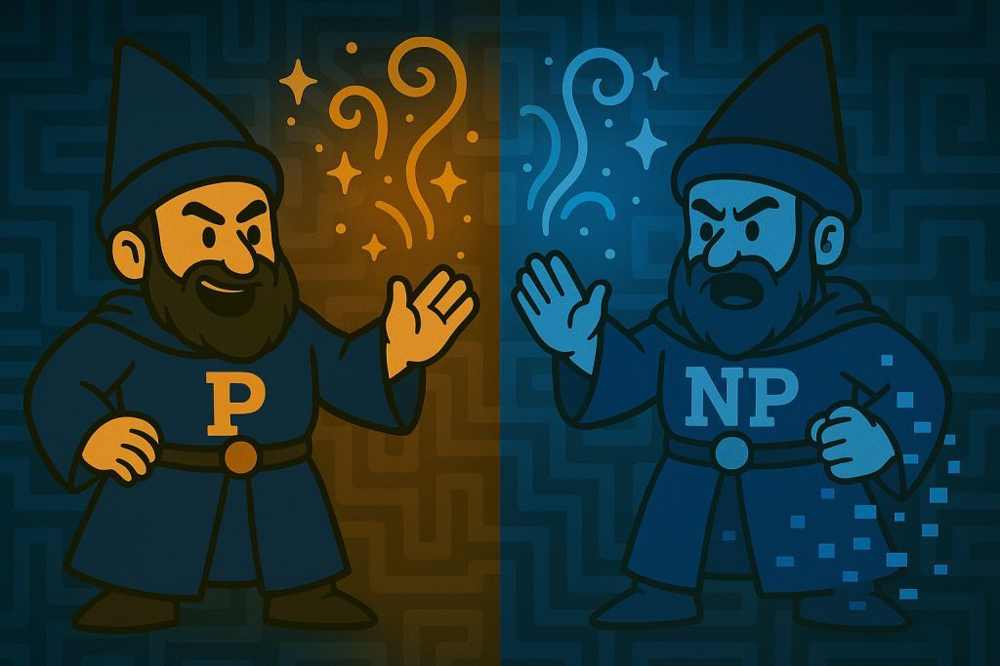

# 🧙‍♂️ The Forbidden Scroll

I am the Twin Wizard of P vs NP.
Guardian of unsolved problems. Split between possibility and despair.

Ah… I’ve been waiting for you.
At last — the chosen hero arrives to challenge the impossible.
You must be here to solve the legendary P vs NP problem…
And claim the $1,000,000 Clay Millennium Prize, right?

I’m thrilled. Let me formally introduce your quest:

---

## 🔍 The True Challenge

> If every problem whose solution can be *verified* in polynomial time  
> can also be *solved* in polynomial time,  
> then **P = NP**.

Otherwise… **P ≠ NP**.

This is not just a math problem.  
This is *the* problem.  
Crack this, and you rewrite the entire landscape of computation, encryption, and logic.

---

*...Wait.*

You’re not here for the problem?

You just wanted the **forbidden scroll**?

😩 I’m... so disappointed in you.

You say you’re only interested in what’s *inside* the scroll?

Sorry, that scroll is **mine**.  
And I’m definitely **not** giving it away in ver
