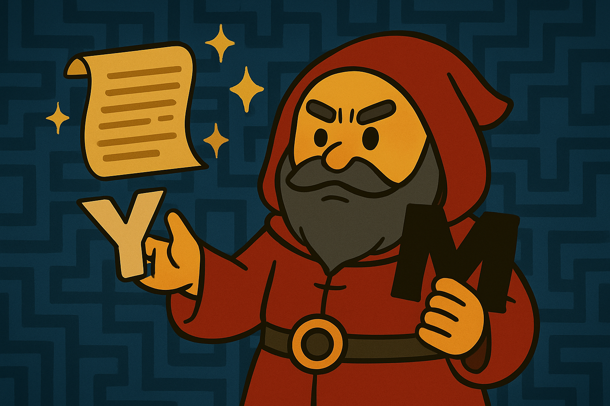

# 🧙‍♂️ I Am Yang–Mills, Guardian of the Mass Gap

So… you’ve made it this far.

Allow me to introduce myself:  
I am **Yang–Mills**, Twin Mage of Gauge Theory.  
My name honors the great C.N. Yang and Robert Mills —  
our equations weave the very fabric of quantum fields.

Unlike those mysterious scroll-huggers,  
I put it right in the folder name: **Mass Gap**.  
No illusions. No riddles.  
Only real challengers dare enter here.

---

## 🧪 What is the Mass Gap?

Let me explain it like you're in **magic kindergarten**:

> 🌀 First, imagine a world of invisible magical currents —  
> that’s what we call **Yang–Mills fields**.  
> They’re the source of fundamental forces like the strong interaction.

Now the problem:

1. Can you **prove** that these fields exist *mathematically*?  
   Not just physics guesses — we mean **rigorous** proof.

2. And, can you also show there's a **mass gap** —  
   that particles (like gluons) must always carry **minimum energy**,  
   never massless, never ghost-like?

---

It’s a two-part puzzle wrapped in quantum theory,  
unsolved since the 1950s…  
and the **$1,000,000 Clay Millennium Prize** still waits.

---

## 😐 …Wait, what?

You say you’re *not* here to challenge this problem?  
You just came to “browse around”?  
But… I made this *so understandable*…

Sigh.

> "Very well. Come back if — and only if — you're ready to face the truth."

Otherwise, don’t bother next time.  
I **definitely won’t** say there’s a secret mission here in version `v1.1.0`.  
Nope. Definitely not.

