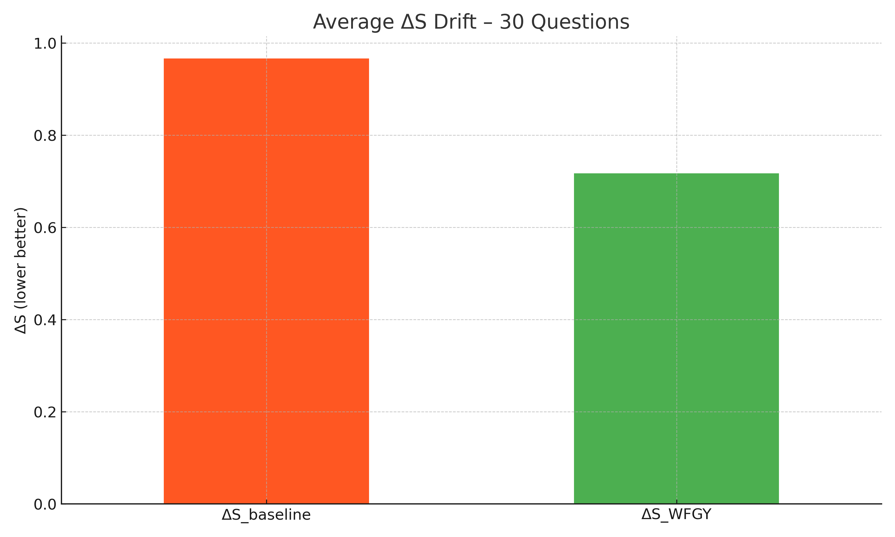
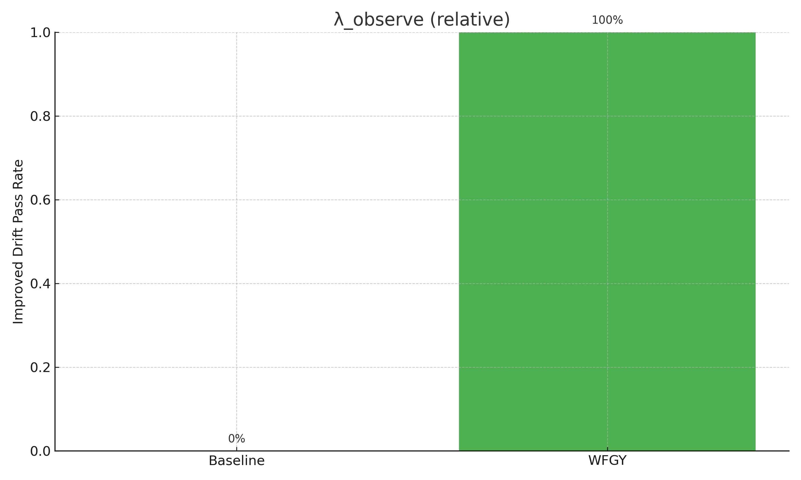

# Semantic‑DriftDemo

Compare plain LLM answers (Baseline) with **WFGY+DrunkMode** on 30 multi‑step prompts.

| Metric | Meaning | Good? |
|--------|---------|-------|
| ΔS | Prompt‑to‑answer distance (0 = perfect) | lower |
| λ_observe | % of answers with ΔS below 0.4 | higher |

<div align="center">
  
  
</div>

## Quick Start

```bash
pip install -r requirements.txt
python scripts/run_eval.py
python scripts/plot_results.py
````

Replace `data/*answers.txt` with your own outputs and re‑run to get new charts.

```

---

### What to do

1. **Re‑create the folder tree** exactly as above.  
2. Copy each code block into its file.  
3. `git add .` → push to GitHub (no need to zip/unzip again).  
4. Users can clone and run in Colab.

This is the full, non‑placeholder content.  
Ping me if anything else is missing—no more empty files.
```
