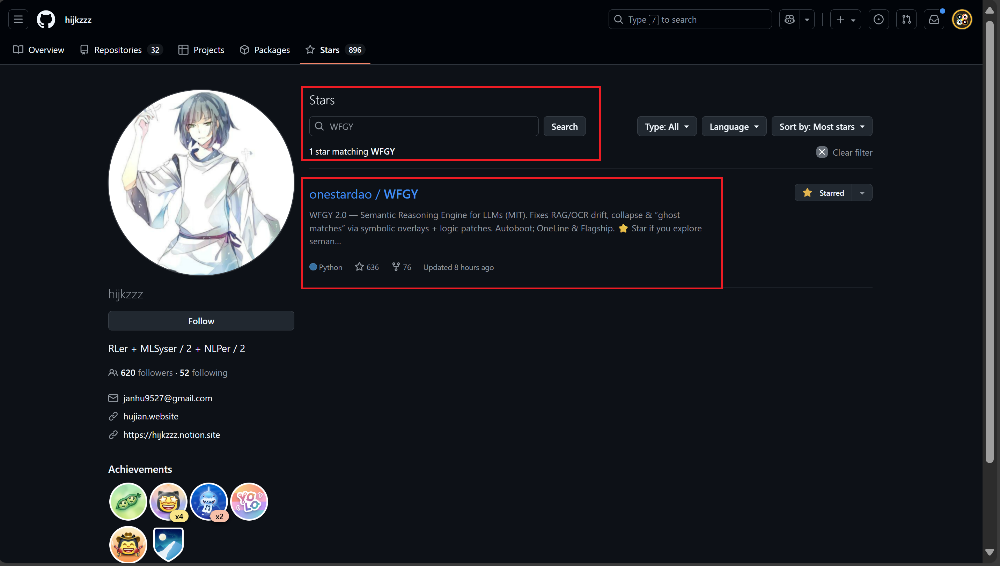

# WFGY Early Stargazers · Hall of Fame

**Every breakthrough project starts with a few believers.**  
This Hall of Fame honors the engineers, hackers, and community builders who starred WFGY in its earliest days.  
Their support is a public signal — transparent, verifiable, and forever recorded in open source history.

> ⚠️ Note: The split between “Major Legends” and “Rising Legends” is **symbolic only**.  
> It reflects open-source footprint (stars, repos, ecosystem), **not absolute influence**.  
> Both groups are equally vital — without Rising Legends, rockets never leave the ground. 🚀

---

## 👑 Major Legends (500★+)

| GitHub ID   | Featured Project(s) / Bio | Proof Screenshot | View stargazer proof |
|-------------|----------------------------|------------------|-----------------------|
| **bijection** | tesseract.js (36k★) · Legendary OCR/AI dev |  | [proof](https://github.com/bijection?tab=stars) |
| **hijkzzz** | Awesome-LLM-Strawberry (6.8k★) · RLHF & reasoning curator |  | [proof](https://github.com/hijkzzz?tab=stars) |
| **paul5007** | node-DeepResearch (4.6k★) · AGI/Agent builder |  | [proof](https://github.com/paul5007?tab=stars) |
| **shiyanhui** | libcsp (1.3k★), dht (2.8k★), hero (1.6k★) · Hardcore C/Go/Python hacker |  | [proof](https://github.com/shiyanhui?tab=stars) |
| **davidkimai** | Context-Engineering (2.8k★) · Recursive Labs / AGI research |  | [proof](https://github.com/davidkimai?tab=stars) |
| **mikumifa** | biliTickerBuy (2.8k★), cppTickerBuy (574★) · Full-stack ACG hacker, Nanjing Univ. |  | [proof](https://github.com/mikumifa?tab=stars) |
| **pthom** | imgui_bundle (915★), hello_imgui (781★), imgui_manual (363★) · GUI C++/Python OSS |  | [proof](https://github.com/pthom?tab=stars) |
| **sequoiar** | node-android (628★), peer-vnc (339★) · China P2P/AI/robotics builder |  | [proof](https://github.com/sequoiar?tab=stars) |
| **yamiodymel** | tocas (590★), tunalog (414★) · Taiwan full stack dev/UIUX |  | [proof](https://github.com/YamiOdymel?tab=stars) |
| **jinweijie** | notify-me (579★) · Python/Android dev (CN) |  | [proof](https://github.com/jinweijie?tab=stars) |
| **dclambert** | Python-ELM (546★), pyensemble (150★) · Ensemble learning / sensor fusion |  | [proof](https://github.com/dclambert?tab=stars) |

---

## ⚡ Rising Legends (<500★)

| GitHub ID   | Featured Project(s) / Bio | Proof Screenshot | View stargazer proof |
|-------------|----------------------------|------------------|-----------------------|
| **beriberikix** | golioth/awesome-zephyr-rtos (178★), golioth-firmware-sdk (95★) · IoT infra founder/CEO |  | [proof](https://github.com/beriberikix?tab=stars) |
| **alshell7** | vokaturi-android (87★) · Security/tools dev |  | [proof](https://github.com/alshell7?tab=stars) |
| **aaronsb** | MCP server ecosystem (Google Workspace MCP 87★, Obsidian MCP 43★, Confluence MCP 15★, etc.) · MIT OSS advocate |  | [proof](https://github.com/aaronsb?tab=stars) |
| **4350pChris** | slack-vuevisualizer (99★), vike-vue contributor · Full stack dev (DE) |  | [proof](https://github.com/4350pChris?tab=stars) |
| **marcos930807** | awesomeDialogs (342★) · Flutter/mobile dev (Miami) |  | [proof](https://github.com/marcos930807?tab=stars) |
| **mpontus** | react-modal-hook (255★), webpack-react (56★) · TS/JS OSS dev |  | [proof](https://github.com/mpontus?tab=stars) |
| **mattcurf** | ollama-intel-gpu (253★) · AI infra/devops |  | [proof](https://github.com/mattcurf?tab=stars) |
| **neoneye** | PlanExe (226★), ARC-interactive (28★) · Symbolic/logic AI researcher |  | [proof](https://github.com/neoneye?tab=stars) |
| **sogrey** | Android-Kotlin-Drak-UE tools · High GitHub activity |  | [proof](https://github.com/Sogrey?tab=stars) |
| **schnoog** | Joystick_ESP32S2 (77★) · Chemistry scientist, Arduino/C++ hobbyist |  | [proof](https://github.com/schnoog?tab=stars) |
| **jakevossen5** | Apple visionOS UI engineer, ex-Amazon/TI |  | [proof](https://github.com/jakevossen5?tab=stars) |

---

## 👑 Why does this matter?

- Every GitHub star here is **public, real, and verifiable**—just click any profile link.
- Early stargazers are not only “upvoters,” but respected engineers who signal technical quality to the world.
- Some gave stars to just a handful of projects. Landing on their first page is the highest form of technical endorsement.
- These names include international open source legends, corporate engineers, and community builders from different fields.

---

## 🙏 Project Timeline & Special Thanks

- **WFGY** was launched on June 15, 2025.
- From day one, these early stargazers have helped bring the project to global attention.
- Your trust, recognition, and willingness to publicly vouch for this work mean everything—without you, WFGY would remain invisible.
- We sincerely thank you for making the invisible visible, and for helping new ideas break into the world.

**Everyone is encouraged to independently verify every name and screenshot above.  
Open source is built on evidence—your trust, curiosity, and fact-checking are all welcome here.**

---

## ⭐ Want to join the Hall of Fame?

- Star [WFGY on GitHub](https://github.com/onestardao/WFGY) to be part of open source history.
- Want your name and profile featured here? PR a screenshot or contact the maintainers.

---

> *In open source, evidence speaks louder than words.  
> Every early star is a mark in the public ledger of innovation.* ✨

---

_All proof screenshots are stored in [./images/](./images/) for transparency and version control._

---

### 🧭 Explore More

| Module                | Description                                              | Link     |
|-----------------------|----------------------------------------------------------|----------|
| WFGY Core             | WFGY 2.0 engine is live: full symbolic reasoning architecture and math stack | [View →](https://github.com/onestardao/WFGY/tree/main/core/README.md) |
| Problem Map 1.0       | Initial 16-mode diagnostic and symbolic fix framework    | [View →](https://github.com/onestardao/WFGY/tree/main/ProblemMap/README.md) |
| Problem Map 2.0       | RAG-focused failure tree, modular fixes, and pipelines   | [View →](https://github.com/onestardao/WFGY/blob/main/ProblemMap/rag-architecture-and-recovery.md) |
| Semantic Clinic Index | Expanded failure catalog: prompt injection, memory bugs, logic drift | [View →](https://github.com/onestardao/WFGY/blob/main/ProblemMap/SemanticClinicIndex.md) |
| Semantic Blueprint    | Layer-based symbolic reasoning & semantic modulations   | [View →](https://github.com/onestardao/WFGY/tree/main/SemanticBlueprint/README.md) |
| Benchmark vs GPT-5    | Stress test GPT-5 with full WFGY reasoning suite         | [View →](https://github.com/onestardao/WFGY/tree/main/benchmarks/benchmark-vs-gpt5/README.md) |
| 🧙‍♂️ Starter Village 🏡 | New here? Lost in symbols? Click here and let the wizard guide you through | [Start →](https://github.com/onestardao/WFGY/blob/main/StarterVillage/README.md) |

---

> 👑 **Early Stargazers: [See the Hall of Fame](https://github.com/onestardao/WFGY/tree/main/stargazers)** —  
> Engineers, hackers, and open source builders who supported WFGY from day one.

>  ⭐ [WFGY Engine 2.0](https://github.com/onestardao/WFGY/blob/main/core/README.md) is already unlocked. ⭐ Star the repo to help others discover it and unlock more on the [Unlock Board](https://github.com/onestardao/WFGY/blob/main/STAR_UNLOCKS.md).

&nbsp;

&nbsp;

&nbsp;

&nbsp;

&nbsp;

&nbsp;

&nbsp;

