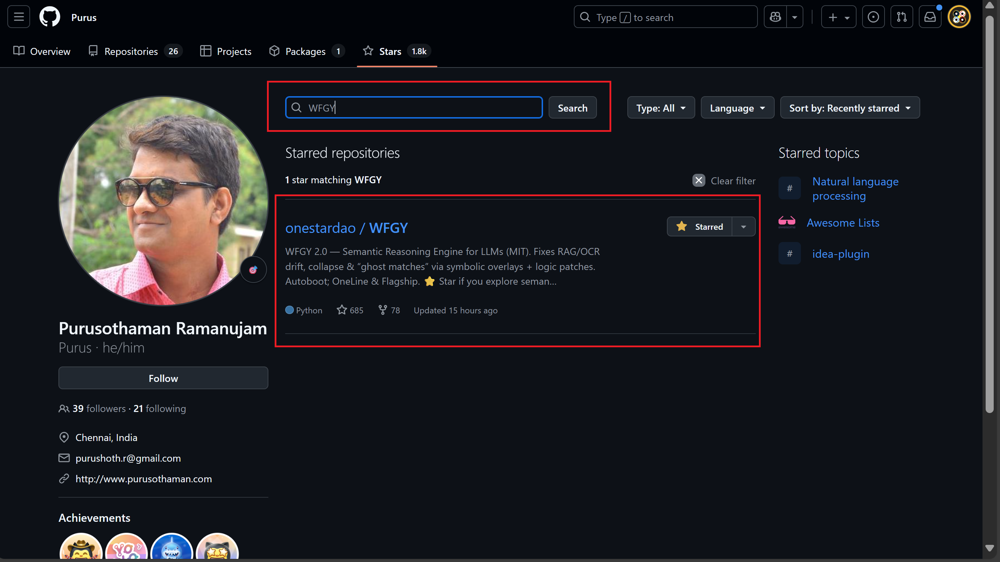
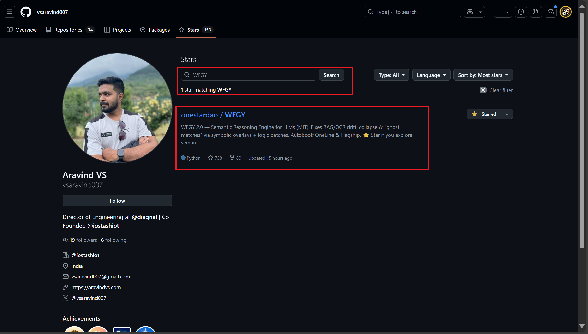
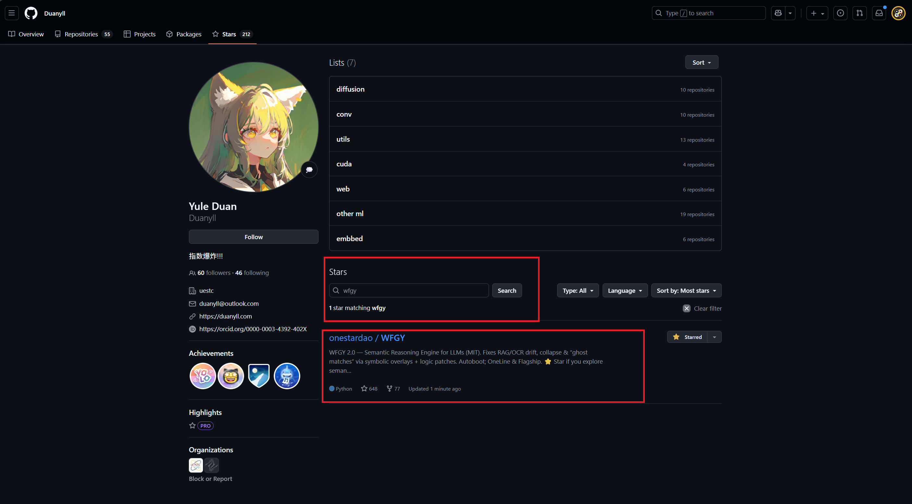
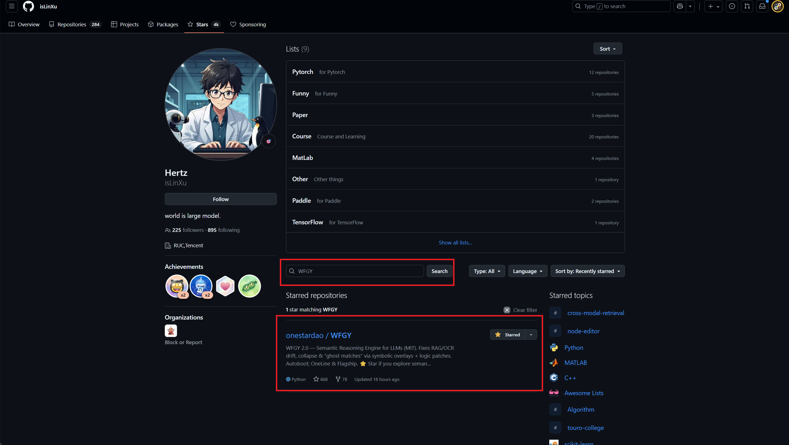
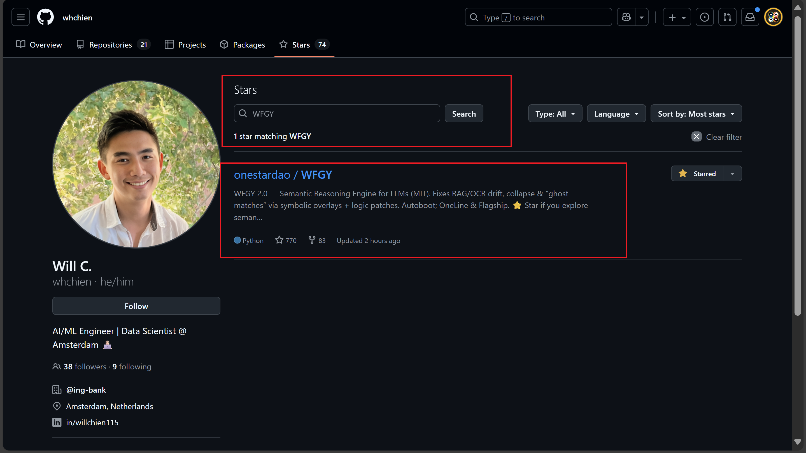
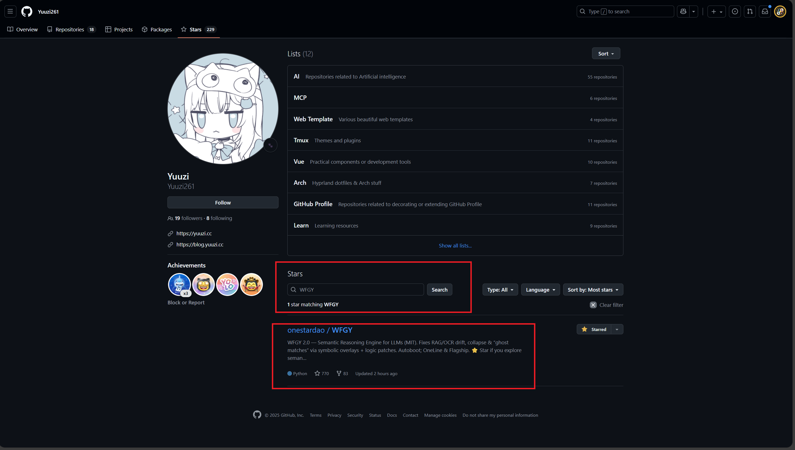

# WFGY Early Stargazers · Hall of Fame

**Every breakthrough project starts with a few believers.**  
This Hall of Fame honors the engineers, hackers, and community builders who starred WFGY in its earliest days.  
Their support is a public signal — transparent, verifiable, and forever recorded in open source history.

> ⚠️ Note: The split between “Major Legends” and “Rising Legends” is **symbolic only** —  
> it reflects open-source footprint (stars, projects, visibility), **not absolute influence**.  
> Some names have thousands of stars, some just the right instinct at the right time.  
>  
> What truly matters: they saw value in WFGY before the world did.  
>  
> ⭐ Every early star is more than a number — it’s a **vote of confidence**,  
> a spark that helped push a zero-budget project into the spotlight.

---

## ⚡ Rising Legends (<500★)

| GitHub ID   | Featured Project(s) / Bio | Proof Screenshot | View stargazer proof |
|-------------|----------------------------|------------------|-----------------------|
| **beriberikix** | golioth/awesome-zephyr-rtos (178★), golioth-firmware-sdk (95★) · IoT infra founder/CEO |  | [proof](https://github.com/beriberikix?tab=stars&q=WFGY) |
| **alshell7** | vokaturi-android (87★) · Security/tools dev |  | [proof](https://github.com/alshell7?tab=stars&q=WFGY) |
| **aaronsb** | MCP server ecosystem (Google Workspace MCP 87★, Obsidian MCP 43★, Confluence MCP 15★, etc.) · MIT OSS advocate |  | [proof](https://github.com/aaronsb?tab=stars&q=WFGY) |
| **4350pChris** | slack-vuevisualizer (99★), vike-vue contributor · Full stack dev (DE) |  | [proof](https://github.com/4350pChris?tab=stars&q=WFGY) |
| **marcos930807** | awesomeDialogs (342★) · Flutter/mobile dev (Miami) |  | [proof](https://github.com/marcos930807?tab=stars&q=WFGY) |
| **mpontus** | react-modal-hook (255★), webpack-react (56★) · TS/JS OSS dev |  | [proof](https://github.com/mpontus?tab=stars&q=WFGY) |
| **Purus** | launch_review (192★) · Flutter plugin dev, also active in API/GraphQL repos |  | [proof](https://github.com/Purus?tab=stars&q=WFGY) |
| **vsaravind007** | nodeScratchpad (111★) · Director of Engineering @DiagnaI, co-founder @iostashiot |  | [proof](https://github.com/vsaravind007?tab=stars&q=WFGY) |
| **mattcurf** | ollama-intel-gpu (253★) · AI infra/devops |  | [proof](https://github.com/mattcurf?tab=stars&q=WFGY) |
| **Duanyll** | CANConv (61★), Standard TLE Library (10★) · Embedded/C++/Qt dev (China) |  | [proof](https://github.com/Duanyll?tab=stars&q=WFGY) |
| **neoneye** | PlanExe (226★), ARC-interactive (28★) · Symbolic/logic AI researcher |  | [proof](https://github.com/neoneye?tab=stars&q=WFGY) |
| **sogrey** | Android-Kotlin-Drak-UE tools · High GitHub activity |  | [proof](https://github.com/Sogrey?tab=stars&q=WFGY) |
| **schnoog** | Joystick_ESP32S2 (77★) · Chemistry scientist, Arduino/C++ hobbyist |  | [proof](https://github.com/schnoog?tab=stars&q=WFGY) |
| **isLinXu** | awesome-road-map (45★), model-metrics-plot (18★) · Tencent AI engineer |  | [proof](https://github.com/isLinXu?tab=stars&q=WFGY) |
| **jakevossen5** | Apple visionOS UI engineer, ex-Amazon/TI |  | [proof](https://github.com/jakevossen5?tab=stars&q=WFGY) |
| **whchien** | ai-trader (227★), funda-scraper (144★) · AI/ML Engineer & Data Scientist in Amsterdam |  | [proof](https://github.com/whchien?tab=stars&q=WFGY) |
| **Yuuzi261** | Tweetcord (97★), FuseFairy/HBR-AxleTool-vue (28★) · Discord bot & Vue developer |  | [proof](https://github.com/Yuuzi261?tab=stars&q=WFGY) |

---

## ⚡ Rising Legends (<500★)

| GitHub ID   | Featured Project(s) / Bio | Proof Screenshot | View stargazer proof |
|-------------|----------------------------|------------------|-----------------------|
| **beriberikix** | golioth/awesome-zephyr-rtos (178★), golioth-firmware-sdk (95★) · IoT infra founder/CEO |  | [proof](https://github.com/beriberikix?tab=stars&q=WFGY) |
| **alshell7** | vokaturi-android (87★) · Security/tools dev |  | [proof](https://github.com/alshell7?tab=stars&q=WFGY) |
| **aaronsb** | MCP server ecosystem (Google Workspace MCP 87★, Obsidian MCP 43★, Confluence MCP 15★, etc.) · MIT OSS advocate |  | [proof](https://github.com/aaronsb?tab=stars&q=WFGY) |
| **4350pChris** | slack-vuevisualizer (99★), vike-vue contributor · Full stack dev (DE) |  | [proof](https://github.com/4350pChris?tab=stars&q=WFGY) |
| **marcos930807** | awesomeDialogs (342★) · Flutter/mobile dev (Miami) |  | [proof](https://github.com/marcos930807?tab=stars&q=WFGY) |
| **mpontus** | react-modal-hook (255★), webpack-react (56★) · TS/JS OSS dev |  | [proof](https://github.com/mpontus?tab=stars&q=WFGY) |
| **Purus** | launch_review (192★) · Flutter plugin dev, also active in API/GraphQL repos |  | [proof](https://github.com/Purus?tab=stars&q=WFGY) |
| **vsaravind007** | nodeScratchpad (111★) · Director of Engineering @DiagnaI, co-founder @iostashiot |  | [proof](https://github.com/vsaravind007?tab=stars&q=WFGY) |
| **mattcurf** | ollama-intel-gpu (253★) · AI infra/devops |  | [proof](https://github.com/mattcurf?tab=stars&q=WFGY) |
| **Duanyll** | CANConv (61★), Standard TLE Library (10★) · Embedded/C++/Qt dev (China) |  | [proof](https://github.com/Duanyll?tab=stars&q=WFGY) |
| **neoneye** | PlanExe (226★), ARC-interactive (28★) · Symbolic/logic AI researcher |  | [proof](https://github.com/neoneye?tab=stars&q=WFGY) |
| **sogrey** | Android-Kotlin-Drak-UE tools · High GitHub activity |  | [proof](https://github.com/Sogrey?tab=stars&q=WFGY) |
| **schnoog** | Joystick_ESP32S2 (77★) · Chemistry scientist, Arduino/C++ hobbyist |  | [proof](https://github.com/schnoog?tab=stars&q=WFGY) |
| **isLinXu** | awesome-road-map (45★), model-metrics-plot (18★) · Tencent AI engineer |  | [proof](https://github.com/isLinXu?tab=stars&q=WFGY) |
| **jakevossen5** | Apple visionOS UI engineer, ex-Amazon/TI |  | [proof](https://github.com/jakevossen5?tab=stars&q=WFGY) |

---

## 👑 Why does this matter?

- Every GitHub star here is **public, real, and verifiable**—just click any profile link.
- Early stargazers are not only “upvoters,” but respected engineers who signal technical quality to the world.
- Some gave stars to just a handful of projects. Landing on their first page is the highest form of technical endorsement.
- These names include international open source legends, corporate engineers, and community builders from different fields.

---

## 🙏 Project Timeline & Special Thanks

- **WFGY** was launched on June 15, 2025.
- From day one, these early stargazers have helped bring the project to global attention.
- Your trust, recognition, and willingness to publicly vouch for this work mean everything—without you, WFGY would remain invisible.
- We sincerely thank you for making the invisible visible, and for helping new ideas break into the world.

**Everyone is encouraged to independently verify every name and screenshot above.  
Open source is built on evidence—your trust, curiosity, and fact-checking are all welcome here.**

---

## ⭐ Want to join the Hall of Fame?

- Star [WFGY on GitHub](https://github.com/onestardao/WFGY) to be part of open source history.
- Want your name and profile featured here? PR a screenshot or contact the maintainers.

---

> *In open source, evidence speaks louder than words.  
> Every early star is a mark in the public ledger of innovation.* ✨

---

_All proof screenshots are stored in [./images/](./images/) for transparency and version control._

---

### 🧭 Explore More

| Module                | Description                                              | Link     |
|-----------------------|----------------------------------------------------------|----------|
| WFGY Core             | WFGY 2.0 engine is live: full symbolic reasoning architecture and math stack | [View →](https://github.com/onestardao/WFGY/tree/main/core/README.md) |
| Problem Map 1.0       | Initial 16-mode diagnostic and symbolic fix framework    | [View →](https://github.com/onestardao/WFGY/tree/main/ProblemMap/README.md) |
| Problem Map 2.0       | RAG-focused failure tree, modular fixes, and pipelines   | [View →](https://github.com/onestardao/WFGY/blob/main/ProblemMap/rag-architecture-and-recovery.md) |
| Semantic Clinic Index | Expanded failure catalog: prompt injection, memory bugs, logic drift | [View →](https://github.com/onestardao/WFGY/blob/main/ProblemMap/SemanticClinicIndex.md) |
| Semantic Blueprint    | Layer-based symbolic reasoning & semantic modulations   | [View →](https://github.com/onestardao/WFGY/tree/main/SemanticBlueprint/README.md) |
| Benchmark vs GPT-5    | Stress test GPT-5 with full WFGY reasoning suite         | [View →](https://github.com/onestardao/WFGY/tree/main/benchmarks/benchmark-vs-gpt5/README.md) |
| 🧙‍♂️ Starter Village 🏡 | New here? Lost in symbols? Click here and let the wizard guide you through | [Start →](https://github.com/onestardao/WFGY/blob/main/StarterVillage/README.md) |

---

> 👑 **Early Stargazers: [See the Hall of Fame](https://github.com/onestardao/WFGY/tree/main/stargazers)** —  
> Engineers, hackers, and open source builders who supported WFGY from day one.

>  ⭐ [WFGY Engine 2.0](https://github.com/onestardao/WFGY/blob/main/core/README.md) is already unlocked. ⭐ Star the repo to help others discover it and unlock more on the [Unlock Board](https://github.com/onestardao/WFGY/blob/main/STAR_UNLOCKS.md).

&nbsp;

&nbsp;

&nbsp;

&nbsp;

&nbsp;

&nbsp;

&nbsp;

