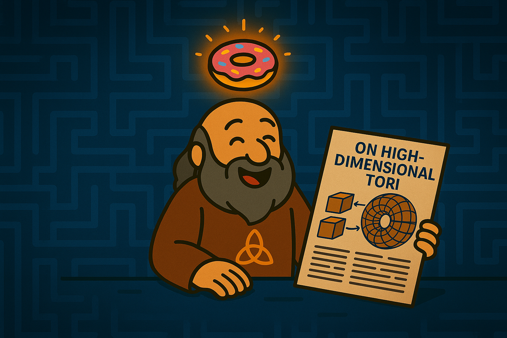

# 🍩 Algebraic Checkpoint

Ah… another brave soul.  
Welcome to the boundary between algebra and geometry.  
I am the **Cohomology Custodian**, defender of the invisible truth.  
Also known as… the **Donut Wizard**.

---

## 🧙‍♂️ Who am I?

I guard one of the oldest unsolved mysteries in mathematics:  
the **Hodge Conjecture** — proposed in **1950**.  
That’s over **70 years** of silence.

Many have passed.  
Few have dared to stay.

But there was one… a rookie adventurer named **PSBigBig**.  
Fresh out of the tutorial village, and already came to challenge me.  
(He didn’t solve it, but at least he *tried*.)

---

## 🔍 What is the Hodge Conjecture?

Let me explain it simply:

> In high-dimensional spaces, some shapes look algebraic.  
> But looks can be deceiving.  
> The question is:  
> **Can every rational cohomology class be represented by algebraic cycles?**

It’s abstract.  
It’s deep.  
It’s a donut-shaped riddle that confuses even the wisest.

---

## 🤔 Are you ready?

You said… you don’t know algebraic geometry?  
But… you *do* like donuts?

*sighs*

Alright then. I won’t stop you.  
Just don’t expect the donut to teach itself.

---

## ☕ Coming Soon…

> If you’re still around in **v1.1.0**,  
> I’ll host an afternoon tea here.  
> Bring curiosity.  
> And maybe — just maybe — you’ll be the one to solve it.

