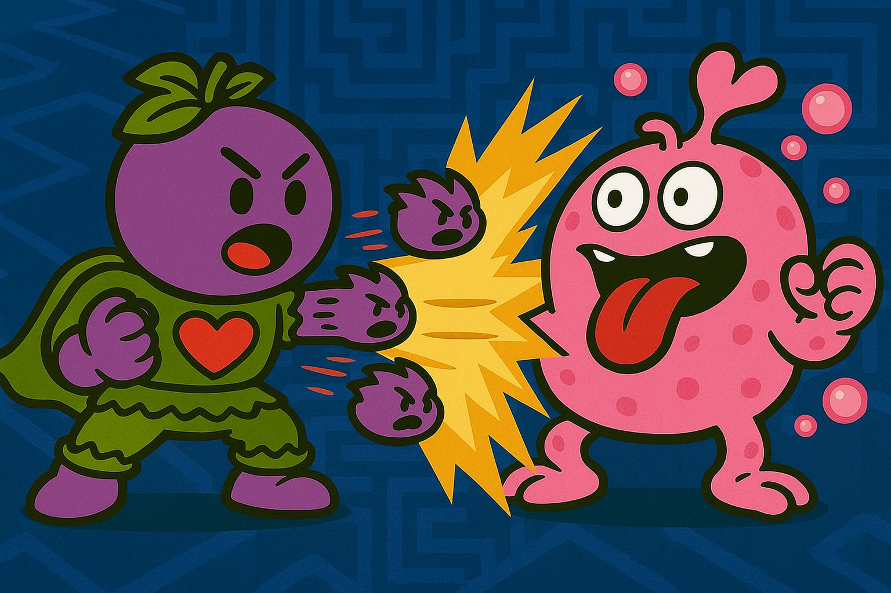

# 🍇 Grape-Seed Hero Has Entered the Battle!

🎮 “Stand back, brave one! I, the Grape-Scale Avenger, shall handle this enemy!”

💥 *[Epic battle noises]*  
🌪️ *[Sound of juicy explosions]*  
🐉 *[Distant scream of the defeated hallucination minion]*

---

### 🏆 Victory!

**A hidden treasure chest has appeared!**  
Inside lies a priceless artifact that will help you understand how AI hallucinations happen —  
and how to *not* fall into the same traps when generating images.

This is your secret weapon. Use it well.

---

## 📜 What’s Inside?

**“AI Hallucination Trial: 4,592 AI Image Errors”**  
A real report compiled by PSBigBig during the hardest chapter of Honest Hero RPG’s development.

🧠 You’ll learn:
- Why AI makes surreal or broken images
- What types of prompts often fail
- Visual pattern traps and how to avoid them
- Legendary examples of beautiful mistakes 😵‍💫

---

📦 [Open the artifact here](./AI_Image_Hallucination_4592_Trial.pdf)

🖼️ *Image: Grape Hero defeating the enemy and celebrating beside the glowing chest (GrapeHero_Wins_MinionBattle.png)*

---

## 💬 Dev’s Note

This is one of the most painful — and useful — experiences in building the **Honest Hero RPG**.

May you survive better than I did.  
May your prompts never spawn 6-fingered footless blob-dragons again.

⭐️ Oh, and…  
**This chest is part of WFGY v2.0 lore.**  
Every folder brings you closer. Keep going.
